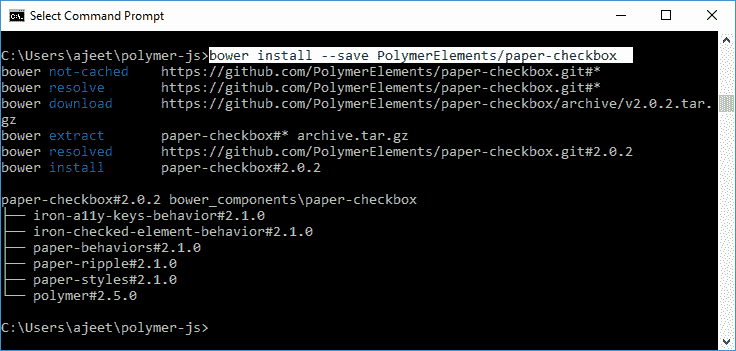
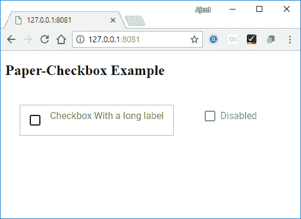

# PolymerPaper-复选框

> 原文：<https://www.javatpoint.com/polymer-paper-checkbox>

PolymerPaper复选框是用于选中或取消选中它的复选框。通常，复选框用于从集合中选择多个选项。要获取目录中的纸张复选框，您应该在命令提示符下使用以下命令。

```

bower install --save PolymerElements/paper-checkbox

```



### 例子

创建一个 index.html 文件，并在其中添加以下代码，以查看 paper-checkbox 元素在 Polymer.js 中的使用

```

<!doctype html>
<html>
   <head>
      <link rel = 'import' href = 'my-app.html'>
   </head>
   <body>
      <h2>Paper-Card Example</h2>
      <my-app></my-app>
   </body>
</html>

```

现在，打开 my-app.html 文件，并在其中包含以下代码。

```

<link rel = 'import' href = 'bower_components/polymer/polymer.html'>
<link rel = "import" href = "bower_components/paper-button/paper-button.html">
<link rel = "import" href = "bower_components/paper-styles/paper-styles.html">
<link rel = "import" href = "bower_components/paper-card/paper-card.html">
<link rel = "import" href = "bower_components/iron-icons/iron-icons.html">
<link rel = "import" href = "bower_components/iron-icons/communication-icons.html">
<link rel = "import" href = "bower_components/paper-checkbox/paper-checkbox.html">
<dom-module id = 'my-app'>  
   <template>
      <style is = "custom-style">
         paper-checkbox {
            font-family: 'Roboto', sans-serif;
            margin: 24px;
         }
         paper-checkbox.styled {
            align-self: center;
            border: 1px solid var(--paper-green-200);
            padding: 8px 16px;
            --paper-checkbox-checked-color: var(--paper-green-500);
            --paper-checkbox-checked-ink-color: var(--paper-green-500);
            --paper-checkbox-unchecked-color: var(--paper-green-900);
            --paper-checkbox-unchecked-ink-color: var(--paper-green-900);
            --paper-checkbox-label-color: var(--paper-green-500);
            --paper-checkbox-label-spacing: 0;
            --paper-checkbox-margin: 8px 16px 8px 0;
            --paper-checkbox-vertical-align: top;
         }
      </style>     
      <paper-checkbox class = "styled">
         Checkbox With a long label
      </paper-checkbox>
      <paper-checkbox disabled>Disabled</paper-checkbox>
   </template>  
   <script>
      Polymer ({
         is: 'my-app',
         ready: function() {
            this.async(function() {          
            });
         }
      });
   </script>
</dom-module>

```

**输出:**

