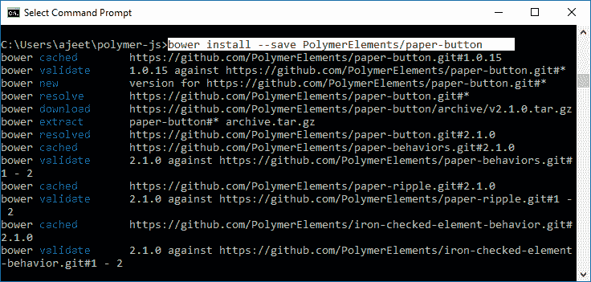
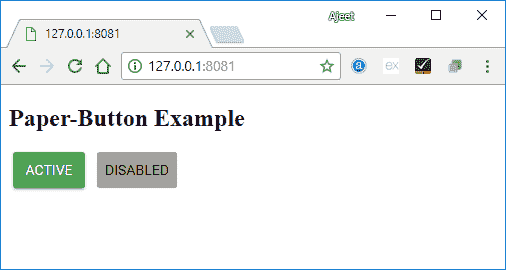

# PolymerPaper纽扣

> 原文：<https://www.javatpoint.com/polymer-paper-button>

PolymerPaper按钮是一个简单的按钮，从接触点有涟漪效应。要获取目录中的纸张按钮，您应该在命令提示符下使用以下命令。

```

bower install --save PolymerElements/paper-button

```



### 例子

以下示例指定了在 Polymer.js 中使用纸按钮元素。创建一个 index.html 文件，并在其中添加以下代码。

```

<!doctype html>
<html>
   <head>
      <link rel = 'import' href = 'my-app.html'>
   </head>
   <body>
      <h2>Paper-Button Example</h2>
      <my-app></my-app>
   </body>
</html>

```

现在，打开 my-app.html 文件，并在其中包含以下代码。

### 例子

```

<link rel = 'import' href = 'bower_components/polymer/polymer.html'>
<link rel = "import" href = "bower_components/paper-button/paper-button.html">
<link rel = "import" href = "bower_components/paper-styles/paper-styles.html">
<dom-module id = 'my-app'>
   <template>
      <div class = "container">
         <paper-button toggles raised class = "green">Active</paper-button>
         <paper-button disabled class = "disabled">Disabled</paper-button>
      </div>

      <div class = "container" ></div>
      <style is = "custom-style">
         #container {
            display: flex;
         }
         paper-button {
            font-family: 'Roboto', 'Noto', sans-serif;
            font-weight: normal;
            font-size: 14px;
            -webkit-font-smoothing: antialiased;
         }
         paper-button.green:hover {
            background-color: var(--paper-green-400);
         }
         paper-button.green {
            background-color: var(--paper-green-500);
            color: white;
         }
         paper-button.green[active] {
            background-color: var(--paper-red-500);
         }
         paper-button.disabled {
            color: black;
            background-color:#969696;
         }
      </style>
   </template>

   <script>
      Polymer ({
         is: 'my-app',
         ready: function() {
            this.async(function() {
            });
         }
      });
   </script>
</dom-module>

```

**输出:**

