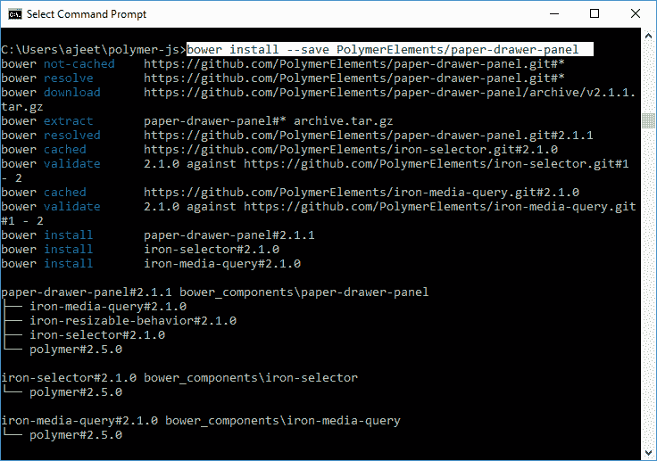
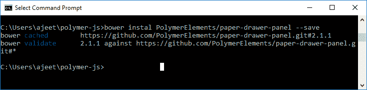

# PolymerPaper 抽屉面板

> 原文：<https://www.javatpoint.com/polymer-paper-drawer-panel>

Polymer 抽屉式面板是一种抽屉面板，用于滑入/滑出以隐藏/露出主面板。默认情况下，它的位置是主面板的左侧。抽屉将以狭窄的布局堆叠在主面板的顶部。

打开命令提示符，使用以下命令获取目录中的抽纸面板。

```

bower install --save PolymerElements/paper-drawer-panel

```

 

### 例子

创建一个 index.html 文件，并在其中添加以下代码，以查看在 Polymer.js 中纸抽屉面板元素的使用

```

<!doctype html>
<html>
   <head>
      <link rel = 'import' href = 'my-app.html'>
   </head>
   <body>    
      <my-app></my-app>
   </body>
</html>

```

现在，打开 my-app.html 文件，并在其中包含以下代码。

```

<link rel = 'import' href='bower_components/polymer/polymer.html'>
<link rel = "import" href="bower_components/paper-button/paper-button.html">
<link rel = "import" href = "bower_components/paper-styles/paper-styles.html">
<link rel = "import" href = "bower_components/paper-card/paper-card.html">
<link rel = "import" href = "bower_components/iron-icons/iron-icons.html">
<link rel = "import" href = "bower_components/iron-icons/communication-icons.html">
<link rel = "import" href = "bower_components/paper-checkbox/paper-checkbox.html">
<link rel = "import" href = "bower_components/paper-drawer-panel/paper-drawer-panel.html">

<dom-module id = 'my-app'>
   <template>
      <style is = "custom-style">          
         paper-button {
            color: white;
            margin: 10px;
            background-color: green;
            white-space: nowrap;
         }
         button {
            display: block;
            line-height: 40px;
            background-color: transparent;
            border: none;
            font-size: 14px;
            margin: 20px;
         }
         #close { 
            color: white;
            margin: 10px;
            background-color: red;
            white-space: nowrap;
         }
      </style>

      <paper-drawer-panel id = "paperDrawerPanel" force-narrow>
         <div drawer>
            <button id = "close" tabindex = "0" paper-drawer-toggle raised>Close Drawer</button>
            <h3>Welcome to Tutorials point</h3>
         </div>

         <div main>
            <div>
               <paper-button paper-drawer-toggle raised>Open Drawer</paper-button>
            </div>
         </div>
      </paper-drawer-panel>
   </template>

   <script>
      Polymer ({
         is: 'my-app',
         ready: function() {
            this.async(function() {         
            });
         }
      });
   </script>
</dom-module>

```