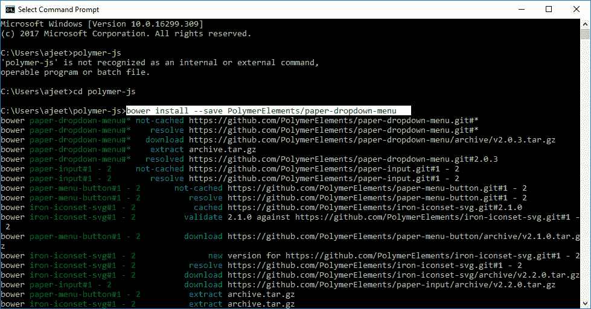
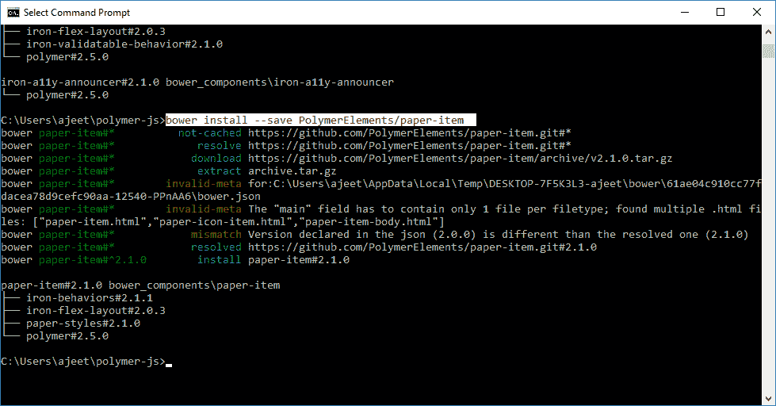
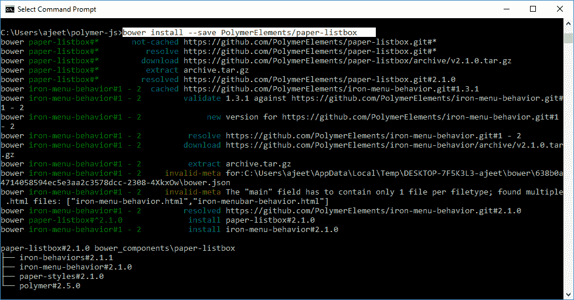
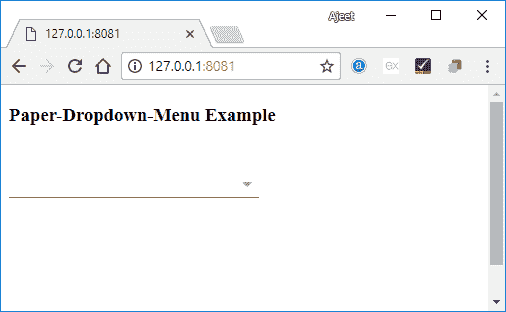

# PolymerPaper 下拉菜单

> 原文：<https://www.javatpoint.com/polymer-paper-dropdown-menu>

PolymerPaper 下拉菜单是一个简单的下拉菜单，用于处理可选内容。使用以下命令将此元素安装到项目目录中，并在应用程序中使用。

```

bower install --save PolymerElements/paper-dropdown-menu

```



```

bower install --save PolymerElements/paper-item

```



```

bower install --save PolymerElements/paper-listbox

```



### 例子

创建一个 index.html 文件，并在其中添加以下代码，以查看 paper-下拉菜单元素在 Polymer.js 中的使用

```

<!doctype html>
<html>
   <head>
      <link rel = 'import' href = 'my-app.html'>
   </head>
   <body>    
      <my-app></my-app>
   </body>
</html>

```

现在，打开 my-app.html 文件，并在其中包含以下代码。

```

<link rel = 'import' href='bower_components/polymer/polymer.html'>
<link rel = "import" href = "bower_components/paper-dropdown-menu/paper-dropdown-menu.html">
<link rel = "import" href = "bower_components/paper-item/paper-item.html">
<link rel = "import" href = "bower_components/paper-listbox/paper-listbox.html">

<dom-module id = 'my-app'>
   <template>
      <style is = "custom-style">
         paper-dropdown-menu {
            width:250px;
         }
         paper-dropdown-menu {
            height: 200px;
            display: block;
         }
      </style>

      <h3>Paper-Dropdown-Menu Example </h3>
      <paper-dropdown-menu>
         <paper-listbox class = "dropdown-content" selected = "1">
            <paper-item>Java Tutorial</paper-item>
            <paper-item>C Tutorial</paper-item>
            <paper-item>PHP Tutorial</paper-item>
            <paper-item>C++ Tutorial</paper-item>
         </paper-listbox>
      </paper-dropdown-menu>
   </template>

   <script>
      Polymer ({
         is: 'my-app', ready: function() {
            this.async(function() {         
            });
         }
      });
   </script>
</dom-module>

```

**输出:**

