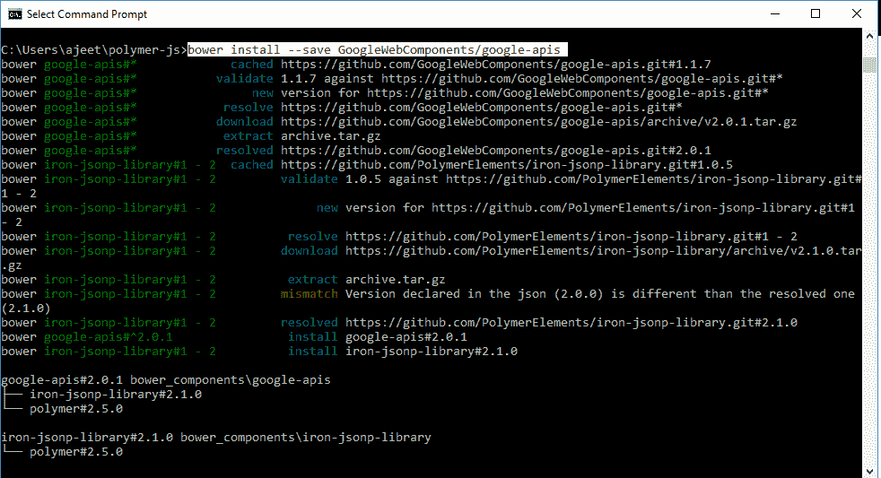

# 聚合物谷歌客户端加载程序

> 原文：<https://www.javatpoint.com/polymer-google-client-loader>

在 Polymer.js 中，谷歌客户端加载器用于加载特定的客户端。它与谷歌应用编程接口和 JavaScript 客户端库一起使用。

运行以下命令在项目目录中安装 polymer _ Google-client-loader element。之后，您可以在应用程序中使用这个元素:

```

bower install --save GoogleWebComponents/google-apis

```



它将在 bower_components 文件夹下安装 polymer_google-client-loader 的所有相关元素。

### 示例:

创建一个 index.html 文件，并在其中添加以下代码，以查看谷歌客户端加载器元素在聚合体中的使用

```

<html>
<head>
<script src = "bower_components/webcomponentsjs/webcomponents-lite.js"></script>
<link rel = "import" href = "bower_components/google-apis/google-apis.html">
</head>

<body>
<div id = "loadedmsg"></div>
<template  id = "googleclient" is = "dom-bind">
<google-client-loader id = "shortener"
            name = "urlshortener"
            version = "v1"
            on-google-api-load = "loadedShortener">
</google-client-loader>

<google-js-api    
            on-js-api-load = "msgloaded">
</google-js-api>

<google-plusone-api  
            on-api-load = "msgloaded">
</google-plusone-api>
</template>

<script>
         var googleclient = document.querySelector('#googleclient');
         googleclient.loadedShortener  = function(event) {
            var request = event.target.api.url.get ({
               shortUrl: 'http://goo.gl/fbsS'
            })
            request.execute(function(resp) {
            });
         };
         googleclient.msgloaded = function(e) {
            document.querySelector('#loadedmsg').innerHTML +=
               e.target.localName + ' is loaded' + '<br>';
         };
</script>
</body>
</html>

```