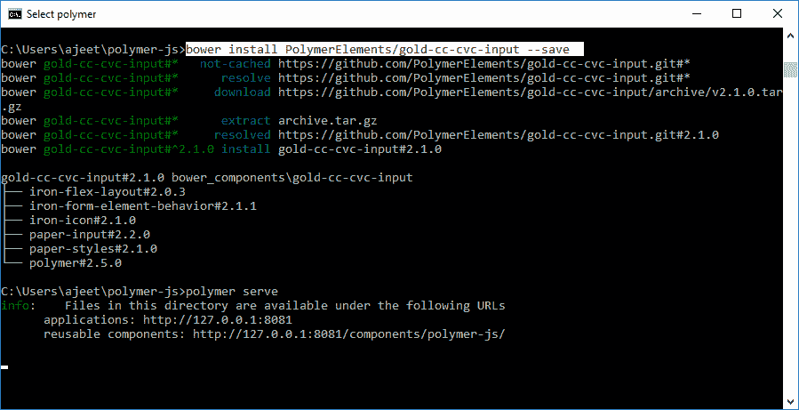
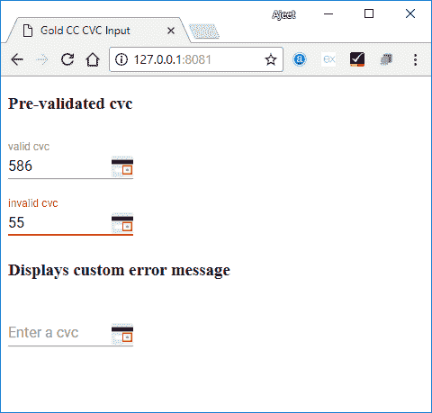

# PolymerGold CC CVC 输入

> 原文：<https://www.javatpoint.com/polymer-gold-cc-cvc-input>

PolymerGold-cc-cvc 输入是一种材料设计风格的单线输入，用于在您输入代码时验证信用卡。

**语法:**

```

<gold-cc-cvc-input label = "cvc"></gold-cc-cvc-input>

```

在这里，CVC 是一个可选的默认标签。

通过绑定属性卡片类型，也可以将<gold-cc-input>和<gold-cc-cvc-input>一起使用。</gold-cc-cvc-input></gold-cc-input>

```

<gold-cc-input card-type = "{{cardType}}"></gold-cc-input>
<gold-cc-cvc-input card-type = "[[cardType]]"></gold-cc-cvc-input>

```

## 确认

对于大多数有效的卡，CVC 输入接受 3 位数的长码，但对于有效的美国运通 CVC，则认为是 4 位数。

您可以使用 **validate()** 方法手动验证它，如果它有效，则返回 true 否则，如果它无效，则返回 false。您可以使用自动验证和必需的属性来自动验证输入。

### 例子

运行以下命令在项目目录中安装 gold-cc-cvc-input 元素。之后，您可以在应用程序中使用这个元素:

```

bower install PolymerElements/gold-cc-cvc-input -save

```



它将在 bower_components 文件夹下安装 polymer_ gold-cc-cvc-input 的所有相关元素。

创建一个 index.html 文件，并在其中添加以下代码，以查看 gold-cc-cvc-input 元素在 Polymer.js 中的用法

```

<!DOCTYPE html>
<html>
   <head>
      <title>Gold CC CVC Input</title>
      <meta charset = "utf-8">
      <script src = "bower_components/webcomponentsjs/webcomponents-lite.min.js"></script>
      <link rel = "import" href = "bower_components/polymer/polymer.html">
      <link rel = "import" 
         href = "bower_components/gold-cc-cvc-input/gold-cc-cvc-input.html">
   </head>

   <body>
      <h3>Pre-validated cvc</h3>
      <gold-cc-cvc-input
         label = "valid cvc"
         value = "586"
         auto-validate  
         style = "width:30%; display:inline-block;">
      </gold-cc-cvc-input><br/>

      <gold-cc-cvc-input
         label = "invalid cvc"
         value = "55"
         auto-validate  
         style = "width:30%; display:inline-block;">
      </gold-cc-cvc-input>	

      <h3>Displays custom error message</h3>
      <gold-cc-cvc-input 
         label = "Enter a cvc" 
         auto-validate 
         error-message = "Please enter a valid cvc" 
         style = "width:30%; display:inline-block;">
      </gold-cc-cvc-input>
   </body>
</html>

```

**输出:**

