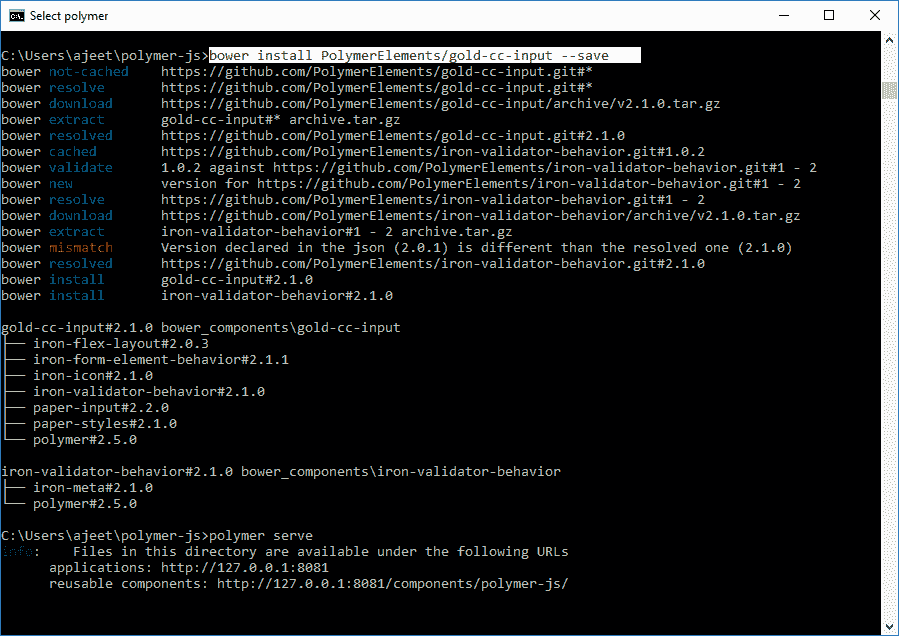
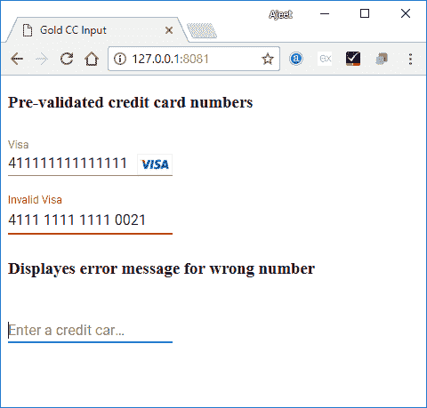

# 聚合物金 CC 输入

> 原文：<https://www.javatpoint.com/polymer-gold-cc-input>

聚合物金 CC 输入是一个材质设计风格的输入文本字段。用于输入信用卡号。当用户键入代码时，每 4 位数字后会添加一个空格。

**语法:**

```

<gold-cc-input></gold-cc-input>

```

该元素有一个可选标签，默认为“卡号”，如下图所示-

```

<gold-cc-input label = "CC"></gold-cc-input>

```

## 确认

我们可以通过使用 Luhn 校验和来验证输入的信用卡号以及卡的类型是否有效。

如果要手动验证，可以使用 validate()方法，如果有效，则返回 true 如果无效，则返回 false。您还可以使用自动验证和必需属性来自动验证输入。

它包括不同类型的信用卡，如美国运通、diners_club、discover、jcb、laser、maestro、mastercard、visa、visa _ electron 等。这些是通过卡片类型属性提供的。

### 例子

运行以下命令在项目目录中安装 gold-cc-input 元素。之后，您可以在应用程序中使用这个元素:

```

bower install PolymerElements/gold-cc-input -save

```



它将在 bower_components 文件夹下安装 polymer-gold-cc-input 的所有相关元素。

创建一个 index.html 文件，并在其中添加以下代码，以查看 gold-cc-input 元素在 Polymer.js 中的用法

```

<!DOCTYPE html>
<html>
   <head>
      <title>Gold CC Input</title>
      <meta charset = "utf-8">
      <script src = "bower_components/webcomponentsjs/webcomponents-lite.min.js"></script>
      <link rel = "import" href = "bower_components/polymer/polymer.html">
      <link rel = "import" href = "bower_components/gold-cc-input/gold-cc-input.html">
   </head>
   <body>
      <h3>Pre-validated credit card numbers</h3>
      <gold-cc-input 
         label = "Visa" 
         auto-validate 
         value = "4111111111111111" 
         style = "width:40%; display:inline-block;">
      </gold-cc-input><br/>	
      <gold-cc-input 
         label = "Invalid Visa" 
         auto-validate 
         value = "4111 1111 1111 0021" 
         style = "width:40%; display:inline-block;">
      </gold-cc-input>	
      <h3>Displayes error message for wrong number</h3>
      <gold-cc-input 
         label = "Enter a credit card number" 
         auto-validate 
         error-message = "Please enter a valid credit card number" 
         style = "width:40%; display:inline-block;">
      </gold-cc-input>
   </body>
</html>

```

**输出:**

