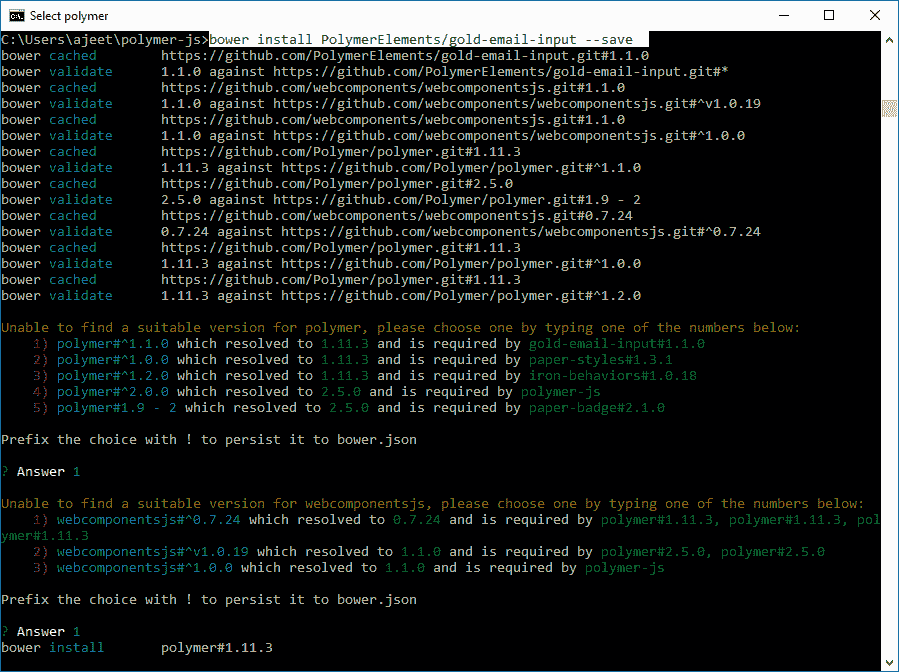
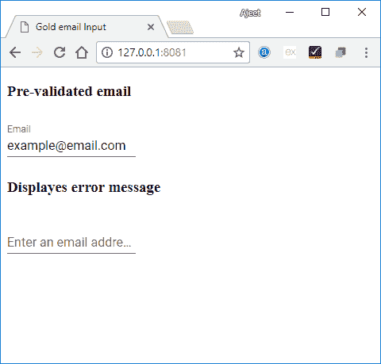

# 聚合物黄金电子邮件输入

> 原文：<https://www.javatpoint.com/polymer-gold-email-input>

polymer gold 电子邮件输入元素是一个用于指定电子邮件地址的简单文本字段。它是在材料设计风格。

**语法:**

```

<gold-email-input></gold-email-input>

```

黄金电子邮件输入元素有一个可选标签，默认情况下是“电子邮件”:

```

<gold-email-input label = "Your email address"></gold-email-input>

```

## 确认

validate()方法用于手动验证电子邮件地址。如果有效，则返回 true 否则，如果无效，则返回 false。您可以使用自动验证和必需的属性来自动验证输入。

### 例子

运行以下命令在项目目录中安装 gold-email-input 元素。之后，您可以在应用程序中使用这个元素:

```

bower install PolymerElements/gold-email-input -save

```



它将在 bower_components 文件夹下安装 polymer_ gold-email-input 的所有相关元素。

创建一个 index.html 文件，并在其中添加以下代码，以查看在 Polymer.js 中黄金电子邮件输入元素的用法

```

<!DOCTYPE html>
<html>
   <head>
      <title>Gold email Input</title>
      <meta charset = "utf-8">
      <script src = "bower_components/webcomponentsjs/webcomponents-lite.min.js"></script>
      <link rel = "import" href = "bower_components/polymer/polymer.html">
      <link rel = "import" href = "bower_components/gold-email-input/gold-email-input.html">
   </head>

   <body>
      <h3>Pre-validated email</h3>
      <gold-email-input
         value = "example@email.com"
         auto-validate  
         style = "width:35%; display:inline-block;">
      </gold-email-input><br/>

      <h3>Displayes error message</h3>
      <gold-email-input 
         label = "Enter an email address" 
         auto-validate 
         error-message = "Please enter a valid email"
         style = "width:35%; display:inline-block;">
      </gold-email-input>	
   </body>
</html>

```

**输出:**

