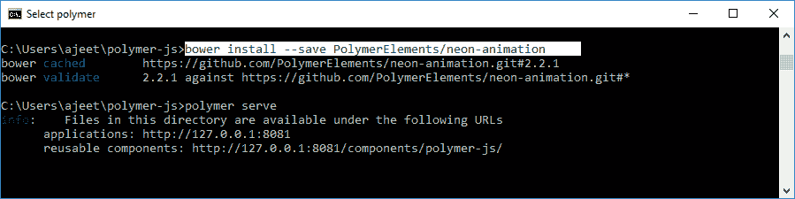
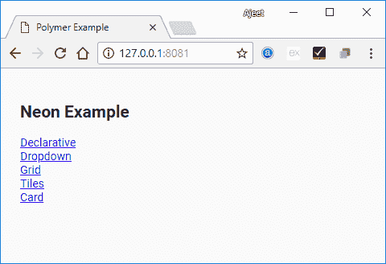

# PolymerNeon元素

> 原文：<https://www.javatpoint.com/polymer-neon-element>

PolymerNeon动画元素用于通过使用网络动画来实现到Polymer元素的动画过渡

运行以下命令在应用程序中使用 neon 动画，并将其安装在您的目录中。

```

bower install --save PolymerElements/neon-animation

```



## 例子

它将在 bower_components 文件夹下安装霓虹动画的所有相关元素。

创建一个 index.html 文件，并在其中添加以下代码，以查看 neon 动画元素在 Polymer.js 中的使用

```

<!doctype html>
<html>
   <head>
      <title>Polymer Example</title>
      <script src = "bower_components/webcomponentsjs/webcomponents-lite.js"></script>
      <link rel = "import" href = "bower_components/polymer/polymer.html">
      <link rel = "import" href = "bower_components/paper-styles/demo-pages.html">
      <link rel = "import" href = "bower_components/neon-animation/web-animations.html">
   </head>

   <body>
      <h2>Neon Example</h2>
      <a href = "bower_components/neon-animation/demo/declarative/index.html">Declarative</a>
      <br>
      <a href = "bower_components/neon-animation/demo/dropdown/index.html">Dropdown</a>
      <br>
      <a href = "bower_components/neon-animation/demo/grid/index.html">Grid</a>
      <br>
      <a href = "bower_components/neon-animation/demo/tiles/index.html">Tiles</a>
      <br>
      <a href = "bower_components/neon-animation/demo/card/index.html">Card</a>
   </body>
</html>

```

**输出:**



## Javatpoint 服务

JavaTpoint 提供了太多高质量的服务。请在[【电子邮件保护】](/cdn-cgi/l/email-protection)上发送邮件给我们，以获取有关特定服务的更多信息。

*   网站设计
*   网站开发
*   Java 开发
*   PHP 开发
*   博客
*   平面设计
*   标志；徽标
*   数字营销
*   页面内和页面外SEO
*   (法)离开(our prendre conge)
*   内容开发
*   企业培训
*   课堂和在线培训
*   数据输入

## 大学校园培训

JavaTpoint 提供核心 Java、高级 Java、。Net、安卓、Hadoop、PHP、Web 技术、Python。请在[【邮件保护】](/cdn-cgi/l/email-protection)
发送您的要求，时间:1 周至 2 周

<sup style="font:16px arial;">Like/Subscribe us for latest updates or newsletter</sup> [](https://feeds.feedburner.com/javatpointsonoo) [](https://feedburner.google.com/fb/a/mailverify?uri=javatpointsonoo) [](https://www.facebook.com/javatpoint) [](https://twitter.com/pagejavatpoint) [](https://www.youtube.com/channel/UCUnYvQVCrJoFWZhKK3O2xLg) [](https://javatpoint.blogspot.com)

<footer class="footer1">

### 学习教程

[Learn Java](https://www.javatpoint.com/java-tutorial)[Learn Data Structures](https://www.javatpoint.com/data-structure-tutorial)[Learn C Programming](https://www.javatpoint.com/c-programming-language-tutorial)[Learn C++ Tutorial](https://www.javatpoint.com/cpp-tutorial)[Learn C# Tutorial](https://www.javatpoint.com/c-sharp-tutorial)[Learn PHP Tutorial](https://www.javatpoint.com/php-tutorial)[Learn HTML Tutorial](https://www.javatpoint.com/html-tutorial)[Learn JavaScript Tutorial](https://www.javatpoint.com/javascript-tutorial)[Learn jQuery Tutorial](https://www.javatpoint.com/jquery-tutorial)[Learn Spring Tutorial](https://www.javatpoint.com/spring-tutorial)

### 我们的网站

[Javatpoint.com](https://www.javatpoint.com)[Hindi100.com](https://www.hindi100.com)[Lyricsia.com](https://www.lyricsia.com)[Quoteperson.com](https://www.quoteperson.com)[Jobandplacement.com](https://www.jobandplacement.com)

### 我们的服务

网站开发

安卓开发

网站设计

数字营销

暑期培训

工业培训

大学校园培训

### 接触

地址:三区二楼 13 层

印度 Noida，201301

联系电话:0120-4256464，9990449935

[Contact Us](https://www.javatpoint.com/contact-us) [Subscribe Us](https://www.javatpoint.com/subscribe.jsp) [Privacy Policy](https://www.javatpoint.com/privacy-policy)[Sitemap](https://www.javatpoint.com/sitemap.xml)
[About Me](https://www.javatpoint.com/sonoo-jaiswal)</footer>

<footer class="footer2">

版权所有 2011-2021 www.javatpoint.com。保留所有权利。由 JavaTpoint 开发。

</footer>