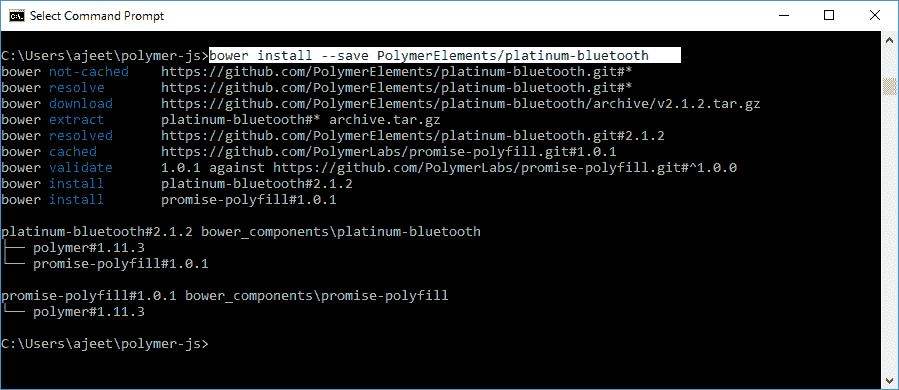
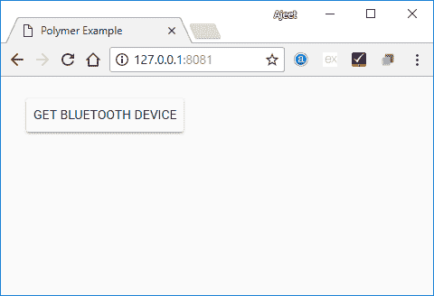

# PolymerPlatium蓝牙

> 原文：<https://www.javatpoint.com/polymer-platinum-bluetooth>

PolymerPlatium蓝牙元件用于与附近的蓝牙设备交互。

运行以下命令在您的应用程序中使用白金蓝牙，并将其安装在您的目录中。

```

bower install --save PolymerElements/platinum-bluetooth 

```



## 例子

它将在 bower_components 文件夹下安装铂金蓝牙的所有相关元素。

创建一个 index.html 文件，并在其中添加以下代码，以查看 Polymer.js 中白金蓝牙元素的用法

```

<!doctype html>
<html>
   <head>
      <title>Polymer Example</title>
      <script src = "bower_components/webcomponentsjs/webcomponents-lite.js"></script>
      <link rel = "import" href = "bower_components/polymer/polymer.html">
      <link rel = "import" href = "bower_components/paper-styles/demo-pages.html">
      <link rel = "import" href = "bower_components/paper-button/paper-button.html">
      <link rel = "import" href = "bower_components/platinum-bluetooth/platinum-bluetooth-device.html">
   </head>  
   <body>
      <section>
         <paper-button raised>Get bluetooth device</paper-button>
      </section>
      <script src = "platinum_bluetooth.js"></script>
   </body>
</html>

```

现在，创建另一个名为 platinum_bluetooth.js 的文件，并包含以下代码:

```

document.addEventListener('WebComponentsReady', function() {
   var mybatteryDevice = document.querySelector('platinum-bluetooth-device');
   var mybutton = document.querySelector('paper-button');
   mybutton.addEventListener('click', function() {
      console.log('The requested bluetooth device advertising a battery service...');
      mybatteryDevice.request().then(function(device) {
         console.log('Bluetooth device has been found...');
         console.log('The device name is: ' + device.name);
      })
      .catch(function(error) {
         console.error('Sorry!No device found...', error);
      });
   });
});

```

**输出:**

