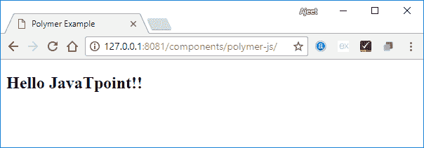

# Polymer定制元素

> 原文：<https://www.javatpoint.com/polymer-custom-elements>

Polymer.js 框架便于您使用标准的 HTML 元素创建自定义元素。

### 自定义元素的特性:

*   它便于您使用关联类来命名自定义元素。
*   当您更改自定义元素实例的状态时，它将请求生命周期回调。
*   如果更改实例的属性，将会请求回调。

您可以使用 ES6 类定义自定义元素。类可以像这样与自定义元素关联:

```

//ElementDemo class is extending the HTMLElement 
class ElementDemo extends HTMLElement { 
   // code here
};
//link the new class with an element name
window.customElements.define('element-demo', ElementDemo);

```

我们可以使用自定义元素作为标准元素:

```

<element-demo></element-demo> 

```

#### 注意:自定义元素名称应该以小写字母开头，并且在名称之间包含破折号。

### 自定义元素生命周期

定制元素生命周期提供了一组定制元素反应，它们负责元素生命周期中的变化

以下是这些自定义元素反应的列表:

**表:**

| 索引 | 反应 | 描述 |
| 1) | 构造器 | 当您创建一个元素或定义先前创建的元素时，会调用这个元素的反应。 |
| 2) | connectedCallback | 当您向文档中添加元素时，会调用该元素的反应。 |
| 3) | disconnectedCallback | 当您从文档中移除元素时，会调用该元素的反应。 |
| 4) | attributeChangedCallback | 每当您更改、追加、移除或替换文档中的元素时，都会调用此元素的反应。 |

## 元素升级

我们可以在通过规范定义自定义元素之前使用它们，并且元素的任何现有实例都将通过向该元素添加定义而升级到自定义类。

自定义元素状态包含以下值-

**未自定义:**有效的自定义元素名称或者是内置元素，或者是未知元素，不能成为自定义元素。

**未定义:**元素可以有有效的自定义元素名称，但不能定义。

**自定义:**元素可以有有效的自定义元素名称，可以定义和升级。

**失败:**尝试升级无效类的失败元素。

## 定义元素

我们可以通过创建一个扩展聚合体的类来定义一个自定义元素。元素，并将该类传递给 customElements.define 方法。类包含一个 getter 方法，该方法返回自定义元素的 HTML 标记名。

### 例如:

```

//ElementDemo class is extending the Polymer.Element 
class ElementDemo extends Polymer.Element {
   static get is() { return 'element-demo'; }
   static get properties() {
      . . .
      . . .
   }
   constructor(){
      super();
      . . .
      . . .
   }
   . . .
   . . .
}
//Associate the new class with an element name
window.customElements.define(ElementDemo.is, ElementDemo);
// create an instance with createElement
var el1 = document.createElement('element-demo');

```

## 进口和原料药

我们可以通过指定三个 HTML 导入来定义Polymer元素:

**高分子元素. html:** 用于指定高分子元素基类。

**legacy-element.html:** 用于扩展 Polymer。使用Polymer的元素。遗留元素基类，并添加 1.x 兼容的遗留 API。它还通过定义传统的 Polymer()工厂方法来创建混合元素。

**Polymer. html:** 它用于包含Polymer基类和辅助元素，这些元素包含在 1 . x polymer.html 中。

### 在主 HTML 文档中定义一个元素

函数的作用是:在主 HTML 文档中定义一个元素。

### 例子

让我们举一个例子来定义主 HTML 文档中的一个元素。创建一个 index.html 文件，并使用以下代码:

```

<!doctype html>
<html lang = "en">
   <head>
      <title>Polymer Example</title>
      <script src = "bower_components/webcomponentsjs/webcomponents-lite.js"></script>
      <link rel = "import" href = "bower_components/polymer/polymer.html">
      <link rel = "import" href = "define-element.html">
   </head> 
   <body>
      <define-element></define-element>
   </body>
</html>

```

现在创建一个名为**define-element.html**的自定义元素，并使用以下代码。

```

<dom-module id = "define-element">
   <template>
      <h2>Hello JavaTpoint!!</h2>
   </template>
   <script>
      HTMLImports.whenReady(function(){
         Polymer ({
            is: "define-element"
         })
      })  
   </script>
</dom-module>

```

**输出:**

