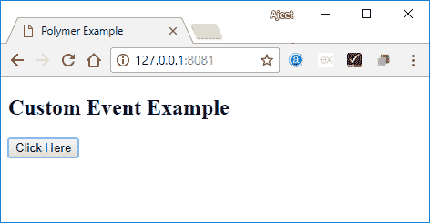
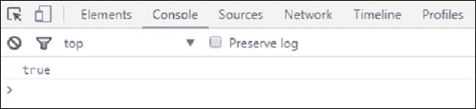
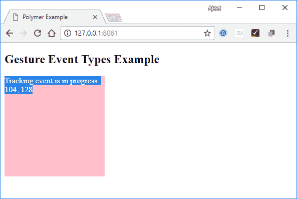
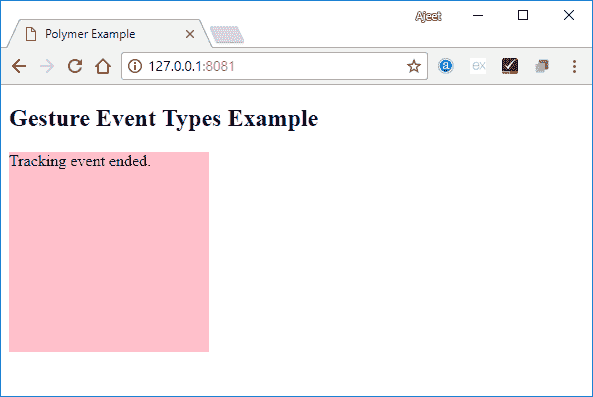

# 聚合物事件

> 原文：<https://www.javatpoint.com/polymer-events>

聚合元素使用聚合事件来与父元素的 DOM 树的状态变化进行通信。Polymer 使用标准的 DOM APIs 来创建、调度和监听事件。

Polymer 使用带注释的事件侦听器，并将它们定义为 DOM 模板的小块。可以使用模板中的 onevent 注释将它们添加到 DOM 子对象中。

## 添加事件侦听器

有两种方法可以添加事件侦听器:

通过提供将事件映射到事件处理程序函数名的 listeners 对象，可以将事件侦听器添加到 host 元素中。

事件监听器也可以添加到**中的任何元素中。$** 集合使用语法

```

nodeId.eventName.

```

### 例子

```

<dom-module id="x-custom">
  <template>
    <div>I will respond</div>
    <div>to a tap on</div>
    <div>any of my children!</div>
    <div id="special">I am special!</div>
  </template>
  <script>
    Polymer({
      is: 'x-custom',
      listeners: {
        'tap': 'regularTap',
        'special.tap': 'specialTap'
      },
      regularTap: function(e) {
        alert("Thank you for tapping");
      },
      specialTap: function(e) {
        alert("It was special tapping");
      }
    });
  </script>
</dom-module>

```

## 添加带注释的事件侦听器

通过在模板中使用事件上的注释，可以将事件侦听器添加到本地 DOM 子对象中。通过使用此方法，您不需要给元素一个 id 来绑定事件侦听器。

### 例子

```

<dom-module id="x-custom">
  <template>
    <button on-tap="handleTap">Kick Me</button>
  </template>
  <script>
    Polymer({
      is: 'x-custom',
      handleTap: function() {
        alert('Ow!');
      }
    });
  </script>
</dom-module>

```

## 添加和删除侦听器

listen()和 unlisten()方法用于强制添加和移除侦听器。

```

this.listen(this.$.myButton, 'tap', 'onTap');
this.unlisten(this.$.myButton, 'tap', 'onTap');

```

#### 注意:如果一个监听器被强制添加，它必须被强制移除。这通常在附加的和分离的回调中完成。

如果使用侦听器对象或带注释的事件侦听器，聚合体会自动添加和移除事件侦听器。

## 自定义事件

通过使用标准的 custom event 构造函数和宿主元素中的 dispatchEvent()方法，可以触发或激发自定义事件。

让我们举一个从宿主元素触发自定义事件的例子。创建一个名为 index.html 的文件，并在其中使用以下代码。

```

<!doctype html>
<html>
   <head>
      <title>Polymer Example</title>
      <script src = "bower_components/webcomponentsjs/webcomponents-lite.js"></script>
      <link rel = "import" href = "bower_components/polymer/polymer.html">
      <link rel = "import" href = "custom-event.html">
   </head>  
   <body>
      <custom-event></custom-event>
      <script>
         document.querySelector('custom-event').addEventListener('customValue', function (e) {
            console.log(e.detail.customval); // true
         })
      </script>
   </body>
</html>

```

现在，创建另一个名为 custom-event.html 的文件，并在其中使用以下代码。

```

<link rel = "import" href = "bower_components/polymer/polymer-element.html">
//it specifies the start of an element's local DOM
<dom-module id = "custom-event">
   <template>
      <h2>Custom Event Example</h2>
      <button on-click = "myClick">Click Here</button>
   </template>

   <script>
      Polymer ({
         is: "custom-event", myClick(e) {
            this.dispatchEvent(new CustomEvent('customValue', {detail: {customval: true}}));
         }
      });
   </script>
</dom-module>

```



现在，单击“单击此处”按钮后，您可以看到自定义事件的真实值。



## 手势事件

手势事件用于使用户在触摸和移动设备上的交互更加愉快。**例如:**轻击事件是手势事件的一部分，在移动和桌面设备上持续触发。

以下是不同支持的手势事件类型列表:

**表:**

| 索引 | 事件类型 | 描述 | 性能 |
| 1) | 向下 | 向下事件类型用于指定手指/按钮已经向下移动。 | **x:** 它为一个事件提供 clientX 坐标。
**y:** 它提供了事件的客户端坐标。
**sourceEvent:** 指定由 DOM 事件引起的下移动作。 |
| 2) | 起来 | 向上事件类型用于指定手指/按钮已经向上移动。 | **x:** 它为一个事件提供 clientX 坐标。
**y:** 它提供了事件的客户端坐标。
**sourceEvent:** 指定 DOM 事件引起的 up 动作。 |
| 3) | 龙头 | 点击事件类型用于指定上下动作的发生。 | **x:** 它为一个事件提供 clientX 坐标。
**y:** 它提供了事件的客户端坐标。
**sourceEvent:** 用于指定 DOM 事件引起的敲击动作。 |
| 4) | Rails | 跟踪事件类型用于跟踪手指/按钮按下时的移动。 | **x:** 用于提供事件的 clientX 坐标。
**y:** 用于为事件提供客户端坐标。
**状态:**是指定跟踪状态的类型字符串。
**dx:** 当你跟踪第一个事件时，它会以像素为单位水平变化。
**dy:** 当你跟踪第一个事件时，它会以像素为单位垂直变化。
**ddx:** 当你跟踪最后一个事件时，它以像素为单位水平变化。
**ddy:** 当你跟踪最后一个事件时，它会以像素为单位垂直变化。
**悬停():**用于确定当前悬停的元素。 |

### 例子

让我们举一个例子来演示模板中手势事件类型的使用。创建一个名为 index.html 的文件，并在其中使用以下代码。

```

<!doctype html>
<html>
   <head>
      <title>Polymer Example</title>
      <script src = "bower_components/webcomponentsjs/webcomponents-lite.js"></script>
      <link rel = "import" href = "bower_components/polymer/polymer.html">
      <link rel = "import" href = "gesture-event.html">
   </head>
   <body>
      <gesture-event></gesture-event>
   </body>
</html>

```

创建另一个名为 gesture-event.html 的文件，其代码如下。

```

<link rel = "import" href = "bower_components/polymer/polymer-element.html">

//it specifies the start of an element's local DOM
<dom-module id = "gesture-event">
   <template>
      <style>
         #box {
            width: 200px;
            height: 200px;
            background: pink;
         }
      </style>

      <h2>Gesture Event Types Example</h2>
      <div id = "box" on-track = "myClick">{{track_message}}</div>
   </template>

   <script>
      Polymer ({
         is: 'gesture-event', myClick: function(e) {
            switch(e.detail.state) {
               case 'start':
               this.track_message = 'Tracking event started.';
               break;
               case 'track':
                  this.track_message = 'Tracking event is in progress. ' +
                  e.detail.x + ', ' + e.detail.y;
               break;
               case 'end':
                  this.track_message = 'Tracking event ended.';
               break;
            }
         }
      });
   </script>
</dom-module>

```

**输出:**

在元素中悬停并拖动鼠标，它将显示事件跟踪的进度，如下所示:



当您停止拖动鼠标时，它将结束元素上的跟踪事件，如下所示:

