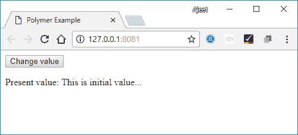
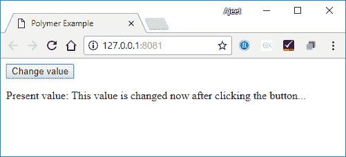

# Polymer数据系统

> 原文：<https://www.javatpoint.com/polymer-data-system>

Polymer通过根据数据变化采取各种行动，帮助您改变元素的属性。这些行动是:

**观察器:**用于在数据发生变化时调用回调。

**计算属性:**用于根据其他属性计算虚拟属性。每当输入数据改变时，它也会重新计算它们。

**数据绑定:**用于在数据发生变化时，使用标注更新 DOM 节点的属性、属性或文本内容。

## 数据路径

Path 是数据系统中的一个字符串，用于提供与范围相关的属性或子属性，其中范围可以是宿主元素。

数据绑定是一种用于将路径链接到不同元素的技术。如果元素与数据绑定相关联，则可以将数据从一个元素更改为另一个元素。

### 例子

```

<dom-module id = "my-name">
   <template>
      . . .
      <address-card address="{{myAddress}}"></address-card>
   </template>
   . . .
</dom-module>

```

在上面的例子中，你可以看到有两条路径(我的名字和地址卡)与数据绑定相连，其中<address-card>在<my-name>元素的本地 DOM 中。</my-name></address-card>

## Polymer中的路径段

以下是Polymer中特殊类型路径段的列表:

*   您可以使用通配符(*)作为路径中的最后一段。
*   通过将字符串拼接作为路径中的最后一段，可以显示给定数组的数组突变。
*   数组项目路径指定数组中的项目，数字路径段指定数组索引。

在数据路径中，路径段是一个属性名，它包括两种类型的路径:

*   由点分隔的路径段。例如:“苹果.葡萄.橘子”。
*   在字符串数组中，每个数组元素要么是路径段，要么是点状路径。例如:[“苹果”，“葡萄”，“橘子”]，[“苹果.葡萄”，“橘子”]。

## 数据流

让我们举个例子来看看数据流的双向绑定。创建一个名为 index.html 的文件，并在其中使用以下代码。

```

<!doctype html>
<html>
   <head>
      <title>Polymer Example</title>
      <script src = "bower_components/webcomponentsjs/webcomponents-lite.js"></script>
      <link rel = "import" href = "bower_components/polymer/polymer.html">
      <link rel = "import" href = "my-element.html">
   </head> 
   <body>
      <my-element></my-element>
   </body>
</html>

```

创建另一个名为 my-element.html 的文件，并使用以下代码。

```

<link rel = "import" href = "bower_components/polymer/polymer-element.html">
<link rel = "import" href = "prop-element.html">
//it specifies the start of an element's local DOM
<dom-module id = "my-element">
   <template>
      <prop-element my-prop="{{demoProp}}"></prop-element>
      <p>
         Present value: <span>{{demoProp}}</span>
      </p>
   </template> 
   <script>
      Polymer ({
         is: "my-element", properties: {
            demoProp: String
         }
      });
   </script>
</dom-module>

```

现在，再创建一个名为 prop-element.html 的文件，并使用以下代码:

```

//it specifies the start of an element's local DOM
<dom-module id = "prop-element">
   <template>
      <button on-click = "onClickFunc">Change value</button>
   </template>
   <script>
      Polymer ({
         is: "prop-element", properties: {
            myProp: {
               type: String,
               notify: true,
               readOnly: true,
               value: 'This is initial value...'
            }
         },
         onClickFunc: function(){
            this._setMyProp('This is new value after clicking the button...');
         }
      });
   </script>
</dom-module>

```

**输出:**



单击按钮，您可以看到值的变化:



## 链接两条路径

使用 linkPaths()方法将两个路径链接到相同的对象。您需要使用数据绑定来生成元素之间的更改。

### 例子

```

linkPaths('myTeam', 'players.5');

```

可以使用如下所示的取消链接路径方法删除路径链接:

```

unlinkPaths('myTeam');

```

## 观察者

观察器是元素的数据调用方法发生的变化。以下是观察员的类型。

*   简单观察器用于观察单个属性。
*   复杂观察器用于观察多个属性或路径。

## 数据绑定

数据绑定用于连接本地 DOM 中宿主元素的属性。

可以通过向 DOM 模板添加注释来创建数据绑定，如下所示:

```

<dom-module id = "myhost-element">
   <template>
      <target-element target-property = "{{myhostProperty}}"></target-element>
   </template>
</dom-module>

```

本地 DOM 模板中数据绑定的剖析:

```

property-name=annotation-or-compound-binding

```

或者

```

attribute-name$=annotation-or-compound-binding

```

绑定的左侧指定目标属性，而绑定的右侧指定绑定注释或复合绑定。绑定批注中的文本由双花括号({{ }})或双方括号([[ ]])分隔符括起来，复合绑定包括一个或多个字符串文字绑定批注。

下面是助手元素，用于数据绑定用例-

**模板中继器:**可以为数组中的每个项目创建模板内容的实例。

**数组选择器:**提供结构化数据数组的选择状态。

**条件模板:**如果条件为真，可以识别内容。

**自动绑定模板:**指定Polymer元素外的数据绑定。

如果助手元素更新了 dom 树，DOM 树会触发一个 DOM 改变事件。有时，您可以通过更改模型数据来与 DOM 交互，而不是通过与创建的节点交互。因此，您可以使用 dom-change 事件直接访问节点。