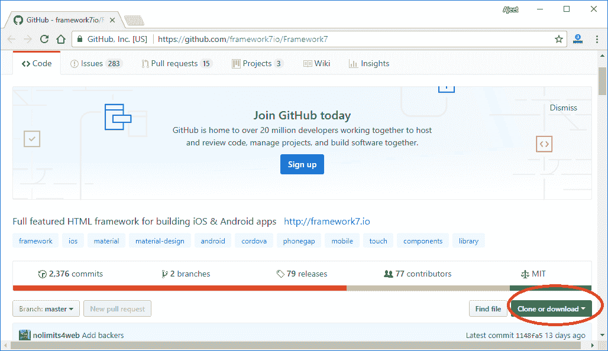
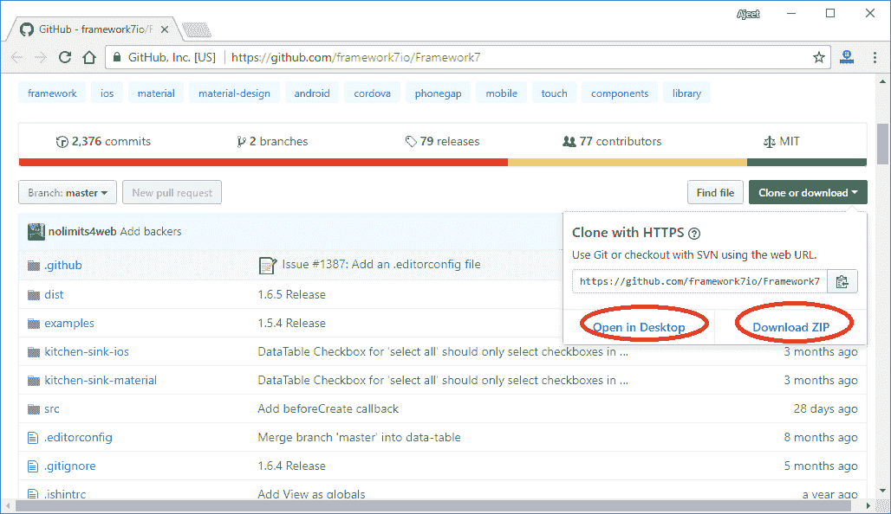
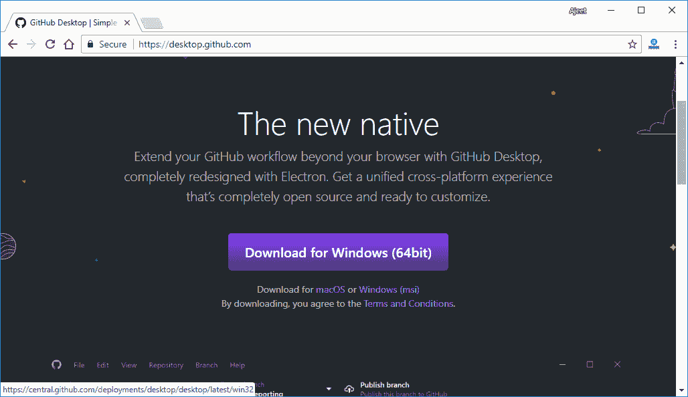
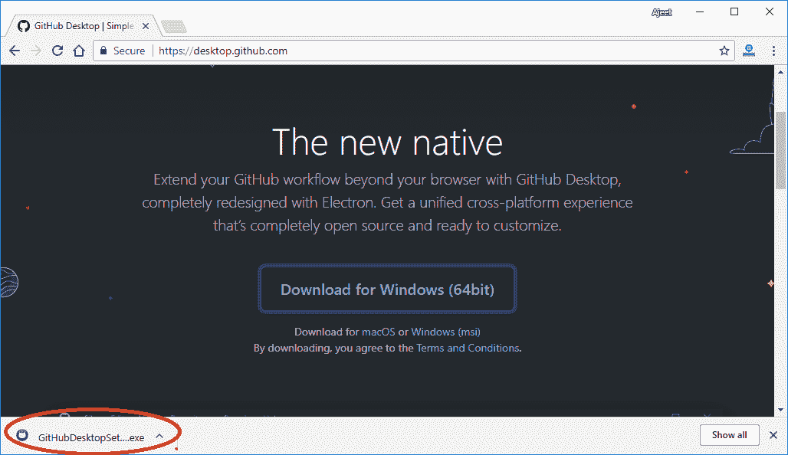
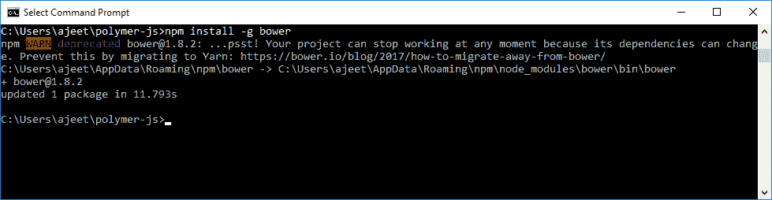
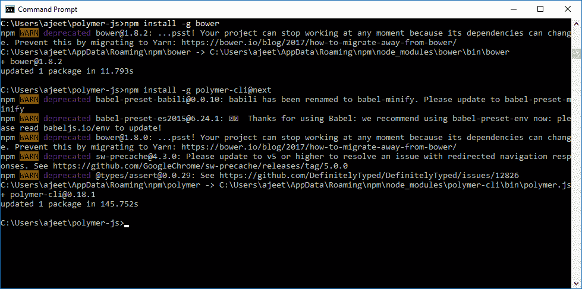
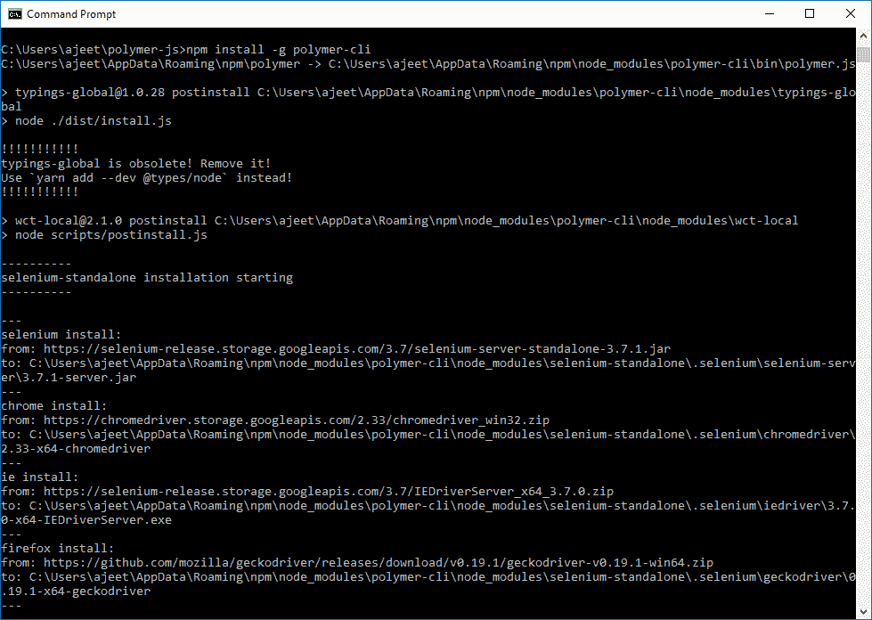
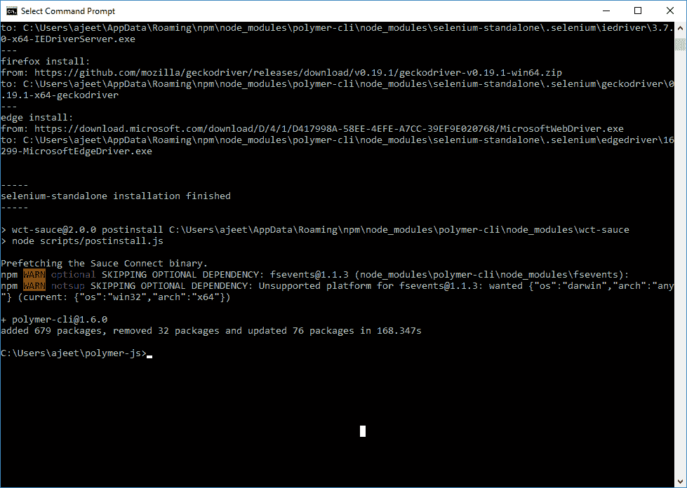
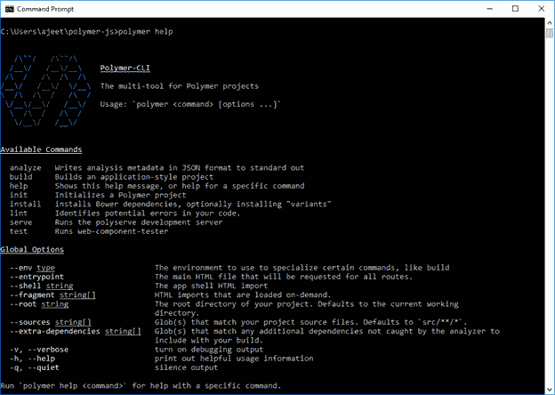

# Polymer工具

> 原文：<https://www.javatpoint.com/polymer-tools>

Polymer为开发、构建和优化Polymer元素和应用程序提供了许多工具。

### Polymer命令行界面

Polymer命令行界面可用于Polymer开发任务中的许多事情。

### 安装 Git

   

安装 Node.js 的活动 LTS 版本(4.x 或 6.x)。如何下载 https://www.javatpoint.com/install-nodejs 节点

安装最新版本的 Bower。

```

npm install -g bower

```

 

安装Polymer命令行界面。

```

npm install -g polymer-cli

```

 

你都准备好了。运行Polymer帮助查看命令列表。

Polymer帮助



Polymer命令行界面是Polymer项目中使用的命令行界面。它包括一个构建管道、一个用于创建元素和应用程序的样板生成器、一个链接器、一个开发服务器和一个测试运行器。

## Polymer命令行界面适用于两种类型的项目:

**元素项目:**在元素项目中，单个元素或一组相关元素用于其他元素或应用程序项目，或者分布在 Bower 或 NPM 等注册中心。元素是可重用的，并且被组织成与其他元素一起使用，因此组件在项目之外被引用。

**应用项目:**在一个 app 项目中，构建了一个包含Polymer元素的应用，并将其部署为网站。应用程序是独立的，由应用程序内部的组件组织而成。