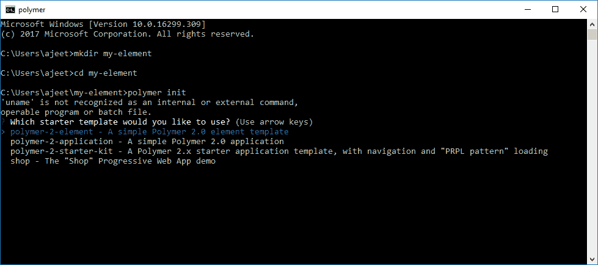
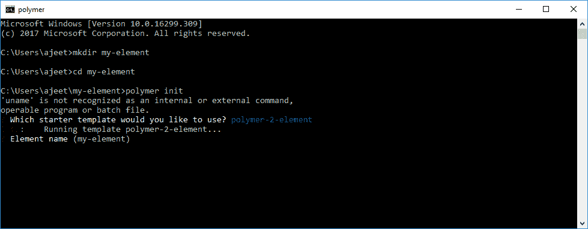
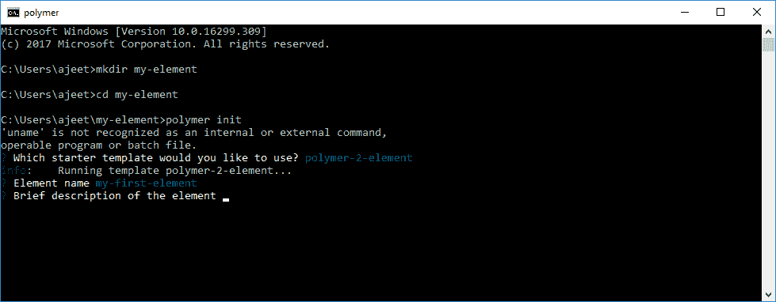
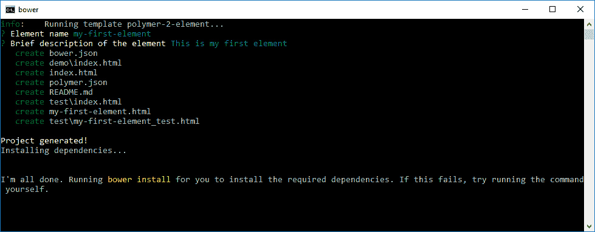
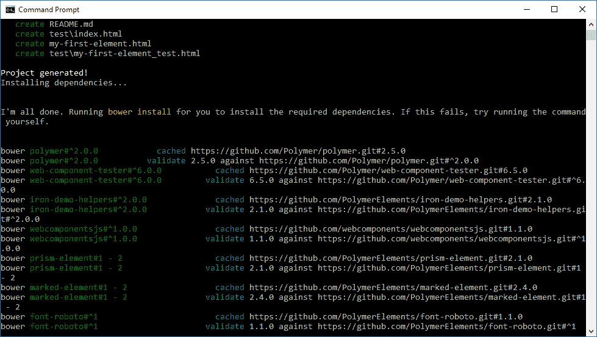
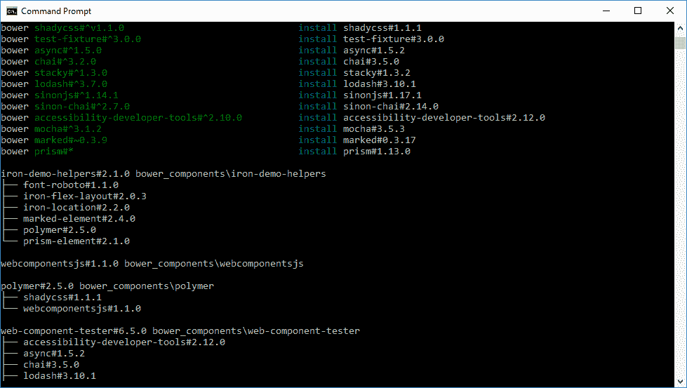
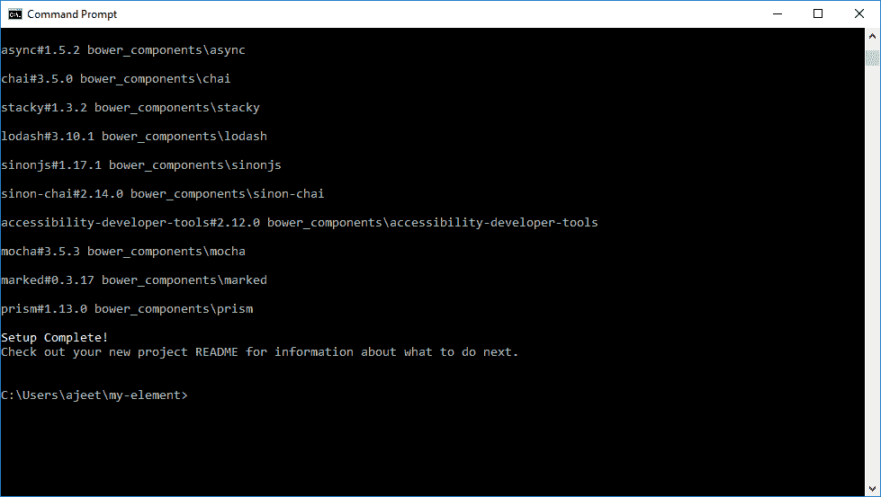

# 创建元素项目

> 原文：<https://www.javatpoint.com/create-an-element-project-in-polymer>

让我们看看如何开始一个元素项目:

1.首先，为元素项目创建一个目录。这里的目录名是 my-element。

```

mkdir my-element

```

2.导航到该目录。

```

cd my-element

```

3.初始化您的元素。Polymer 命令行界面在设置元素项目时会问您几个问题。

```

polymer init

```



4.选择元素



5.输入元素的名称。这里我的元素的名字是“我的第一元素”。



6.输入元素的描述。



现在，Polymer CLI 将为您的元素生成文件和目录，并将安装项目的依赖项。您可以在下图中看到:

 

7.现在您的设置已经完成。



## 元素项目布局

初始化过程完成后，Polymer 命令行界面会生成以下文件和目录。

```

bower.json
demo\index.html
index.html
polymer.json
README.md
test\index.html
my-first-element.html
test\my-first-element_test.html

```