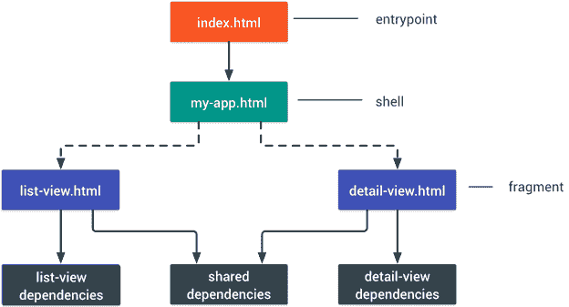
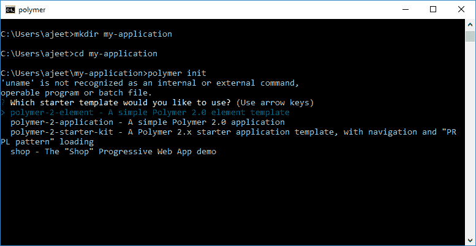
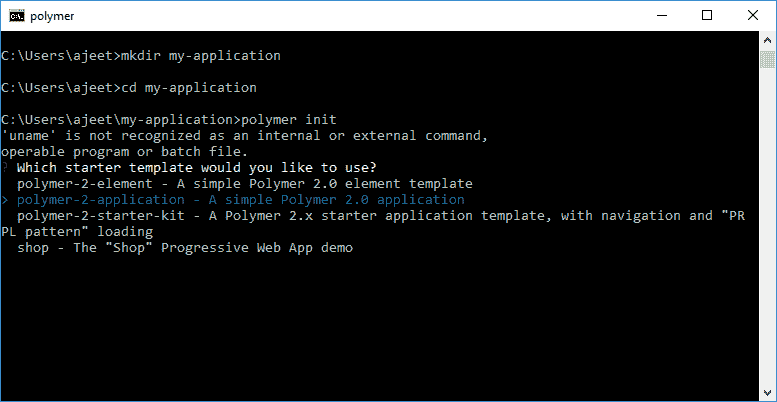
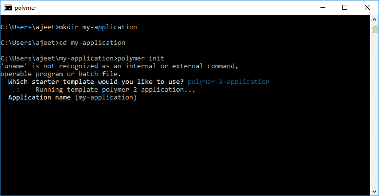
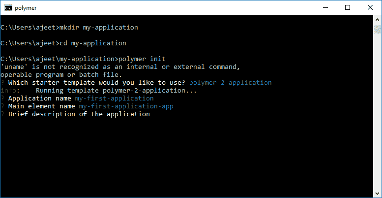
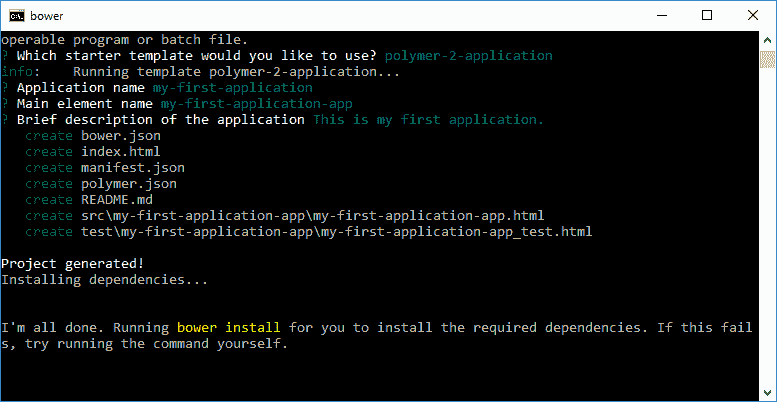
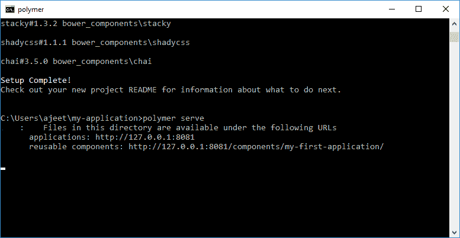
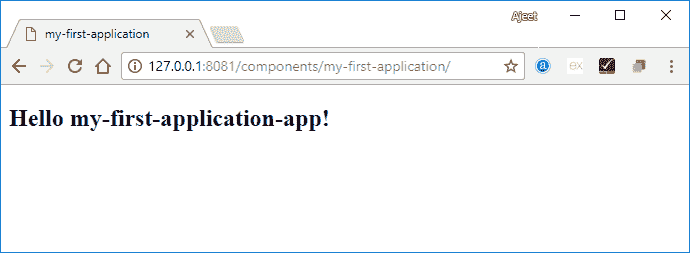

# 创建应用程序项目

> 原文：<https://www.javatpoint.com/create-an-app-project-in-polymer>

聚合物命令行界面便于您使用几个应用程序模板中的一个来初始化项目文件夹。命令行界面附带一个基本模板，这是基于聚合物的应用程序最基本的起点。

## 应用项目架构

Polymer app 项目遵循 app shell 架构。

*   **第一个:**应用程序的主要入口点，从每个有效路由提供服务。这个文件应该非常小，因为它将从不同的网址提供服务，因此会被缓存多次。入口点中的所有资源 URL 都需要是绝对的，因为它可能由非顶级 URL 提供服务。
*   **秒:**shell 或 app-shell，包括顶层 app 逻辑、路由器等。
*   **第三:**这些是 app 的片段。片段可以表示特定视图的代码，或者可以延迟加载的其他代码(例如，第一次绘制时不需要的主应用程序部分，如直到用户与应用程序交互时才显示的菜单)。外壳负责根据需要动态导入片段。

下图显示了一个简单应用程序的组件:



## 设置基本的应用程序项目

1.为您的应用程序项目创建目录。我们把它命名为“我的应用”。

```

mkdir my-application

```

2.导航到该目录。

```

cd my-application

```

3.初始化您的应用程序项目。

```

polymer init

```



4.选择应用程序

这里我们选择了一个聚合物 2.0 应用。



输入应用程序的名称。默认为当前目录的名称。在这里，我们选择了“我的第一次申请”这个名字。



输入项目中主要元素的名称。主要元素是应用程序最顶层的应用程序级元素。默认为当前目录的名称，后跟-app。这里，我们选择了默认名称。



为您的应用程序输入描述。



现在，聚合物命令行界面将为您的应用程序生成文件和目录，并将安装您项目的依赖项。

## App 项目布局

初始化过程后，聚合物命令行界面生成以下文件和目录。

```

 bower.json
index.html
manifest.json
polymer.json
README.md
src\my-first-application-app\my-first-application-app.html
test\my-first-application-app\my-first-application-app_test.html

```

## 运行您的聚合物应用程序

执行以下命令运行您的聚合物应用程序。

**聚合物服务**

 