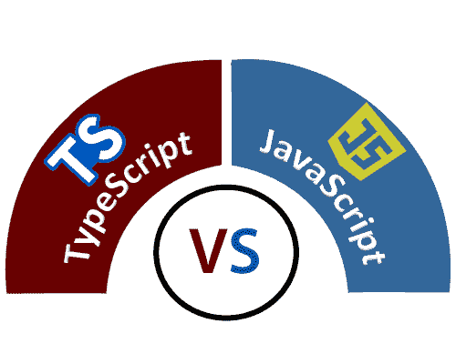

# JavaScript 和 TypeScript 的区别

> 原文：<https://www.javatpoint.com/javascript-vs-typescript>

## Java Script 语言

JavaScript 是 HTML 和 Web 中最流行的编程语言。JavaScript 是一种轻量级、跨平台的基于对象的脚本语言。它用于创建客户端动态页面。JavaScript 语言中的程序称为脚本。脚本是用 HTML 页面编写的，并在页面加载时自动执行。它以纯文本形式提供和执行，不需要特殊准备或编译即可运行。

### JavaScript 的历史

网景通信公司程序员布伦丹·艾希开发了 JavaScript。1995 年 9 月推出，最初叫摩卡。然而，在成为最受欢迎的脚本工具后，它被重命名为 JavaScript，以反映网景在其浏览器中对 Java 的支持。1996 年 11 月，网景公司向 ECMA(欧洲计算机制造商协会)提交了 JavaScript。当前版本的 JavaScript 是 2018 年 6 月发布的 ECMAScript 2018。/p >

## 以打字打的文件

TypeScript 是一种开源的纯面向对象编程语言。它是 JavaScript 的强类型超集，可以编译成普通的 JavaScript。TypeScript 由微软根据 Apache 2 许可证开发和维护。它不是直接在浏览器上运行的。它需要一个编译器在 JavaScript 文件中编译生成。TypeScript 源文件在中。ts "扩展。我们可以使用任何有效的”。js "文件通过将其重命名为"。ts "文件。TypeScript 是带有一些附加功能的 JavaScript 的 ES6 版本。

### 打字稿的历史

安德斯·海尔斯伯格开发了打字稿。它于 2012 年 10 月 1 日首次向公众推出。经过微软两年的内部开发，新版本的 TypeScript 0.9 于 2013 年发布。TypeScript 的当前版本是 2019 年 4 月 24 日发布的 TypeScript 3.4.5。

## TypeScript 相对于 JavaScript 的优势

*   TypeScript 总是在开发期间的编译时突出显示错误，而 JavaScript 则在运行时指出错误。
*   TypeScript 支持强类型或静态类型，而这在 JavaScript 中是没有的。
*   TypeScript 运行在任何浏览器或 JavaScript 引擎上。
*   智能感知提供了强大的工具支持，当添加代码时，智能感知会提供主动提示。
*   通过定义一个模块，它有一个命名空间概念。

## TypeScript 相对于 JavaScript 的缺点

*   TypeScript 编译代码需要很长时间。
*   TypeScript 不支持抽象类。
*   如果我们在浏览器中运行 TypeScript 应用程序，需要一个编译步骤来将 TypeScript 转换为 JavaScript。



## TypeScript 与 JavaScript

| 塞内加尔 | Java Script 语言 | 以打字打的文件 |
| 1. | 它不支持强类型或静态类型。 | 它支持强类型或静态类型功能。 |
| 2. | 网景公司在 1995 年开发了它。 | 安德斯·海尔斯伯格在 2012 年开发了它。 |
| 3. | JavaScript 源文件在"。js "扩展。 | TypeScript 源文件在中。ts "扩展。 |
| 4. | 它直接在浏览器上运行。 | 它不是直接在浏览器上运行的。 |
| 5. | 它只是一种脚本语言。 | 它支持面向对象的编程概念，如类、接口、继承、泛型等。 |
| 6. | 它不支持可选参数。 | 它支持可选参数。 |
| 7. | 这是解释语言，这就是为什么它在运行时突出错误。 | 它编译代码并在开发期间突出显示错误。 |
| 8. | JavaScript 不支持模块。 | TypeScript 支持模块。 |
| 9. | 在这种情况下，数字、字符串是对象。 | 在这种情况下，数字、字符串是接口。 |
| 10. | JavaScript 不支持泛型。 | TypeScript 支持泛型。 |
| 11. | **例:**

```
<script>
function addNumbers(a, b) {  
    return a + b;  
}  
var sum = addNumbers(15, 25);  
document.write('Sum of the numbers is: ' + sum); 
</script>
```

 | **例:**

```
function addNumbers(a, b) {  
    return a + b;  
}  
var sum = addNumbers(15, 25);  
console.log('Sum of the numbers is: ' + sum);
```

 |