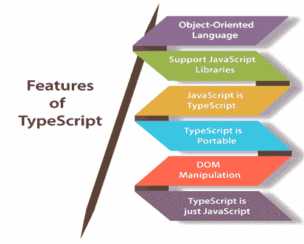

# TypeScript 的特点

> 原文：<https://www.javatpoint.com/typescript-features>

**面向对象语言:** TypeScript 提供了一种面向对象编程语言的完整特性，如类、接口、继承、模块等。在 TypeScript 中，我们可以为客户端和服务器端开发编写代码。

**TypeScript 支持 JavaScript 库:** TypeScript 支持每个 JavaScript 元素。它允许开发人员将现有的 JavaScript 代码与 TypeScript 一起使用。在这里，我们可以轻松地使用所有的 JavaScript 框架、工具和其他库。

**JavaScript 为 TypeScript:** 表示用 JavaScript 编写的代码具有有效性。通过将扩展名从。js to。ts 并与其他 TypeScript 文件一起编译。

**TypeScript 是可移植的:** TypeScript 是可移植的，因为它可以在任何浏览器、设备或任何操作系统上执行。它可以在任何运行 JavaScript 的环境中运行。它不是特定于任何虚拟机执行的。

**DOM 操纵:** TypeScript 可用于操纵 DOM，以添加或移除类似于 JavaScript 的元素。

**TypeScript 只是一个 JS:** TypeScript 代码不直接在任何浏览器上执行。用 TypeScript 编写的程序总是以 JavaScript 开头，以 JavaScript 结尾。因此，我们只需要知道 JavaScript 就可以在 TypeScript 中使用它。用 TypeScript 编写的代码被编译并转换为它的等效 JavaScript 代码以供执行。这个过程被称为**转运**。在 JavaScript 代码的帮助下，浏览器可以读取 TypeScript 代码并显示输出。

## TypeScript 相对于 JavaScript 的优势

*   TypeScript 总是在开发期间的编译时突出显示错误，而 JavaScript 则在运行时指出错误。
*   TypeScript 支持强类型或静态类型，而这在 JavaScript 中是没有的。
*   TypeScript 运行在任何浏览器或 JavaScript 引擎上。
*   智能感知提供了强大的工具支持，它在添加代码时提供了主动提示。
*   通过定义一个模块，它有一个命名空间概念。

## TypeScript 相对于 JavaScript 的缺点

*   TypeScript 编译代码需要很长时间。
*   TypeScript 不支持抽象类。
*   如果我们在浏览器中运行 TypeScript 应用程序，需要一个编译步骤来将 TypeScript 转换为 JavaScript。