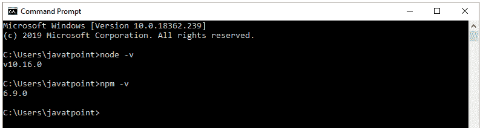
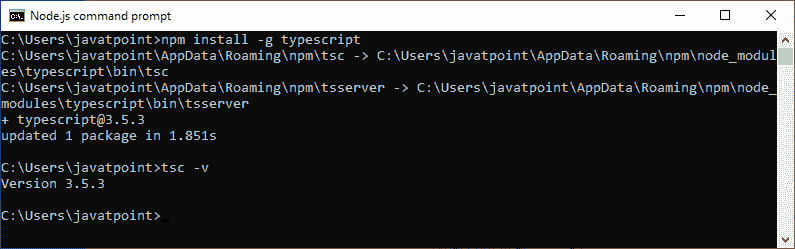
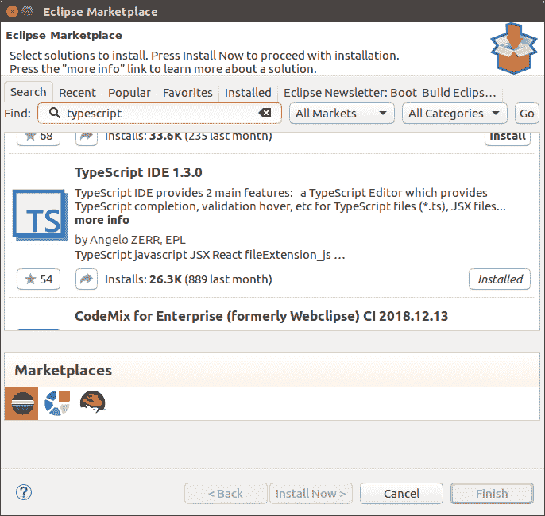
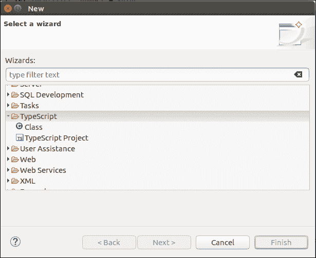
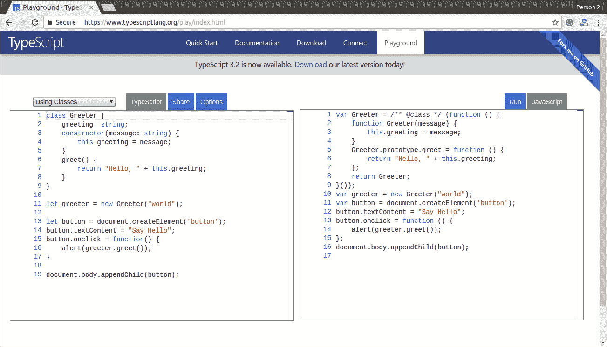

# 类型脚本安装

> 原文：<https://www.javatpoint.com/typescript-installation>

在本节中，我们将学习如何安装 TypeScript，安装 TypeScript 之前的先决条件，以及我们可以通过多少种方式安装 TypeScript。

### 安装类型脚本的先决条件

1.  文本编辑器或集成开发环境
2.  包管理器
3.  TypeScript 编译器

### 安装 TypeScript 的方法

安装 TypeScript 有两种方法:

1.  使用 Node.js 包管理器(npm)安装类型脚本。
2.  在集成开发环境中安装类型脚本插件。

### 使用节点包管理器安装类型脚本

**步骤-1** 安装 Node.js，用来在我们本地的电脑上设置 TypeScript。

要在 Windows 上安装 Node.js，请访问以下链接:[https://www.javatpoint.com/install-nodejs](install-nodejs)

要在 Linux/Ubuntu/CentOS 中安装 Node.js，请访问以下链接:[https://www . javatpoint . com/install-nodejs-on-Linux-Ubuntu-CentOS](install-nodejs-on-linux-ubuntu-centos)

要验证安装是否成功，请在终端窗口中输入以下命令。

```

$ node -v
$ npm -v

```



**第 2 步**安装打字稿。要安装类型脚本，请在终端窗口中输入以下命令。

```

$ npm install typescript --save-dev         //As dev dependency
$ npm install typescript -g                      //Install as a global module
$ npm install typescript@latest -g          //Install latest if you have an older version

```

**步骤-3** 要验证安装是否成功，请在终端窗口中输入命令 **$ tsc -v** 。



### 在集成开发环境中安装类型脚本插件

**第一步**安装 Eclipse、Visual Studio、WebStorm、Atom、崇高文字等 IDE。在这里，我们安装 Eclipse。要安装 Eclipse，请转到以下链接:

**在 Windows:**[https://www.javatpoint.com/javafx-how-to-install-eclipse](javafx-how-to-install-eclipse)

**在乌班图:**T2】https://www.javatpoint.com/how-to-install-eclipse-in-ubuntu

**以厘为单位:**[https://www.javatpoint.com/how-to-install-eclipse-on-centos](how-to-install-eclipse-on-centos)

**第 2 步**安装 TypeScript 插件。

*   打开月食，前往**帮助- >月食市场**。
*   搜索**类型脚本**并选择**类型脚本 IDE** ，点击安装。



*   在下一个窗口中，选择要安装的**功能**，点击**确认**。
*   将打开一个新窗口，选择**接受条款和条件**，单击**下一步**，并按照屏幕上的说明进行操作。
*   现在**重启**月食。要验证打字稿，请转到**新建- >其他- >打字稿**。一旦 TypeScript 显示在窗口中，这意味着 TypeScript 已成功安装在您的计算机上。



## 打字稿在线编译器

我们也可以用官方编译器在线运行我们的脚本。为此，请访问下面的链接。[https://www.typescriptlang.org/play/index.html](https://www.typescriptlang.org/play/index.html)

The following screen appears. Now, you can do any TypeScript program on this. 