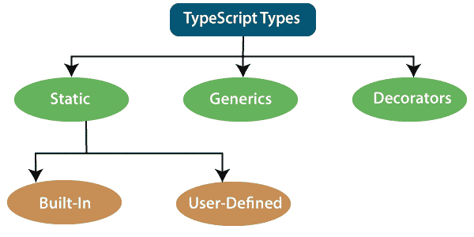
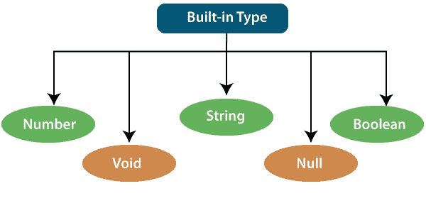
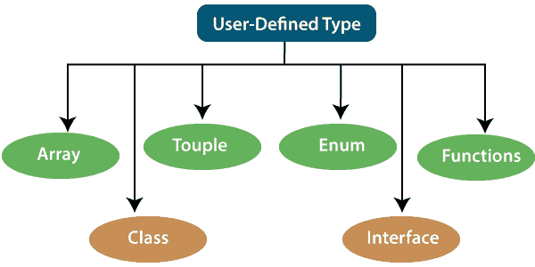

# 类型脚本类型

> 原文：<https://www.javatpoint.com/typescript-types>

TypeScript 语言支持不同类型的值。它为 JavaScript 提供数据类型，将其转换为强类型编程语言。JavaScript 不支持数据类型，但是在 TypeScript 的帮助下，我们可以使用 JavaScript 中的数据类型功能。当面向对象的程序员想要在任何脚本语言或面向对象的编程语言中使用类型特性时，TypeScript 起着重要的作用。在程序使用给定值之前，类型系统检查它们的有效性。它确保代码按预期运行。

类型脚本提供数据类型作为可选的类型系统。我们可以将 TypeScript 数据类型分类如下。



## 1.静态类型

在类型系统的上下文中，静态类型意味着“在编译时”或“不运行程序”在静态类型语言中，变量、参数和对象具有编译器在编译时知道的类型。编译器使用这些信息来执行类型检查。

静态类型可以进一步分为两个子类别:

### 内置或基本类型

TypeScript 有五种内置数据类型，如下所示。



### 数字

像 JavaScript 一样，TypeScript 中的所有数字都存储为浮点值。这些数值被视为数字数据类型。数字数据类型可用于表示整数和分数。TypeScript 还支持二进制(基数为 2)、八进制(基数为 8)、十进制(基数为 10)和十六进制(基数为 16)文字。

**语法:**

```

let identifier: number = value;

```

**示例:-**

```

let first: number = 12.0;             // number 
let second: number = 0x37CF;          // hexadecimal
let third: number = 0o377 ;           // octal
let fourth: number = 0b111001;        // binary 

console.log(first);           // 123
console.log(second);          // 14287
console.log(third);           // 255
console.log(fourth);          // 57

```

### 线

我们将使用字符串数据类型来表示 TypeScript 中的文本。字符串类型使用文本数据。我们通过用单引号或双引号将字符串包含在脚本中。它还表示一系列 Unicode 字符。它以 **$ {expr}** 的形式嵌入表达式。

**语法**

```

let identifier: string = " ";
                Or 
let identifier: string = ' ';

```

**示例**

```

let empName: string = "Rohan"; 
let empDept: string = "IT"; 

// Before-ES6
let output1: string = employeeName + " works in the " + employeeDept + " department."; 

// After-ES6
let output2: string = `${empName} works in the ${empDept} department.`; 

console.log(output1);//Rohan works in the IT department. 
console.log(output2);//Rohan works in the IT department.

```

### 布尔代数学体系的

字符串和数字数据类型可以有无限多个不同的值，而布尔数据类型只能有两个值。它们是“真”和“假”布尔值是指定条件是否为真的真值。

**语法**

```

let identifier: Boolean = Boolean value;

```

**示例**

```

let isDone: boolean = false;

```

### 空的

void 是函数的返回类型，它不返回任何类型的值。它用在没有数据类型可用的地方。void 类型的变量没有用，因为我们只能给它们赋值未定义或 null。未定义的数据类型表示未初始化的变量，而 null 表示值未定义的变量。

**语法**

```

let unusable: void = undefined;

```

**示例**

```

1\. function helloUser(): void {
       alert("This is a welcome message");
       }

```

```

2\. let tempNum: void = undefined;
  tempNum = null;    
  tempNum = 123;      //Error

```

### 空

Null 表示值未定义的变量。很像虚空，它本身并不是非常有用。空值只接受一个空值。Null 关键字用于在 TypeScript 中定义 Null 类型，但它没有用，因为我们只能为它分配一个空值。

**示例**

```

let num: number = null;
let bool: boolean = null; 
let str: string = null;

```

* * *

## 不明确的

未定义的基本类型表示类型脚本和 JavaScript 中所有未初始化的变量。它只有一个未定义的值。undefined 关键字在 TypeScript 中定义了未定义的类型，但是它没有用，因为我们只能给它分配一个未定义的值。

**例**

```

let num: number = undefined;
let bool: boolean = undefined;
let str: string = undefined;

```

### 任何类型

它是 TypeScript 中所有数据类型的“超级类型”。它用于表示任何 JavaScript 值。它允许我们在编译期间选择加入和选择退出类型检查。如果一个变量不能用任何一种基本数据类型来表示，那么可以用“ **Any** ”数据类型来声明。当我们不知道值的类型(可能来自 API 或第三方库)时，任何类型都是有用的，我们希望在编译时跳过类型检查。

**语法**

```

let identifier: any = value;

```

**示例**

```

1\. let val: any = 'Hi';
      val = 555;   // OK
      val = true;   // OK         

```

```

2\. function ProcessData(x: any, y: any) {
                       return x + y;
            }
            let result: any;
            result = ProcessData("Hello ", "Any!"); //Hello Any!
            result = ProcessData(2, 3); //5

```

### 用户定义的数据类型

TypeScript 支持以下用户定义的数据类型:



### 排列

数组是相同数据类型的元素的集合。像 JavaScript 一样，TypeScript 也允许我们处理值的数组。数组可以用两种方式编写:

1.使用后跟[]的元素类型来表示该元素类型的数组:

```

var list : number[] = [1, 3, 5];

```

2.第二种方法使用泛型数组类型:

```

var list : Array = [1, 3, 5]; 
```

### 夫妻二人

元组是一种数据类型，它包括两组不同数据类型的值。它允许我们表达一个数组，其中固定数量的元素的类型是已知的，但它们是不同的。例如，如果我们想将一个值表示为一对数字和一个字符串，那么它可以写成:

```

// Declare a tuple
let a: [string, number];

// Initialize it
a = ["hi", 8, "how", 5]; // OK

```

### 连接

接口是一种在我们的应用程序中充当契约的结构。它定义了类要遵循的语法，这意味着实现接口的类必须实现它的所有成员。它不能被实例化，但是可以被实现它的类引用。TypeScript 编译器使用接口进行类型检查，也称为“鸭式类型”或“结构子类型”

**例**

```

interface Calc {
    subtract (first: number, second: number): any;
}

let Calculator: Calc = {
    subtract(first: number, second: number) {
        return first - second;
    }
}

```

### 班级

类用于创建可重用的组件，并充当创建对象的模板。它是一个逻辑实体，存储变量和函数来执行操作。TypeScript 从 ES6 获得对类的支持。它不同于内部有实现的接口，而接口内部没有任何实现。

**例**

```

class Student
{
    RollNo: number;
    Name: string; 
    constructor(_RollNo: number, Name: string) 
    {
        this.RollNo = _rollNo;
        this.Name = _name;
    }
    showDetails()
    {
        console.log(this.rollNo + " : " + this.name);
    }
}

```

### 枚举数

枚举定义了一组命名常量。TypeScript 提供基于字符串和基于数字的枚举。默认情况下，枚举从 0 开始对其元素进行编号，但我们也可以通过手动将值设置为其元素之一来更改这一点。TypeScript 从 ES6 获得对枚举的支持。

**例**

```

enum Color {
        Red, Green, Blue
};
let c: Color;
Color = Color.Green;

```

### 功能

函数是组织程序的逻辑代码块。像 JavaScript 一样，TypeScript 也可以用来创建函数，既可以作为**命名函数**也可以作为**匿名函数**。函数确保我们的程序是可读的、可维护的和可重用的。函数声明有函数名、返回类型和参数。

**例**

```

//named function with number as parameters type and return type
function add(a: number, b: number): number {
            return a + b;
}

//anonymous function with number as parameters type and return type
let sum = function (a: number, y: number): number {
            return a + b;
};

```

* * *

## 2.一般的

Generic 用于创建一个可以使用多种数据类型而不是单一数据类型的组件。它允许创建可重用组件的方法。它确保了程序的灵活性和长期可伸缩性。TypeScript 使用泛型，类型变量<t>表示类型。泛型函数的类型就像非泛型函数一样，首先列出类型参数，类似于函数声明。</t>

**例**

```

function identity<T>(arg: T): T {
    return arg;
}
let output1 = identity<string>("myString");
let output2 = identity<number>( 100 );

```

* * *

## 3.装饰者

装饰器是一种特殊的数据类型，可以附加到类声明、方法、属性、访问器和参数。它提供了一种为类和函数添加注释和元编程语法的方法。它与“@”符号一起使用。

装饰器是一个实验性的特性，在未来的版本中可能会改变。要启用对装饰器的支持，我们必须在**命令行**或我们的 tsconfig.json 中启用**实验编辑器**编译器选项。

**例**

```

function f() {
    console.log("f(): evaluated");
    return function (target, propertyKey: string, descriptor: PropertyDescriptor) {
        console.log("f(): called");
    }
}

class C {
    @f()
    method() {}
}

```