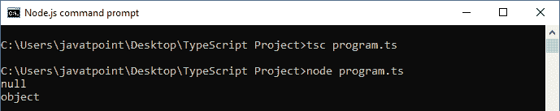
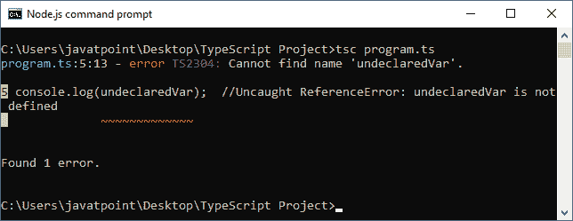

# 空和未定义的区别

> 原文：<https://www.javatpoint.com/null-vs-undefined>

## 空

Null 用于表示有意缺少值。它表示一个值未定义的变量。它只接受一个空值。Null 关键字用于在 TypeScript 中定义 Null 类型，但它没有用，因为我们只能为它分配一个空值。

### 例子

```

//Variable declared and assigned to null
var a = null; 
console.log( a );   //output: null
console.log( typeof(a) );   //output: object

```

**输出:**



## 不明确的

它表示 TypeScript 和 JavaScript 中未初始化的变量。它只有一个未定义的值。undefined 关键字在 TypeScript 中定义了未定义的类型，但是它没有用，因为我们只能给它分配一个未定义的值。

### 例子

```

//Variable declaration without assigning any value to it
var a;      
console.log(a);  //undefined
console.log(typeof(a));  //undefined
console.log(undeclaredVar);  //Uncaught ReferenceError: undeclaredVar is not defined

```

**输出:**



## 空与未定义

Null 和 Undefined 之间的重要区别是:

| 塞内加尔 | 空 | 不明确的 |
| 1. | 这是一个赋值。它可以被分配给一个变量，这个变量表示一个变量不指向任何对象。 | 它不是赋值。这意味着变量已经声明，但尚未赋值。 |
| 2. | 它是一个物体。 | 它本身就是一种类型。 |
| 3. | null 值是表示 null、空或不存在的引用的基元值。 | 未定义的值是一个基元值，在变量没有赋值时使用。 |
| 4. | Null 表示变量没有值。 | Undefined 表示变量本身不存在。 |
| 5. | 执行基本运算时，Null 被转换为零(0)。 | 在执行原语操作时，Undefined 被转换为 NaN。 |