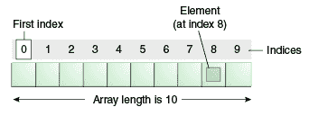

# 类型脚本数组

> 原文：<https://www.javatpoint.com/typescript-arrays>

数组是具有连续内存位置的相似类型元素的同构集合。

数组是用户定义的数据类型。

数组是一种数据结构，我们在其中存储类似数据类型的元素。在数组中，我们只能存储一组固定的元素。我们也可以把它作为一个对象。

该数组是基于索引的存储，其中第一个元素存储在索引 0 处。下面的结构有助于理解数组的结构。



## 数组的特征

1.  数组存储具有相同数据类型的元素。
2.  存储在连续存储单元中的数组元素。
3.  二维数组元素的存储在一个连续的存储单元中逐行排列。
4.  数组名称表示起始元素的地址。
5.  数组的大小应该在声明时初始化。
6.  数组大小应该是常量表达式，而不是变量。
7.  我们可以通过指定元素对应的索引值来检索数组元素。

## 优势

**代码优化:**数组有助于优化代码，提高程序的速度和性能。它允许我们更高效地检索或排序数组数据。

**随机访问:**它提供了在恒定时间内访问数组中任何数据的能力(与数组的位置和大小无关)。因此，我们可以直接获得位于任何索引位置的数组的任何数据。

## 不足之处

**大小限制:**一个数组只允许我们存储固定数量的元素。一旦声明了数组，我们就不能改变它的大小。因此，如果我们想插入比声明的更多的元素，这是不可能的。

## 数组声明

就像 JavaScript 一样，TypeScript 也支持数组。有两种方法可以声明数组:

**1。使用方括号。**

```

let array_name[:datatype] = [val1,val2,valn..]

```

**示例:**

```

let fruits: string[] = ['Apple', 'Orange', 'Banana'];

```

**2。使用泛型数组类型。**

```

let array_name: Array = [val1,val2,valn..] 
```

**示例:**

```

let fruits: Array = ['Apple', 'Orange', 'Banana']; 
```

## TypeScript 中数组的类型

数组有两种类型:

1.  一维数组
2.  多维数组


### 一维数组

一维数组是一种线性数组，它只包含一行用于存储数据。它只有一组方括号(“[]”)。我们可以使用行或列索引来访问它的元素。

**语法**

```

let array_name[:datatype]; 

```

**初始化**

```

array_name = [val1,val2,valn..]

```

**例**

```

let arr:number[]; 
arr = [1, 2, 3, 4] 
console.log("Array[0]: " +arr[0]); 
console.log("Array[1]: " +arr[1]);

```

**输出:**

```
Array[0]: 1
Array[1]: 2

```

### 多维数组

多维数组是包含一个或多个数组的数组。在多维数组中，数据存储在基于行和列的索引中(也称为矩阵形式)。二维数组(二维数组)是多维数组的最简单形式。


**语法**

```

let arr_name:datatype[][] = [ [a1,a2,a3], [b1,b2,b3] ];

```

**初始化**

```

let arr_name:datatype[initial_array_index][referenced_array_index] = [ [val1,val2,val 3], [v1,v2,v3]];

```

**例**

```

var mArray:number[][] = [[1,2,3],[5,6,7]] ;
console.log(mArray[0][0]);
console.log(mArray[0][1]);
console.log(mArray[0][2]);
console.log();
console.log(mArray[1][0]);
console.log(mArray[1][1]);
console.log(mArray[1][2]);

```

**输出:**

```
1
2
3

5
6
7

```

* * *

## 数组对象

数组对象允许我们在一个变量中存储多个值。我们可以使用 array 对象创建一个数组。数组构造函数用于为数组创建传递以下参数。

*   代表数组大小的数值，或者
*   逗号分隔值的列表。

**语法**

```

let arr_name:datatype[] = new Array(values);

```

**例**

```

//array by using the Array object.
let arr:string[] = new Array("JavaTpoint","2200","Java","Abhishek");
for(var i = 0;i
```

**输出:**

```
JavaTpoint
2200
Java
Abhishek

```

### 使用的数组遍历...循环中

**例**

```

let i:any; 
let arr:string[] = ["JavaTpoint", "2300", "Java", "Abhishek"];
for(i in arr) { 
   console.log(arr[i]) 
}

```

**输出:**

```
JavaTpoint
2300
Java
Abhishek

```

### 将数组传递给函数

我们可以通过指定不带索引的数组名来将数组传递给函数。

**例**

```

let arr:string[] = new Array("JavaTpoint", "2300", "Java", "Abhishek"); 
//Passing arrays in function
function display(arr_values:string[]) {
   for(let i = 0;i
```

**输出:**

```
JavaTpoint
2300
Java
Abhishek

```

* * *

## 类型脚本扩展运算符

扩展运算符用于从另一个数组或对象初始化数组和对象。我们也可以用它来进行对象去结构化。它是 ES 6 版本的一部分。

**例**

```

let arr1 = [ 1, 2, 3];
let arr2 = [ 4, 5, 6];
//Create new array from existing array
let copyArray = [...arr1];   
console.log("CopiedArray: " +copyArray);
//Create new array from existing array with more elements
let newArray = [...arr1, 7, 8];
console.log("NewArray: " +newArray);
//Create array by merging two arrays
let mergedArray = [...arr1, ...arr2];
console.log("MergedArray: " +mergedArray);

```

**输出:**

```
CopiedArray: 1,2,3
NewArray: 1,2,3,7,8
MergedArray: 1,2,3,4,5,6

```

* * *

## 数组方法

下面列出了数组方法及其描述。

| 塞内加尔 | 方法 | 描述 |
| 1. | concat() | 它用于连接两个数组并返回组合结果。 |
| 2. | copy InTerface() | 它复制数组中元素的序列。 |
| 3. | 每隔() | 如果数组中的每个元素都满足提供的测试函数，则返回 true。 |
| 4. | 填充() | 它从指定的开始到结束索引用静态值填充数组。 |
| 5. | 索引（） | 它返回数组中匹配元素的索引，否则为-1。 |
| 6. | 包括() | 它用于检查数组是否包含某个元素。 |
| 7. | 加入() | 它用于将数组的所有元素连接成一个字符串。 |
| 8. | lastIndexOf() | 它返回数组中元素的最后一个索引。 |
| 9. | Pop() | 它用于移除数组的最后一个元素。 |
| 10. | 推送() | 它用于向数组中添加新元素。 |
| 11. | 反向() | 它用于反转数组中元素的顺序。 |
| 12. | Shift() | 它用于移除并返回数组的第一个元素。 |
| 13. | 切片() | 它返回新数组中数组的部分。 |
| 14. | 排序() | 它用于对数组的元素进行排序。 |
| 15. | 拼接() | 它用于在数组中添加或移除元素。 |
| 16. | toString() | 它返回数组的字符串表示形式。 |
| 17. | unshift() | 它用于将一个或多个元素添加到数组的开头。 |