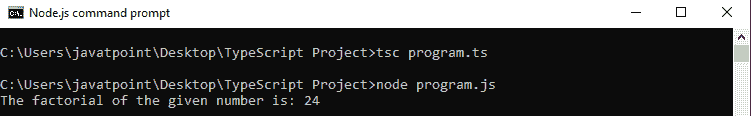
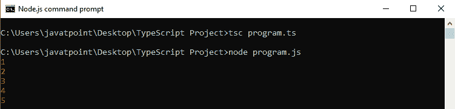
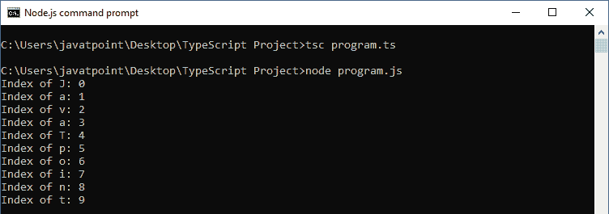
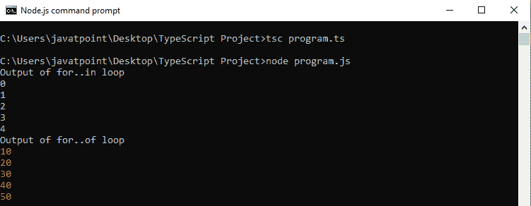

# 类型脚本确定循环

> 原文：<https://www.javatpoint.com/typescript-definite-loop>

在这个循环中，我们知道语句块执行之前的迭代次数。一个“ **for 循环**”就是这个循环最好的例子。在这里，我们将讨论三种类型的循环:

1.  for 循环
2.  为..循环的
3.  为..循环中

* * *

## 循环的类型脚本

强制循环是**重复**控制结构。它用于将代码块执行特定次数。for 语句在一行中包含初始化、条件和递增/递减，这提供了一种更短、更易于调试的循环结构。for 循环的语法如下。

**语法**

```

for (first expression; second expression; third expression ) {
    // statements to be executed repeatedly
}

```

对回路的控制流程的解释是:

第一个表达式是**初始化**步骤，首先执行，只执行一次。它允许我们声明和初始化循环控制变量。

下一个表达式计算**条件**。如果为真，则执行循环体。如果为假，循环不执行，控制流程跳转到紧接循环的“**之后的下一条语句。**

当循环的**主体执行时，控制流程跳转到递增/递减语句。它允许我们更新循环控制变量。只要条件后出现分号，就可以留空。**

现在条件是**重新评估**。如果发现为真，循环执行，过程重复。当条件变为假时，循环的“**终止，这标志着生命周期的结束。**


**例**

```

let num = 4; 
let factorial = 1; 
while (num >= 1) { 
   factorial = factorial * num; 
   num--; 
} 
console.log("The factorial of the given number is: " + factorial);

```

**输出:**



* * *

## 的类型脚本..循环的

森林..of loop 用于迭代和访问数组、字符串、集合、映射、列表或元组集合的元素。的语法..循环的定义如下。

**语法**

```

for (var val of list) { 
   //statements to be executed
}

```

**例**

```

let arr = [1, 2, 3, 4, 5];

for (var val of arr) {
  console.log(val);
}

```

**输出:**



* * *

## 的类型脚本..循环中

森林..in loop 用于数组、列表或元组。此循环遍历列表或集合，并在每次迭代时返回一个索引。在这种情况下，“ **val** ”的数据类型应该是字符串或任意。的语法..以下给出了 in 循环。

**语法**

```

for (var val in list) { 
   //statements 
}

```

**例**

```

let str:any = "JavaTpoint";

for (let index in str) {
  console.log('Index of ${str[index]}: ${index}');
}

```

**输出:**



* * *

## 为..的与的..循环

两个循环都遍历列表，但是它们的迭代类型不同。**为..在**循环中，返回被迭代对象的索引列表，而**为..循环返回被迭代对象的值列表。**

以下示例演示了这些差异:

```

let myArray = [10, 20, 30, 40, 50,];
console.log("Output of for..in loop ");
for (let index in myArray) {
   console.log(index);
}
console.log("Output of for..of loop ");
for (let val of myArray) {
   console.log(val);
}

```

**输出:**

