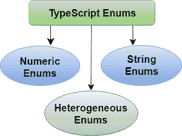
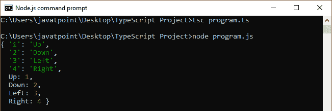
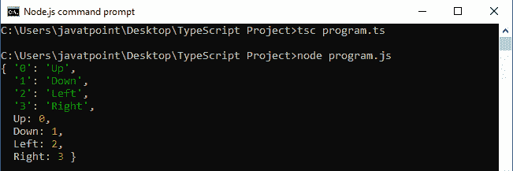
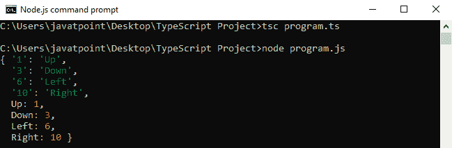
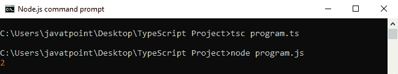
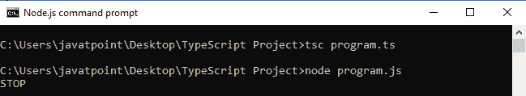
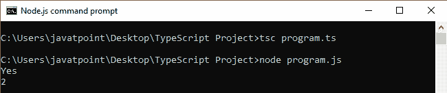
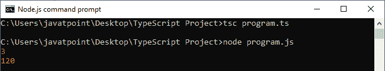
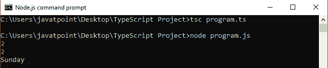

# TypeScript枚举

> 原文：<https://www.javatpoint.com/typescript-enums>

枚举代表**枚举**。枚举是 TypeScript 中支持的一种新数据类型。用于定义一组**命名常数**，即相关值的集合。TypeScript 支持**数字**和**基于字符串的**枚举。我们可以使用**枚举**关键字来定义枚举。

## 为什么是埃努姆？

枚举在TypeScript中很有用，因为:

*   这使得未来改变价值观变得很容易。
*   它减少了因传输或输入错误数字而导致的错误。
*   它只在编译时存在，所以不分配内存。
*   它用 JavaScript 中的内联代码节省了运行时和编译时。
*   它允许我们创建常数，我们可以很容易地与程序联系起来。
*   它将使开发人员能够在 JavaScript 中开发内存高效的自定义常量，JavaScript 不支持枚举，但是 TypeScript 可以帮助我们访问它们。

TypeScript 中有三种类型的枚举。这些是:



*   数字枚举
*   枚举字符串
*   异构枚举

* * *

## 数字枚举

数值枚举是基于**数字的**枚举，将数值存储为数字。这意味着我们可以将这个数字分配给枚举的一个实例。

**例**

```

enum Direction {
    Up = 1,
    Down,
    Left,
    Right,
}
console.log(Direction);

```

在上面的例子中，我们有一个名为**方向**的数值枚举。在这里，我们用 1 初始化 **Up** ，以下所有成员从那时起**自动递增**。意思是方向。向上数值为 1，**向下**为 2，**左侧**为 3，**右侧**为 4。

**输出:**



根据我们的需要，它还允许我们省略枚举的初始化。我们可以如下所示，在不初始化的情况下声明枚举。

```

enum Direction {
    Up,
    Down,
    Left,
    Right,
}

console.log(Direction);

```

这里，Up 的值为 0，所有下列成员从该点开始自动递增。意思是方向。向上的值为 0，向下的值为 1，向左的值为 2，向右的值为 3。当不需要关心成员值本身时，*自动递增*行为是有用的。但是每个值都必须与同一枚举中的其他值不同**。**

 ****输出:**



在 TypeScript 枚举中，不必总是为枚举成员分配**个连续的**值。我们可以向枚举成员提供任何值，如下例所示。

**例**

```

enum Direction {
    Up=1,
    Down=3,
    Left=6,
    Right=10,
}
console.log(Direction);

```

**输出:**



## 作为函数参数的枚举

我们也可以使用枚举作为**函数类型**或**返回类型**，我们可以在下面的例子中看到。

```

enum AppStatus {
    ACTIVE,
    INACTIVE,
    ONHOLD
} 
function checkStatus(status: AppStatus): void {
    console.log(status);
}
checkStatus(AppStatus.ONHOLD);

```

在上面的例子中，我们已经声明了一个枚举 **AppStatus** 。接下来，我们创建一个函数**检查状态()**，它接受一个返回枚举应用状态的输入参数状态。在功能中，我们**检查**的状态类型。如果状态名匹配，我们得到匹配的枚举成员。

**输出:**



在这里，我们可以看到，在最后一条语句中打印的值“2”在大多数情况下没有多大用处。这就是为什么**更喜欢**，**推荐**使用**基于字符串的**枚举。

## 枚举字符串

字符串枚举类似于数值枚举，只是枚举有一些细微的运行时差异。在字符串枚举中，每个枚举值都是用字符串文字或另一个字符串枚举成员而不是数值进行常量初始化的。

字符串枚举没有**自动递增**行为。使用这个枚举的好处是字符串枚举提供了更好的**可读性**。如果我们正在调试一个程序，字符串枚举允许我们在代码运行时给出一个有意义且可读的值，而与枚举成员本身的名称无关。

考虑下面的数字枚举示例，但它表示为字符串枚举:

**例**

```

enum AppStatus {
    ACTIVE = 'ACT',
    INACTIVE = 'INACT',
    ONHOLD = 'HLD',
    ONSTOP = 'STOP'
}
function checkStatus(status: AppStatus): void {

    console.log(status);
}
checkStatus(AppStatus.ONSTOP);

```

**输出:**



在上面的例子中，我们已经声明了一个字符串枚举 **AppStatus** ，其值与上面的数字枚举相同。但是字符串枚举不同于数字枚举，数字枚举中的字符串枚举值是用**字符串文字**初始化的。这些枚举之间的区别在于数字枚举值是自动递增的，而字符串枚举值需要单独初始化。

## 异构枚举

异构枚举是枚举，包含**字符串**和**数字**值。但是建议您不要这样做，除非需要利用 JavaScript 运行时行为。

**例**

```

enum AppStatus {
    ACTIVE = 'Yes',
    INACTIVE = 1,
    ONHOLD = 2,
    ONSTOP = 'STOP'
}
console.log(AppStatus.ACTIVE);
console.log(AppStatus.ONHOLD);

```

**输出:**



## 计算成员和常量成员

我们知道每个枚举成员都有一个与之关联的值。这些值可以是常量，也可以是计算值。如果满足以下条件，我们可以将枚举成员视为**常量**:

**1。**是枚举的第一个成员，没有初始值。在这种情况下，它被赋值为 0。

**例**

```

// Name.Abhishek is constant:
enum Name { 
   Abhishek 
}
console.log(Name);

```

**2。**它没有初始值，前面的枚举成员是一个数值常量。在这种情况下，当前枚举成员的值将是前一个枚举成员的值加 1。

```

// All enum members in 'Name' and 'Profile' are constant.
enum Name { 
   Abhishek,
   Ravi,
   Ajay
}
enum Profile { 
   Engineer=1,
   Leader,
   Businessman
}

```

在 TypeScript 中，我们可以说一个表达式是常量枚举表达式，如果它是:

*   文字枚举表达式。
*   对先前定义的常量枚举成员的引用。
*   带圆括号的常量枚举表达式。
*   它是应用于常量枚举表达式的+、-、~一元运算符之一。
*   +、-、*、/、%、<>、>>>、&、|、以常量枚举表达式作为操作数的^二进制运算符。

在所有其他情况下，枚举成员被认为是**计算的**。下面的枚举示例包括具有计算值的枚举成员。

```

enum Weekend {
  Friday = 1,
  Saturday = getDate('Dominoz'),
  Sunday = Saturday * 40
}

function getDate(day : string): number {
    if (day === 'Dominoz') {
        return 3;
    }
}
console.log(Weekend.Saturday); 
console.log(Weekend.Sunday);

```

**输出:**



## 反向映射

TypeScript 枚举也支持反向映射。这意味着我们可以访问枚举成员的值，也可以从其值中访问成员名称。我们可以从下面的例子中理解反向映射。

#### 注意:字符串枚举不支持反向映射。

**例**

```

enum Weekend {
  Friday = 1,
  Saturday,
  Sunday
}
console.log(Weekend.Saturday);   
console.log(Weekend["Saturday"]);  
console.log(Weekend[3]);

```

**输出:**



## 运行时枚举

枚举是运行时存在的真实对象。我们可以从下面的例子来理解。

```

enum E {
    A, B, C
}

```

它实际上可以传递给函数，我们可以在下面的例子中看到。

```

function f(obj: { A: number }) {
    return obj.A;
}
// Works, since 'E' has a property named 'A' which is a number.
f(E);

```

## 枚举环境

我们可以使用环境枚举来描述已经存在的枚举类型的**形状**。

```

Declare enum Enum{
    X=1,
    Y,
    Z=2
}

```

环境枚举和非环境枚举 主要有一个 ***的区别。在常规枚举中，如果其前面的枚举成员被认为是常量，则没有初始值设定项的成员被认为是**常量**。但是，没有初始值设定项的环境(和非常数)枚举成员总是被认为是**计算的**枚举。***

* * ***