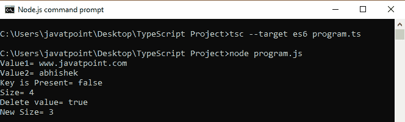
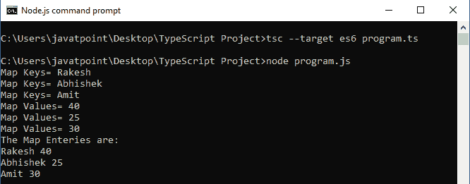

# 类型脚本映射

> 原文：<https://www.javatpoint.com/typescript-map>

TypeScript 映射是在 **ES6** 版本的 JavaScript 中新增的一种数据结构。它允许我们将数据存储在**键值对**中，并像其他编程语言一样记住键的原始**插入顺序**。在 TypeScript 映射中，我们可以使用任何值作为**键**或**值**。

## 创建地图

我们可以创建如下图。

```

var map = new Map();

```

## 地图方法

下面列出了类型脚本映射方法。

| 塞内加尔 | 方法 | 描述 |
| **1。** | map.set(键，值) | 它用于在地图中添加条目。 |
| **2。** | map.get(键) | 它用于从地图中检索条目。如果映射中不存在该键，则返回 undefined。 |
| **3。** | map.has(键) | 如果该键出现在地图中，则返回 true。否则，它返回 false。 |
| **4。** | map.delete(键) | 它用于通过键删除条目。 |
| **5。** | map.size() | 它用于返回地图的大小。 |
| **6。** | map.clear() | 它会从地图上移除所有内容。 |

**例**

我们可以从下面的例子中了解地图方法。

```

let map = new Map();

map.set('1', 'abhishek');   
map.set(1, 'www.javatpoint.com');     
map.set(true, 'bool1'); 
map.set('2', 'ajay');

console.log( "Value1= " +map.get(1)   ); 
console.log("Value2= " + map.get('1') ); 
console.log( "Key is Present= " +map.has(3) ); 
console.log( "Size= " +map.size ); 
console.log( "Delete value= " +map.delete(1) ); 
console.log( "New Size= " +map.size );

```

**输出:**

当我们执行上面的代码片段时，它会返回以下输出。



## 迭代地图数据

我们可以通过使用“**来迭代映射键、值或条目...**回路的。下面的例子有助于更清楚地理解它。

**例**

```

let ageMapping = new Map();

ageMapping.set("Rakesh", 40);
ageMapping.set("Abhishek", 25);
ageMapping.set("Amit", 30);

//Iterate over map keys
for (let key of ageMapping.keys()) {
    console.log("Map Keys= " +key);        
}
//Iterate over map values
for (let value of ageMapping.values()) {
    console.log("Map Values= " +value);    
}
console.log("The Map Enteries are: "); 
//Iterate over map entries
for (let entry of ageMapping.entries()) {
    console.log(entry[0], entry[1]); 
}

```

**输出:**



* * *