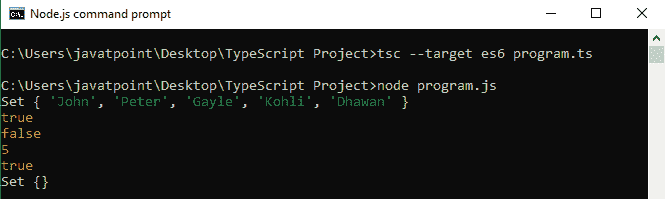
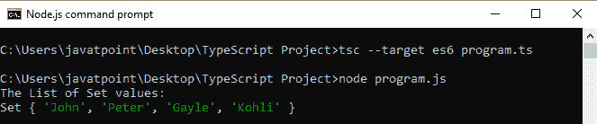
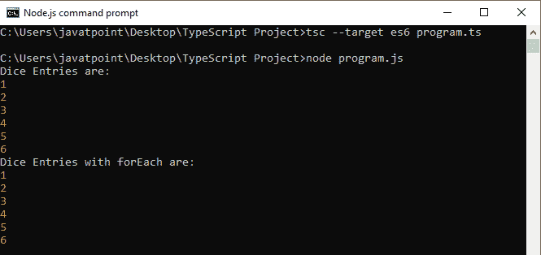

# 类型脚本集

> 原文：<https://www.javatpoint.com/typescript-set>

TypeScript 集是在 **ES6** 版本的 JavaScript 中新增的一种数据结构。它允许我们将**不同的数据**(每个值只出现一次)存储到**列表**中，类似于其他编程语言。集合有点类似于**映射**，但是它只存储**键**，而不是**键值**对。

### 创建集合

我们可以如下创建一个**集合**。

```

let mySet = new Set();

```

### 设置方法

下面列出了类型脚本集方法。

| 塞内加尔 | 方法 | 描述 |
| **1。** | set.add(值) | 它用于在集合中添加值。 |
| **2。** | set.has(值) | 如果集合中存在该值，则返回 true。否则，它返回 false。 |
| **3。** | set.delete() | 它用于从集合中移除条目。 |
| **4。** | set.size() | 它用于返回集合的大小。 |
| **5。** | set.clear() | 它会从集合中移除所有内容。 |

**例**

我们可以从下面的例子中理解 set 方法。

```

let studentEntries = new Set();

//Add Values
studentEntries.add("John");
studentEntries.add("Peter");
studentEntries.add("Gayle");
studentEntries.add("Kohli"); 
studentEntries.add("Dhawan"); 

//Returns Set data
console.log(studentEntries); 

//Check value is present or not
console.log(studentEntries.has("Kohli"));      
console.log(studentEntries.has(10));      

//It returns size of Set
console.log(studentEntries.size);  

//Delete a value from set
console.log(studentEntries.delete("Dhawan"));    

//Clear whole Set
studentEntries.clear(); 

//Returns Set data after clear method.
console.log(studentEntries);

```

**输出:**

当我们执行上面的代码片段时，它会返回以下输出。



### 集合方法的链接

TypeScript 设置方法也允许链接 **add()** 方法。我们可以从下面的例子来理解。

**例**

```

let studentEntries = new Set();

//Chaining of add() method is allowed in TypeScript
studentEntries.add("John").add("Peter").add("Gayle").add("Kohli");

//Returns Set data
console.log("The List of Set values:");
console.log(studentEntries);

```

**输出:**



### 迭代集合数据

我们可以通过使用“**来迭代集合值或条目...**回路的。下面的例子有助于更清楚地理解它。

**例**

```

let diceEntries = new Set();

diceEntries.add(1).add(2).add(3).add(4).add(5).add(6);

//Iterate over set entries
console.log("Dice Entries are:"); 
for (let diceNumber of diceEntries) {
    console.log(diceNumber); 
}

// Iterate set entries with forEach
console.log("Dice Entries with forEach are:"); 
diceEntries.forEach(function(value) {
  console.log(value);   
});

```

**输出:**



* * *