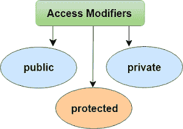
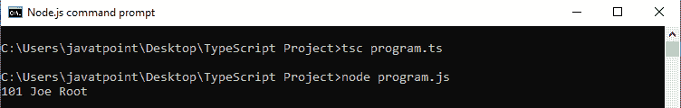
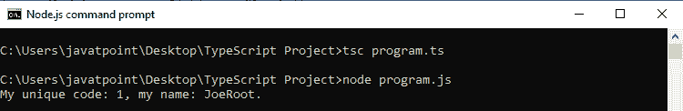
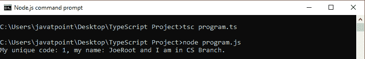
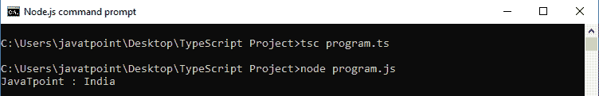

# 类型脚本访问修饰符

> 原文：<https://www.javatpoint.com/typescript-access-modifiers>

像其他编程语言一样，Typescript 允许我们在类级别使用访问修饰符。它给予类成员直接的访问控制。这些类成员是函数和属性。我们可以在它自己的类内、类外的任何地方、子类或派生类内使用类成员。

访问修饰符增加了类成员的安全性，并防止它们被无效使用。我们还可以用它来控制类的数据成员的可见性。如果不必为该类设置任何访问修饰符，TypeScript 会自动为所有类成员设置公共访问修饰符。



TypeScript 访问修饰符有三种类型。这些是:

1.  公众
2.  私人的
3.  受到保护。

## 了解所有类型脚本访问修饰符

让我们了解给定表的访问修饰符。

| 访问修饰符 | 可在班级内访问 | 可在子类中访问 | 可通过类实例从外部访问 |
| 公众 | 是 | 是 | 是 |
| 保护 | 是 | 是 | 不 |
| 私人的 | 是 | 不 | 不 |

* * *

## 公众

默认情况下，在 TypeScript 中，类的所有成员(属性和方法)都是公共的。所以，没有必要在成员前面加上这个关键字。我们可以不受任何限制地在任何地方访问该数据成员。

**例**

```

class Student {
    public studCode: number;
    studName: string;
}

let stud = new Student();
stud.studCode = 101;
stud.studName = "Joe Root";

console.log(stud.studCode+ " "+stud.studName);

```

在上面的例子中， **studCode** 是公共的， **studName** 是在没有修饰符的情况下声明的，因此 TypeScript 默认将它们视为**公共的**。由于数据成员是公共的，因此可以使用类的对象在类外访问它们。

**输出:**



* * *

## 私人的

私有访问修饰符不能在其包含的类之外访问。它确保类成员仅对包含它的类可见。

**例**

```

class Student {
public studCode: number;
private studName: string;
constructor(code: number, name: string){
this.studCode = code;
this.studName = name;
}
public display() {
return (`My unique code: ${this.studCode}, my name: ${this.studName}.`);
}
}

let student: Student = new Student(1, "JoeRoot");
console.log(student.display());

```

在上面的例子中， **studCode** 是私有的， **studName** 是在没有修饰符的情况下声明的，所以默认情况下 TypeScript 将其视为公共的。如果我们访问类外的私有成员，它会给出一个编译错误。

**输出:**



* * *

## 保护

受保护的访问修饰符只能在类及其子类中访问。我们不能从包含它的类的外部访问它。

**例**

```

class Student {
    public studCode: number;
    protected studName: string;
    constructor(code: number, name: string){
        this.studCode = code;
        this.studName = name;
        }
}
class Person extends Student {
    private department: string;

    constructor(code: number, name: string, department: string) {
        super(code, name);
        this.department = department;
    }
    public getElevatorPitch() {
        return (`My unique code: ${this.studCode}, my name: ${this.studName} and I am in ${this.department} Branch.`);
    }
}
let joeRoot: Person = new Person(1, "JoeRoot", "CS");
console.log(joeRoot.getElevatorPitch());

```

在上面的例子中，我们不能使用**学生**班级之外的名字。我们仍然可以在 Person 类的实例方法中使用它，因为 **Person** 类源自 Student 类。

**输出:**



* * *

## 只读修改

*   我们可以使用 readonly 修饰符使类、类型或接口的属性成为只读的。
*   这个修饰符需要在声明时或者在构造函数中初始化。
*   我们也可以从类的外部访问 readonly 成员，但是不能更改它的值。

**例**

```

class Company {
 readonly country: string = "India";
 readonly name: string;

 constructor(contName: string) {
 this.name = contName;
 }
 showDetails() {
 console.log(this.name + " : " + this.country);
 }
}

let comp = new Company("JavaTpoint");
comp.showDetails(); // JavaTpoint : India

comp.name = "TCS"; //Error, name can be initialized only within constructor

```

**输出:**

