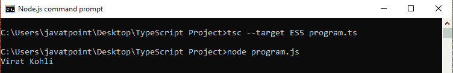

# TypeScript访问器

> 原文：<https://www.javatpoint.com/typescript-accessor>

在 TypeScript 中，访问器属性提供了访问和设置类成员的方法。下面给出了两种方法。

1.  吸气剂
2.  作曲者

## 吸气剂

getter 访问器属性是用于检索变量值的常规方法。在对象文字中，由“**表示的 getter 属性得到**关键字。它可以是公共的、私有的和受保护的。

**语法**

```

get propName() {
    // getter, the code executed on getting obj.propName
  },

```

**例**

```

class MyDrawing {  
    length: number = 20;  
    breadth: string = 15;  

    get rectangle() {  
        return this.length * this.breadth;  
    }  
}  
console.log(new MyDrawing().square);

```

* * *

## 作曲者

setter 访问器属性是用于更新变量值的常规方法。在对象文字中，setter 属性由“ **set** ”关键字表示。

**语法**

```

set propName(value) {
    // setter, the code executed on setting obj.propName = value
  }

```

**例**

```

set displayFullName { 
    const parts = value.split (''); 
    this.pname = firstname[0]; 
    this.pname = firstname[1]; 
} 
person displayFullName = "Abhishek Mishra"
console.log(student);

```

<fieldset><legend class="legendfont">Note:</legend>

*   **getter** 和 **setter** 为我们提供了一种更好地控制如何在每个对象上访问成员的方法。
*   TypeScript 访问器要求我们将编译器设置为输出 ECMAScript 5 或更高版本。它不支持低于 ECMAScript 5 的版本。
*   具有 get 属性但没有任何 set 属性的访问器被自动假定为只读。当我们从代码中生成一个**d . ts**文件时，这很有帮助。

</fieldset>

我们可以从下面的例子中理解 getter 和 setter 的概念。

### 例子

```

let passcode = "secret passcode";

class Student {
    private _fullName: string;

    get fullName(): string {
        return this._fullName;
    }

    set fullName(newName: string) {
        if (passcode && passcode == "secret passcode") {
            this._fullName = newName;
        }
        else {
            console.log("Unauthorized update of student detail!");
        }
    }
}

let stud = new Student();
stud.fullName = "Virat Kohli";
if (stud.fullName) {
    console.log(stud.fullName);
}

```

**输出:**



现在，如果我们更改第一行:*让 password =“secret _ password”*；

然后，输出:未经授权更新学生详细信息！

**获取器和设置器的命名约定**

setter 和 getter 方法的命名约定应该如下:

getXX()和 setXX()

这里，XX 是变量的名称。例如:

```

private String name;

```

那么设置者和获取者将是:

```

public void setName(String name) { }
public String getName() { }

```