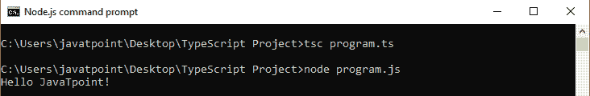
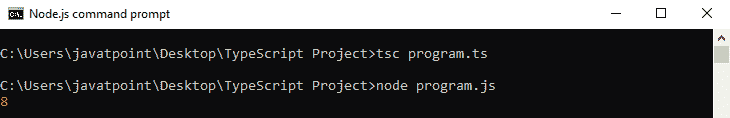
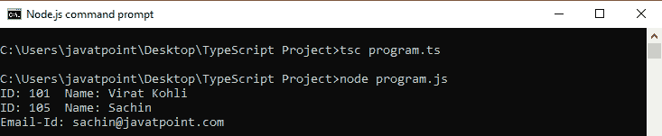
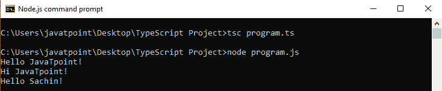
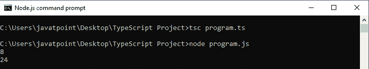

# TypeScript函数

> 原文：<https://www.javatpoint.com/typescript-function>

函数是 JavaScript 中任何应用程序的基本构造块。它使代码可读、可维护和可重用。我们可以用它来建立抽象层，模仿类、信息隐藏和模块。然而，在 TypeScript 中，我们有类、名称空间和模块的概念，但是函数仍然是描述如何做事的一个组成部分。TypeScript 还允许向标准 JavaScript 函数添加新功能，以使代码更容易工作。

## 功能优势

这些是函数的主要优点。

*   **代码可重用性:**我们可以多次调用一个函数，而无需再次编写同一块代码。代码的可重用性节省了时间，减小了程序的规模。
*   **少编码:**函数让我们的程序紧凑。所以，我们不需要每次写很多行代码来执行一个普通的任务。
*   **易于调试:**让程序员轻松定位和隔离故障信息。

* * *

## 功能方面

一个函数有三个方面。

*   **函数声明:**函数声明告诉编译器函数名、函数参数和返回类型。函数声明的语法是:

```

function functionName( [arg1, arg2, ...argN] ); 

```

*   **函数定义:**包含将要执行的实际语句。它规定了具体任务的内容和方式。函数定义的语法是:

```

function functionName( [arg1, arg2, ...argN] ){  
         //code to be executed  
}  

```

*   **函数调用:**我们可以从程序中的任何地方调用函数。参数/参数在函数调用和函数声明方面不能不同。我们必须传递与函数声明中声明的相同数量的函数。函数调用的语法是:

```

FunctionName();

```

* * *

## 功能创建

我们可以通过两种方式创建函数。这些是:

*   命名函数
*   匿名函数

### 命名函数

当我们通过函数的给定名称来声明和调用函数时，这种类型的函数被称为名为的**函数。**

**语法**

```

functionName( [arguments] ) { }

```

**例**

```

//Function Definition
function display() {
    console.log("Hello JavaTpoint!");
}
//Function Call
display();

```

**输出:**



### 匿名函数

没有名称的函数称为匿名函数。这些类型的函数在运行时动态声明。它被定义为一个表达式。我们可以把它存储在一个变量中，所以它不需要函数名。像标准函数一样，它也接受输入并返回输出。我们可以通过使用包含函数的变量名来调用它。

**语法**

```

let res = function( [arguments] ) { }

```

**例**

```

// Anonymous function
let myAdd = function (x: number, y: number) : number {
    return x + y;
};
// Anonymous function call
console.log(myAdd(5,3));

```

**输出:**



* * *

## 功能参数

参数是传递给函数的值或参数。在 TypeScript 中，编译器接受与函数签名中定义的相同数量和类型的参数。如果编译器与函数签名中的参数不匹配，那么它会给出编译错误。

**功能参数可分为以下几类:**

*   任选参数
*   默认参数
*   静止参数

### 任选参数

在 JavaScript 中，我们可以在不传递任何参数的情况下调用函数。因此，在 JavaScript 函数中，参数是可选的，当我们这样做时，每个参数值都是未定义的。

与 JavaScript 不同的是，如果我们试图调用一个函数，而没有提供函数签名中声明的参数的确切数量和类型，TypeScript 编译器会抛出一个错误。为了克服这个问题，我们可以使用问号('？'来使用可选参数).这意味着可以接收或不接收值的参数可以附加“？”签名将它们标记为可选。在下面的例子中， **e_mail_id** 被标记为可选参数。

**语法**

```

function function_name(parameter1[:type], parameter2[:type], parameter3 ? [:type]) { }

```

**例**

```

function showDetails(id:number,name:string,e_mail_id?:string) { 
   console.log("ID:", id, " Name:",name); 
   if(e_mail_id!=undefined)  
   console.log("Email-Id:",e_mail_id); 
}
showDetails(101,"Virat Kohli");
showDetails(105,"Sachin","sachin@javatpoint.com");

```

**输出:**



### 默认参数

TypeScript 提供了一个为函数参数设置默认值的选项。如果用户没有向参数传递值，TypeScript 将初始化参数的默认值。默认参数的行为与可选参数相同。对于默认参数，如果在函数调用中没有传递值，那么默认参数必须跟在函数签名中所需的参数之后。但是，如果函数签名在所需参数之前有一个默认参数，我们仍然可以调用一个函数，该函数将默认参数标记为未定义的值。

#### 注意:我们不能同时让参数可选和默认。

**语法**

```

function function_name(parameter1[:type], parameter2[:type] = default_value) { }

```

**例**

```

function displayName(name: string, greeting: string = "Hello") : string {
    return greeting + ' ' + name + '!';
}
console.log(displayName('JavaTpoint'));   //Returns "Hello JavaTpoint!"
console.log(displayName('JavaTpoint', 'Hi'));   //Returns "Hi JavaTpoint!".
console.log(displayName('Sachin'));    //Returns "Hello Sachin!"

```

**输出:**



### 静止参数

其余参数用于将**零个或多个**值传递给函数。我们可以通过在**前面加上三个“点”**字符来声明它(“...”)放在参数之前。它允许函数在不使用 arguments 对象的情况下拥有不同数量的参数。TypeScript 编译器将使用 rest 参数创建一个参数数组，以便所有数组方法都可以使用 rest 参数。rest 参数是有用的，这里我们有不确定数量的参数。

**休息参数应遵循的规则:**

*   函数中只允许有一个 rest 参数。
*   它必须是数组类型。
*   它必须是参数列表中的最后一个参数。

**语法**

```

function function_name(parameter1[:type], parameter2[:type], ...parameter[:type]) { }

```

**例**

```

function sum(a: number, ...b: number[]): number {
  let result = a;
  for (var i = 0; i < b.length; i++) {
  result += b[i];
  }
  return result;
}
let result1 = sum(3, 5);
let result2 = sum(3, 5, 7, 9);
console.log(result1 +"\n" + result2);

```

**输出:**

