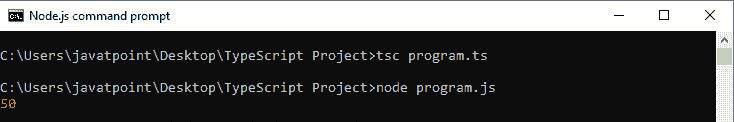
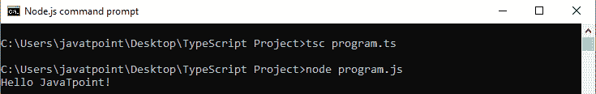
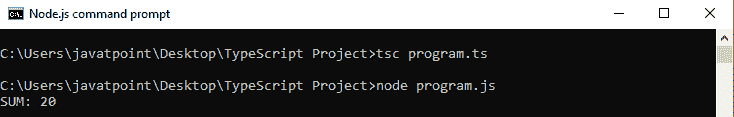
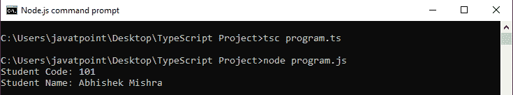

# TypeScript箭头函数

> 原文：<https://www.javatpoint.com/typescript-arrow-function>

ES6 版本的 TypeScript 提供了一个箭头函数，这是定义匿名函数的**简写**语法，即函数表达式。它省略了函数关键字。我们可以称之为胖箭(因为- >是细箭而= >是“**胖**”箭)。它也被称为**λ函数**。箭头函数有“**”这个**”关键字的词法范围。

箭头功能的动机是:

*   当我们不需要保持打字功能的时候。
*   它从词汇上抓住了这个关键词的意思。
*   它从词汇上抓住了论点的含义。

### 句法

我们可以将 Arrow 函数的语法分成三部分:

*   **参数:**一个函数可以有参数，也可以没有参数。
*   **箭头符号/λ符号** (= >)
*   **语句:**表示函数的指令集。

```

(parameter1, parameter2, ..., parameterN) => expression;

```

如果使用**胖箭头(= > )** 符号，就不需要使用**功能**关键字。参数在括号()中传递，函数表达式包含在花括号{}中。

在 ES5 和 ES6 的编码风格中，有两种编写函数的方式。

```

// ES5: Without arrow function
var getResult = function(username, points) {
  return username + ' scored ' + points + ' points!';
};

// ES6: With arrow function
var getResult = (username: string, points: number): string => {
  return `${ username } scored ${ points } points!`;
}

```

* * *

## 带参数的箭头函数

下面的程序是一个带参数的箭头函数的例子。

```

let sum = (a: number, b: number): number => {
            return a + b;
}
console.log(sum(20, 30)); //returns 50

```

在上例中， **sum** 为箭头函数， **a: number，b: number** 为参数类型，**number**为返回类型，箭头符号= >将函数参数和函数体分开。

编译上述 TypeScript 程序后，对应的 JavaScript 代码为:

```

let sum = (a, b) => {
    return a + b;
};
console.log(sum(20, 30)); //returns 50

```

**输出:**



* * *

## 不带参数的箭头函数

下面的程序是一个不带参数的箭头函数的例子。

```

let Print = () => console.log("Hello JavaTpoint!");
Print();

```

**输出:**



在 arrow 函数中，如果函数体只由一条语句组成，那么就不需要花括号和 return 关键字。我们可以从下面的例子来理解。

```

let sum = (a: number, b: number) => a + b;
console.log("SUM: " +sum(5, 15));

```

**输出:**



* * *

## 类中的箭头函数

我们可以在类中包含箭头函数作为属性。下面的例子有助于更清楚地理解它。

```

class Student {
    studCode: number;
    studName: string;
    constructor(code: number, name: string) {
            this.studName = name;
            this.studCode = code;
    }
    showDetail = () => console.log("Student Code: " + this.studCode + '\nStudent Name: ' + this.studName)
}
let stud = new Student(101, 'Abhishek Mishra');
stud.showDetail();

```

**输出:**

