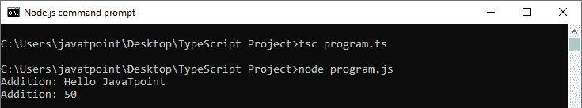
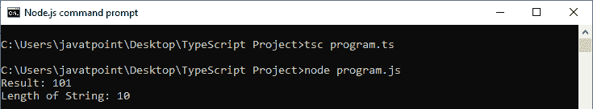

# TypeScript函数重载

> 原文：<https://www.javatpoint.com/typescript-function-overloading>

函数重载是一种创建多个方法的机制或能力，这些方法具有相同的**名称**但是不同的参数类型和**返回类型**。但是，它可以有相同数量的参数。函数重载也称为方法重载。

在下列情况下，允许函数/方法重载:

*   函数名是相同的
*   每个重载函数中的参数数量是不同的。
*   参数数量相同，类型不同。
*   所有重载函数必须具有相同的返回类型。

假设我们必须执行数字的**乘法**，这具有不同数量的参数。我们为**两个参数**编写了**两个**方法，如 mul_a(数，数)，为**三个参数**编写了 mul_b(数，数，数)。现在，我们和其他程序员可能很难理解这个方法的行为，因为它的名字**不同于**。在这种情况下，我们需要使用函数重载，这增加了程序的可读性。

## 函数重载的优势

*   它节省了内存空间，因此程序执行变得更快。
*   它提供了代码可重用性，节省了时间和精力。
*   它增加了程序的可读性。
*   代码维护很容易。

**例**

```

//Function with string type parameter
function add(a:string, b:string): string;
//Function with number type parameter
function add(a:number, b:number): number;
//Function Definition
function add(a: any, b:any): any {
    return a + b;
}
//Result
console.log("Addition: " +add("Hello ", "JavaTpoint")); 
console.log("Addition: "+add(30, 20));

```

在上例中:

*   前两条**线是功能过载**申报**。它有两个重载:**
    *   接受**字符串**参数的函数。
    *   接受**数字**参数的函数。
*   第三行是**功能定义**，参数的数据类型设置为**任意**。
*   最后两个语句**调用**重载函数。

编译完上面的 TypeScript 程序后，我们会得到下面的 JavaScript 代码。

```

//Function Definition
function add(a, b) {
    return a + b;
}
//Result
console.log("Addition: " + add("Hello ", "JavaTpoint"));
console.log("Addition: " + add(30, 20));

```

**输出:**



* * *

## 类中的函数重载

下面的示例有助于理解方法重载在类中的使用。

```

class A
{
    public foo(s: string): number;
    public foo(n: number): string;
    public foo(arg: any): any 
    {
        if (typeof(arg) === 'number')
            return arg.toString();
        if (typeof(arg) === 'string')
            return arg.length;
    }
}
let obj = new A();
console.log("Result: " +obj.foo(101));
console.log("Length of String: " +obj.foo("JavaTpoint"));

```

编译完上面的 TypeScript 程序后，我们会得到下面的 JavaScript 代码。

```

class A {
    foo(arg) {
        if (typeof (arg) === 'number')
            return arg.toString();
        if (typeof (arg) === 'string')
            return arg.length;
    }
}
let obj = new A();
console.log("Result: " + obj.foo(101));
console.log("Length of String: " + obj.foo("JavaTpoint"));

```

**输出:**



不支持使用不同数量的参数和不同类型以及相同的函数名进行函数重载。

### 例子

```

function display(x:number, y:number):void //Compiler Error: Duplicate function implementation
{
    console.log(x + x);
}

function display(x:string): void //Compiler Error: Duplicate function implementation
{
    console.log(x);
}

```