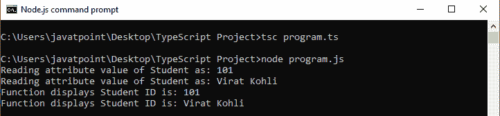
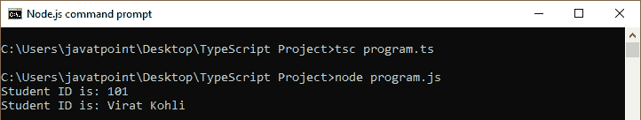
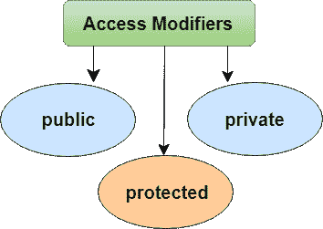

# 类型脚本类

> 原文：<https://www.javatpoint.com/typescript-classes>

在像 Java 这样的面向对象编程语言中，类是用来创建**可重用**组件的基本实体。它是一组具有共同属性的对象。就 OOPs 而言，一个类就是一个**模板**或者**蓝图**来创建对象。它是一个逻辑实体。

**类定义可以包含以下属性:**

*   **字段:**是类中声明的变量。
*   **方法:**它代表对象的一个动作。
*   **构造函数:**负责初始化内存中的对象。
*   **嵌套类和接口:**表示一个类可以包含另一个类。

TypeScript 是一种面向对象的 JavaScript 语言，因此它支持面向对象的编程特性，如类、接口、多态性、数据绑定等。JavaScript **ES5** 或**早期版本**不支持类。TypeScript 从 **ES6** 和**更高版本**支持该功能。TypeScript 内置了**对使用类的**支持，因为它基于 ES6 版本的 JavaSript。如今，许多开发人员使用基于类的面向对象编程语言，并将它们编译成 JavaScript，这种语言可以在所有主要的浏览器和平台上工作。

### 声明类的语法

class 关键字用于在 TypeScript 中声明类。我们可以使用以下语法创建一个类:

```

class <class_name>{  
    field;  
    method;  
}

```

### 例子

```

class Student {
    studCode: number;
    studName: string;

    constructor(code: number, name: string) {
            this.studName = name;
            this.studCode = code;
    }

    getGrade() : string {
        return "A+" ;
    }
}

```

TypeScript 编译器将上面的类转换为下面的 JavaScript 代码。

```

var Student = /** @class */ (function () {
    function Student(code, name) {
        this.studName = name;
        this.studCode = code;
    }
    Student.prototype.getGrade = function () {
        return "A+";
    };
    return Student;
}());

```

* * *

## 创建类的对象

一个类通过使用 **new** 关键字后跟**类名**来创建一个对象。new 关键字在运行时为对象创建分配内存。所有对象都在堆内存区域获得内存。我们可以如下创建一个对象。

**语法**

```

let object_name = new class_name(parameter)

```

1.  **new 关键字:**用于实例化内存中的对象。
2.  表达式的右侧调用构造函数，构造函数可以传递值。

**例**

```

//Creating an object or instance   
let obj = new Student();

```

* * *

## 对象初始化

对象初始化意味着将数据存储到对象中。初始化对象有三种方法。这些是:

### 1.通过引用变量

**例**

```

//Creating an object or instance   
let obj = new Student();

//Initializing an object by reference variable
obj.id = 101;
obj.name = "Virat Kohli";

```

### 2.通过方法

方法类似于用于公开对象行为的函数。

**方法优势**

*   代码可重用性
*   代码优化

**例**

```

//Defining a Student class.
class Student { 
    //defining fields  
    id: number;
    name:string;

    //creating method or function 
    display():void { 
        console.log("Student ID is: "+this.id) 
        console.log("Student ID is: "+this.name) 
    } 
} 

//Creating an object or instance   
let obj = new Student();
obj.id = 101;
obj.name = "Virat Kohli";
obj.display();

```

**输出:**


### 3.按构造函数

构造函数用于初始化对象。在 TypeScript 中，构造函数方法总是用名称“**构造函数**来定义在构造函数中，我们可以通过使用**这个**关键字来访问一个类的成员。

#### 注意:类中不需要总是有构造函数。

**例**

```

//defining constructor 
constructor(id: number, name:string) { 
    this.id = id;
    this.name = name;
}  

```

**带构造函数、方法和对象的示例:**

```

//Defining a Student class.
class Student { 
    //defining fields  
    id: number;
    name:string;

    //defining constructor 
   constructor(id: number, name:string) { 
       this.id = id;
       this.name = name;
   }  

   //creating method or function 
   display():void { 
      console.log("Function displays Student ID is: "+this.id) 
      console.log("Function displays Student ID is: "+this.name) 
   } 
} 

//Creating an object or instance   
let obj = new Student(101, "Virat Kohli")

//access the field 
console.log("Reading attribute value of Student as: " +obj.id,)
console.log("Reading attribute value of Student as: " +obj.name)

//access the method or function
obj.display()

```

**输出:**



**无构造函数示例**

```

//Defining a Student class.
class Student { 
    //defining fields  
    id: number;
    name:string;
} 

//Creating an object or instance   
let obj = new Student();

// Initializing an object
obj.id = 101;
obj.name = "Virat Kohli";

//access the field 
console.log("Student ID: " +obj.id,);
console.log("Student Name: " +obj.name);

```

**输出:**



* * *

## 数据隐藏

这是一种用于隐藏内部对象细节的技术。一个类可以从其他类的成员中控制其数据成员的可见性。这种能力被称为封装或数据隐藏。OOPs 使用访问修饰符的概念来实现封装。访问修饰符定义了类数据成员在其定义类之外的可见性。

TypeScript 支持三种类型的访问修饰符。这些是:



要阅读更多关于访问修饰符的信息，请点击这里。