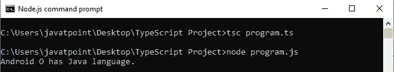
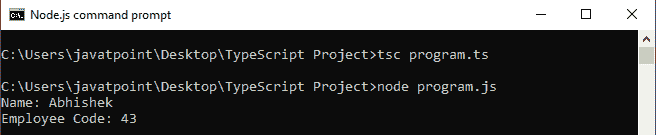
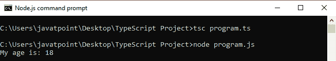
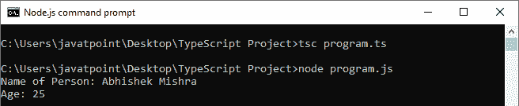

# TypeScript接口

> 原文：<https://www.javatpoint.com/typescript-interface>

在我们的应用程序中，接口是一种充当**契约**的结构。它定义了类要遵循的语法，这意味着实现接口的类必须实现它的所有成员。我们不能实例化接口，但是它可以被实现它的类对象引用。TypeScript 编译器使用接口对对象是否具有特定结构进行**类型检查**(也称为“鸭式类型”或“结构子类型”)。

界面只包含**方法**和**字段**的**声明**，不包含**实现**。我们不能用它来建造任何东西。它由一个类继承，实现接口的类定义接口的所有成员。

当 Typescript 编译器将其编译成 JavaScript 时，该接口将从 JavaScript 文件中消失。因此，它的目的只是在开发阶段提供帮助。

## 接口声明

我们可以如下声明一个接口。

```

interface interface_name {
          // variables' declaration
          // methods' declaration
}

```

*   **接口**是一个关键字，用于声明一个TypeScript接口。
*   一个**接口 _ 名称**是接口的名称。
*   接口主体包含变量和方法声明。

**例**

```

interface OS {
    name: String;
    language: String;
}
let OperatingSystem = (type: OS): void => {
  console.log('Android ' + type.name + ' has ' + type.language + ' language.');
};
let Oreo = {name: 'O', language: 'Java'}
OperatingSystem(Oreo);

```

在上面的例子中，我们创建了一个接口操作系统，其属性名和语言为字符串类型。接下来，我们定义了一个函数，有一个参数，就是接口 OS 的类型。

现在，将 TS 文件编译成如下所示的 JS 输出。

```

let OperatingSystem = (type) => {
    console.log('Android ' + type.name + ' has ' + type.language + ' language.');
};
let Oreo = { name: 'O', language: 'Java' };
OperatingSystem(Oreo);

```

**输出:**



## 界面的使用

我们可以将该界面用于以下事项:

*   验证属性的特定结构
*   作为参数传递的对象
*   从函数返回的对象。

### 接口继承

我们可以从其他接口继承这个接口。换句话说，Typescript 允许从零个或多个**基本类型**继承接口。

基本类型可以是**类**或**接口**。我们可以使用“**扩展**关键字来实现接口之间的继承。

下面的例子帮助我们更清楚地理解接口继承。

**语法**

```

child_interface extends parent interface{
}

```

**例**

```

interface Person { 
   name:string
   age:number
}
interface Employee extends Person { 
   gender:string
   empCode:number
}
let empObject = {}; 
empObject.name = "Abhishek"
empObject.age = 25 
empObject.gender = "Male"
empObject.empCode = 43
console.log("Name: "+empObject.name);
console.log("Employee Code: "+empObject.empCode); 
```

**输出:**



举个上面的例子，有助于我们理解**多接口**继承。

**例**

```

interface Person { 
   name:string  
}
interface PersonDetail { 
    age:number
    gender:string
}
interface Employee extends Person, PersonDetail { 
    empCode:number
}
let empObject = {}; 
empObject.name = "Abhishek"
empObject.age = 25 
empObject.gender = "Male"
empObject.empCode = 43
console.log("Name: "+empObject.name);
console.log("Employee Code: "+empObject.empCode); 
```

**输出:**


## 数组类型接口

我们也可以使用接口来描述数组类型。以下示例有助于我们理解数组类型接口。

**例**

```

// Array which return string
interface nameArray {
    [index:number]:string
}
// use of the interface
let myNames: nameArray;
myNames = ['Virat', 'Rohit', 'Sachin'];

// Array which return number
interface ageArray {
    [index:number]:number
}
var myAges: ageArray;
myAges =[10, 18, 25];
console.log("My age is: " +myAges[1]);

```

在上面的例子中，我们已经声明了返回**字符串**的**名称数组**和返回**数字**的**年龄数组**。数组中索引的类型始终是**号**，这样我们就可以利用它在数组中的**索引位置**来检索数组元素。

**输出:**



## 类中的接口

TypeScript 还允许我们在类中使用接口。一个类通过使用**实现**关键字来实现接口。我们可以用下面的例子来理解。

**例**

```

// defining interface for class
interface Person {
    firstName: string;
    lastName: string;
    age: number;
    FullName();
    GetAge();
}
// implementing the interface
class Employee implements Person {
    firstName: string;
    lastName: string;
    age:number;
    FullName() {
        return this.firstName + ' ' + this.lastName;
    }
    GetAge() {
        return this.age;
    }
    constructor(firstN: string, lastN: string, getAge: number) {
        this.firstName = firstN;
        this.lastName = lastN;
        this.age = getAge;
    }
}
// using the class that implements interface
let myEmployee = new Employee('Abhishek', 'Mishra', 25);
let fullName = myEmployee.FullName();
let Age = myEmployee.GetAge();
console.log("Name of Person: " +fullName + '\nAge: ' + Age);

```

在上例中，我们已经声明了 **Person** 接口，其中**名**、**姓**为属性，**全名**和 **GetAge** 为**方法/函数**。 **Employee** 类通过使用**实现**关键字来实现这个接口。实现接口后，我们必须声明类中的属性和方法。如果我们不实现那些属性和方法，它会抛出一个**编译时**错误。我们还在类中声明了一个构造函数。所以当我们实例化这个类时，我们需要传递必要的参数，否则它会在编译时抛出一个错误。

**输出:**



## 接口和继承的区别

| 塞内加尔 | 连接 | 遗产 |
| 1. | 接口是一种在我们的应用程序中充当契约的结构。它定义了所需的功能，该类负责实现它以满足该约定。 | 继承是面向对象的编程，允许相似的对象相互继承功能和数据。 |
| 2. | 在接口中，我们只能声明属性和方法。 | 在继承中，我们可以使用超类来声明和定义变量和方法。 |
| 3. | 接口类型对象不能声明任何新的方法或变量。 | 在这种情况下，我们可以声明和定义继承超类的子类的变量和方法。 |
| 4. | 接口强制执行必须出现在对象中的变量和方法。 | 子类扩展了超类的能力，以适应“**自定义**”的需求。 |
| 5. | 接口是包含无体结构(抽象或虚函数)的类。因此，我们必须导出接口，然后实现子类中的所有功能。 | 继承是一个子类获取其超类属性的过程。 |