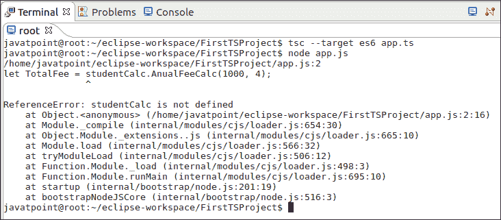
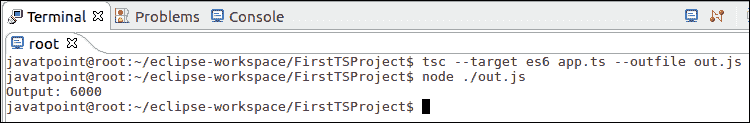

# TypeScript 命名空间

> 原文：<https://www.javatpoint.com/typescript-namespaces>

名称空间是用于功能的**逻辑分组**的方式。它封装了共享公共关系的特征和对象。它允许我们以更简洁的方式组织代码。

命名空间也称为**内部模块**。命名空间还可以包括接口、类、函数和变量，以支持一组相关的功能。

与 JavaScript 不同，名称空间是内置在 TypeScript 中的。在 JavaScript 中，变量声明进入**全局范围**。如果在同一个项目中使用了多个 JavaScript 文件，那么有可能通过用相似的名称覆盖它们来混淆新用户。因此，使用 TypeScript 命名空间消除了**命名冲突**。

#### 注意:一个名称空间可以跨越多个文件中的，并允许使用“ -outFile ”连接每个文件，因为它们都是在一个地方定义的。它使代码更容易维护。

## 命名空间声明

我们可以通过使用**命名空间**关键字后跟**命名空间 _ 名称**来创建一个命名空间。通过使用 **export** 关键字，可以在**大括号{}** 中定义所有的接口、类、函数和变量。export 关键字使命名空间之外的人可以访问每个组件。我们可以如下声明命名空间。

```

namespace <namespace_name> {
               export interface I1 { }
               export class c1{ }
}

```

要访问另一个命名空间中的接口、类、函数和变量，我们可以使用以下语法。

```

namespaceName.className;
namespaceName.functionName;

```

如果命名空间在单独的 TypeScript 文件中，则必须使用**三斜杠(///)** 引用语法来引用它。

```

/// < reference path = "Namespace_FileName.ts" />

```

### 例子

下面的程序帮助我们理解名称空间的使用。

**创建项目和申报文件**

命名空间文件: **studentCalc**

```

namespace studentCalc{
	export function AnualFeeCalc(feeAmount: number, term: number){
	return feeAmount * term;
	}
}

```

主文件: **app.ts**

```

/// <reference path = "./studentCalc.ts" />

let TotalFee = studentCalc.AnualFeeCalc(1500, 4);

console.log("Output: " +TotalFee);

```

**编译和执行命名空间**

打开终端，转到存储项目的位置。然后，键入以下命令。

```

$ tsc --target es6 app.ts
$ node app.js

```

我们将看到下面的输出: **studentCalc** 未定义。



所以，**编译**和**执行**以上代码的正确方法，我们需要在终端窗口使用以下命令。

```

$ tsc --target es6 app.ts --outfile out.js
$ node ./out.js

```

现在，我们可以看到以下输出。



* * *

## 嵌套命名空间

命名空间还允许我们将一个命名空间定义到另一个命名空间中。我们可以通过使用**点(。)**运算符。下面的示例帮助我们更清楚地理解嵌套的命名空间。

**例**

嵌套命名空间文件: **StoreCalc**

```

namespace invoiceCalc { 
   export namespace invoiceAccount { 
      export class Invoice { 
         public calculateDiscount(price: number) { 
            return price * .60; 
         } 
      } 
   } 
}

```

主文件: **app.ts**

```

/// let invoice = new invoiceCalc.invoiceAccount.Invoice(); 

console.log("Output: " +invoice.calculateDiscount(400)); 
```

现在**编译****用下面的命令执行**上面的代码。

```

$ tsc --target es6 app.ts --outfile out.js
$ node ./out.js

```

它产生以下输出。

```
Output: 240

```