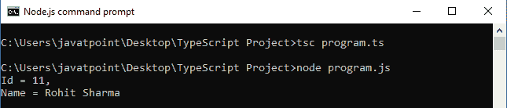

# TypeScript 泛型

> 原文：<https://www.javatpoint.com/typescript-generics>

TypeScript 泛型是一个工具，它提供了一种创建**可重用**组件的方法。它创建了一个组件，可以使用**多种数据类型**而不是单一数据类型。它允许用户使用这些组件并使用他们自己的类型。泛型确保了程序的灵活性以及长期的可伸缩性。

泛型提供了类型安全性，而不影响性能或生产率。TypeScript 使用泛型和表示类型的类型变量。泛型函数的类型就像非泛型函数一样，首先列出类型参数，类似于函数声明。

在泛型中，我们需要在**开(< )** 和**关(> )** 括号之间写一个**类型参数**，使其成为强类型集合。泛型使用一种特殊的类型变量 **< T >** ，表示**类型**。泛型集合只包含相似类型的对象。

在 TypeScript 中，我们可以创建泛型类、泛型函数、泛型方法和泛型接口。TypeScript 泛型几乎类似于 C#和 Java 泛型。

**例**

下面的例子帮助我们清楚地理解泛型。

```
function identity<T>(arg: T): T {  
    return arg;  
}  
let output1 = identity<string>("myString");  
let output2 = identity<number>( 100 );
console.log(output1);
console.log(output2);

```

当我们编译上面的文件时，它会返回相应的 JavaScript 文件，如下所示。

```

function identity(arg) {
    return arg;
}
var output1 = identity("myString");
var output2 = identity(100);
console.log(output1);
console.log(output2);

```

**输出:**


### 仿制药的优势

泛型主要有三个优点。它们如下:

1.  **类型安全:**我们在泛型中只能持有单一类型的对象。它不允许存储其他对象。
2.  **不需要类型转换:**不需要类型转换对象。
3.  **编译时检查:**编译时检查，所以运行时不会出现问题。

## 为什么需要泛型？

我们可以通过下面的例子来理解对泛型的需求。

```

function getItems(items: any[] ) : any[] {
    return new Array().concat(items);
}
let myNumArr = getItems([10, 20, 30]);
let myStrArr = getItems(["Hello", "JavaTpoint"]);
myNumArr.push(40); // Correct
myNumArr.push("Hello TypeScript"); // Correct
myStrArr.push("Hello SSSIT"); // Correct
myStrArr.push(40); // Correct
console.log(myNumArr); // [10, 20, 30, 40, "Hello TypeScript"]
console.log(myStrArr); // ["Hello", "JavaTpoint", "Hello SSSIT", 40]

```

**输出:**


在上面的例子中， **getItems()** 函数接受一个类型为**任意**的数组。getItems()函数创建一个类型为 **any** 的新数组，将项目连接到它并返回这个新数组。因为我们使用了任何数据类型，所以我们可以向函数传递任何类型的项。但是，这可能不是添加项目的正确方式。我们必须将**数字**添加到**数字数组**中，将**字符串**添加到**字符串数组**中，但我们不想将数字添加到字符串数组中，反之亦然。

为了解决这个问题，TypeScript 引入了泛型。在泛型中，类型变量只接受用户在声明时提供的特定类型。它还保留了类型检查信息。

所以，我们可以把上面的函数写成如下的泛型函数。

```

function getItems<T>(items : T[] ) : T[] {
    return new Array<T>().concat(items);
}
let arrNumber = getItems<number>([10, 20, 30]);
let arrString = getItems<string>(["Hello", "JavaTpoint"]);
arrNumber.push(40); // Correct
arrNumber.push("Hi! Javatpoint"); // Compilation Error
arrString.push("Hello TypeScript"); // Correct
arrString.push(50); // Compilation Error
console.log(arrNumber);
console.log(arrString);

```

**输出:**


在上例中，类型变量 T 在尖括号**中指定了函数 getItems < T >** 。这个变量还指定了参数的类型和返回值。它确保在函数调用时指定的数据类型也是参数和返回值的数据类型。

泛型函数 **getItems()** 接受数字数组和字符串数组。当我们调用函数 **getItems <编号>(【10，20，30】)**时，它会用编号替换 **T** 。因此，参数的类型和返回值将是数字数组。同样，对于函数**getItems<string>([“Hello”，“JavaPoint”])**，参数类型和返回值将是字符串数组。现在，如果我们尝试在 **arrNumber** 中添加一个字符串，或者在 **arrString** 数组中添加一个数字，编译器会显示一个错误。因此，它保留了类型检查的优势。

在 TypeScript 中，我们也可以在不指定类型变量的情况下调用泛型函数。TypeScript 编译器将根据参数值的数据类型设置函数的 T 值。

## 多类型变量

在 TypeScript 泛型中，我们可以用不同的名称定义多类型变量。我们可以用下面的例子来理解。

**例**

```

function displayDataType<T, U>(id:T, name:U): void { 
  console.log("DataType of Id: "+typeof(id) + "\nDataType of Name: "+ typeof(name));  
}
displayDataType<number, string>(101, "Abhishek");

```

**输出:**


## 具有非泛型类型的泛型

我们还可以将泛型类型与其他非泛型类型一起使用。

**例**

```

function displayDataType<T>(id:T, name:string): void { 
  console.log("DataType of Id: "+typeof(id) + "\nDataType of Name: "+ typeof(name));  
}
displayDataType<number>(1, "Abhishek");

```

**输出:**


## 泛型类

TypeScript 还支持泛型类。泛型类型参数在类名称后面的尖括号(<>)中指定。泛型类可以有泛型字段或泛型方法。

**例**

```

class StudentInfo<T,U>
{ 
    private Id: T;
    private Name: U;
    setValue(id: T, name: U): void { 
        this.Id = id;
        this.Name = name;
    }
    display():void { 
        console.log(`Id = ${this.Id}, Name = ${this.Name}`);
    }
}
let st = new StudentInfo<number, string>();
st.setValue(101, "Virat");
st.display();
let std = new StudentInfo<string, string>();
std.setValue("201", "Rohit");
std.display();

```

**输出:**


## 泛型接口

泛型类型也可以与接口一起使用。我们可以通过下面的例子来理解通用接口。

**例**

```

interface People {
    name: string
    age: number
}
interface Celebrity extends People {
    profession: string
}
function printName<T extends Celebrity>(theInput: T): void {
    console.log(`Name: ${theInput.name} \nAge: ${theInput.age} \nProfession: ${theInput.profession}`);
}
let player: Celebrity = {
    name: 'Rohit Sharma', age: 30, profession: 'Cricket Player'
}
printName(player);

```

**输出:**


## 作为函数类型的泛型接口

我们也可以使用泛型接口作为函数类型。下面的例子可以理解。

**例**

```

interface StudentInfo<T, U>
{
    (id: T, value: U): void;
};
function studentData(id: number, value:string):void { 
    console.log('Id = '+ id + ', \nName = ' + value)
}
let std: StudentInfo<number, string> = studentData;
std(11, "Rohit Sharma");

```



## 通用约束

正如我们所知，TypeScript泛型类型允许处理任何和所有数据类型。但是，我们可以通过使用约束将其限制为特定类型。在下面的示例中，我们将创建一个具有单个。长度属性。我们将使用这个接口，并且“**扩展**”关键字来表示我们的约束。

**例**

```

interface Lengthwise {
    length: number;
}
function loggingIdentity<T extends Lengthwise>(arg: T): T {
    console.log("Length: " +arg.length);  // It has a .length property, so no more error found
    return arg;
}
loggingIdentity({length: 10, value: 9});
loggingIdentity(3);  // Compilation Error, number doesn't have a .length property

```

**输出:**

```
Length: 10
Length: undefined

```

## 类的一般约束

下面给出了构造函数和类类型的实例方之间的泛型约束关系的一个更高级的例子。

**例**

```

class Student {
    Id: number;
    Name: string;

    constructor(id:number,  name:string) { 
        this.Id = id;
        this.Name = name;
    }
}
function display<T extends Student>(per: T): void {
    console.log(`${ st.Id} ${st.Name}` );
}
var st = new Student(101, "\nVirat Kohli");
display(st);

```

**输出:**

