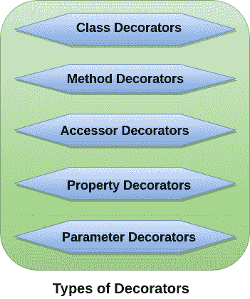

# TypeScript 装饰器

> 原文：<https://www.javatpoint.com/typescript-decorators>

装饰器是一种特殊的声明，可以应用于类、方法、访问器、属性或参数。装饰器只是前缀为**@表达式**符号的函数，其中表达式必须评估为一个函数，该函数将在运行时使用关于装饰声明的信息进行调用。

#### 注意:装饰器是为 ES7 提出的一个实验特性。它已经被一些 JavaScript 框架使用，包括 Angular 2。在未来的版本中，装饰者可能会改变。

要启用对装饰器的实验支持，我们必须在**命令行**或在我们的 **tsconfig.json:** 中启用**实验编辑器**编译器选项

## 命令行

```

$tsc --target ES5 --experimentalDecorators

```

tsconfig . JSON

```

{
    "compilerOptions": {
        "target": "ES5",
        "experimentalDecorators": true
    }
}

```

## 目的

TypeScript Decorators 的目的是以声明的方式向现有代码添加注释和元数据。

## 装饰工厂

为了定制装饰器如何应用于声明，我们可以编写一个装饰器工厂。装饰工厂是一个函数，它返回将由装饰者在运行时调用的表达式。

装饰工厂可以用以下方式编写:

```

function color(value: string) { // this is the decorator factory
    return function (target) { // this is the decorator
        // do something with 'target' and 'value'...
    }
}

```

## 装饰构图

我们可以对一个声明应用多个装饰器。下面的例子有助于理解它。

## 在一条线上

```

@f @g x

```

## 多行

```

@f
@g
x

```

## 装饰者的类型

TypeScript 使用以下类型的装饰器:



1.  [级装饰师](#class-decorators)
2.  [方法装饰者](#method-decorators)
3.  [访问者装饰器](#accessor-decorators)
4.  [物业装修商](#property-decorators)
5.  [参数装饰器](#parameter-decorators)

### 1.阶级装饰者

类装饰器就在类声明之前定义，它讲述类的行为。类装饰器应用于类的构造函数。类装饰器可以用来观察、修改或替换类定义。如果类装饰器返回值，它将用给定的构造函数替换类声明。

### 示例:

```

@sealed
class Person {
    msg: string;
    constructor(message: string) {
        this.msg = message;
    }
    show() {
        return "Hello, " + this.msg;
    }
}

```

在上面的例子中，当 **@sealed** 装饰器被执行时，它将同时密封构造器和它的原型，这样我们就不能继承 **Person** 类。

### 2.方法装饰者

方法装饰器就在方法声明之前定义。它应用于方法的属性描述符。它可用于观察、修改或替换方法定义。我们不能在声明文件中使用方法装饰器。

方法装饰函数的表达式接受三个参数。它们是:

1.  静态成员的类的构造函数或实例成员的类的原型。
2.  成员名称。
3.  成员的属性描述符。

### 示例:

在下面的例子中， **@log** 装饰器将记录新的条目。

```

class Item {
    itemArr: Array;
    constructor() {
        this.itemArr = [];
        }
    @log
    Add(item: string): void {
       this.itemArr.push(item);
       }
    GetAll(): Array {
       return this.itemArr;
       }
}

```

### 3.访问者装饰器

存取器装饰器就在存取器声明之前定义。它应用于访问者的属性描述符。它可用于观察、修改或替换访问者的定义。

#### 注意:访问器是类声明的 getter 和 setter 属性。

存取器装饰函数的表达式接受三个参数。它们是:

1.  静态成员的类的构造函数或实例成员的类的原型。
2.  成员名称。
3.  成员的属性描述符。

### 示例:

在下面的例子中，一个访问器装饰器**(@可配置)**被应用于**雇员**类的成员。

```

class Employee {
    private _salary: number;
    private _name: string;

    @configurable(false)
    get salary() { return 'Rs. ${this._salary}'; }
    set salary(salary: any) { this._salary = +salary; }

    @configurable(true)
    get name() { return 'Sir/Madam, ${this._name}'; }
    set name(name: string) { this._name = name; }
}

```

### 4.物业装修商

属性装饰器就在属性声明之前定义。它类似于方法装饰器。属性装饰器和方法装饰器之间的唯一区别是，它们不接受属性描述符作为参数，也不返回任何东西。

属性装饰函数的表达式接受两个参数。它们是:

1.  静态成员的类的构造函数或实例成员的类的原型。
2.  成员名称。

### 示例:

在下面的例子中， **@ReadOnly** 装饰器会将 name 属性设为只读，因此我们无法更改其值。

```

class Company {
 @ReadOnly 
 name: string = "JavaTpoint.com";
}
let comp = new Company();
comp.name = 'SSSIT.com'; // Here, we can't change company name.
console.log(comp.name); // 'JavaTpoint.com'

```

### 5.参数装饰器

参数装饰器就在参数声明之前定义。它应用于类构造函数或方法声明的函数。它不能在声明文件或任何其他环境上下文中使用(例如在声明的类中)。

参数装饰函数的表达式接受三个参数。它们是:

1.  静态成员的类的构造函数或实例成员的类的原型。
2.  成员名称。
3.  函数中参数的索引？的参数列表。

### 示例:

在下面的例子中，参数装饰器 **(@required)** 被应用于**人**类的成员的参数。

```

class Person {
    msg: string;
    constructor(message: string) {
        this.msg = message;
    }
    @validate
    show(@required name: string) {
        return "Hello " + name + ", " + this.msg;
    }
}

```

* * *