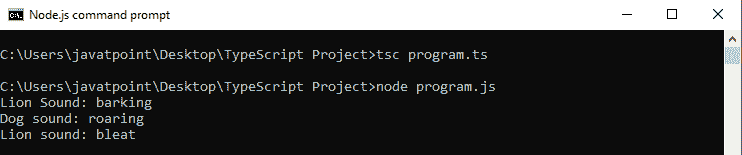

# TypeScript 鸭式打字

> 原文：<https://www.javatpoint.com/typescript-duck-typing>

根据 TypeScript，Duck-Typing 是用于检查更复杂变量类型的**类型兼容性**的方法/规则。

TypeScript 使用**鸭式输入**方法，通过检查两个对象是否具有匹配名称的**相同类型来比较一个对象和其他对象。这意味着我们不能改变变量的签名。例如，如果我们分配一个有两个**属性的对象，如名称、地址，下一次我们分配一个包含更多属性或更少属性的对象，或者两个属性都不包含(名称、地址)，那么 TypeScript 编译器将生成**编译时错误**。这个概念被称为**鸭打字**。****

duck-typing 特性在 TypeScript 代码中提供类型安全。

通过鸭式规则，TypeScript 编译器检查一个对象是否与其他对象相同。

根据 duck-typing 方法，两个对象必须具有相同的属性/变量类型。

```

class Dog {
    sound = "barking";
}
class Lion {
    sound = "roaring";
}
class Goat {
    sound = "bleat";
    swim(){
        console.log("Cannot Swim!");
    }
}
let lion: Lion = new Dog(); // substitutes
let dog: Dog = new Lion(); // substitutes
let lionTwo: Lion = new Goat();
//let goat: Goat = new Lion(); // IDE & compiler error
console.log("Lion Sound: "+lion.sound);
console.log("Dog sound: "+dog.sound);
console.log("Lion sound: "+lionTwo.sound);

```

**输出**



在上面的例子中，我们可以看到它不允许用一只**狮子**替换**一只山羊**，因为山羊类有一个额外的方法(所以狮子没有通过鸭子类型)。**狗**和狮子在鸭子打字中是可以替代的，因为没有什么是狮子做不到的，狗做不到的，反之亦然。

* * *