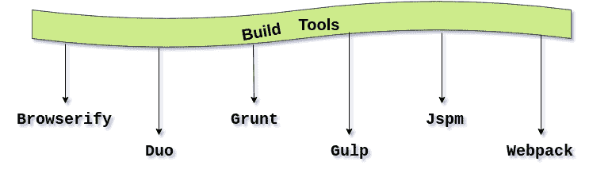

# 类型脚本构建工具

> 原文：<https://www.javatpoint.com/typescript-build-tools>

构建工具是编程工具，帮助我们将源代码的转换和 T2 打包成一个文件。构建工具实用程序用于构建程序的新版本。构建意味着将代码编译、链接和打包成可执行的形式。

构建工具通常在**命令行**上运行，或者在 IDE 中运行，或者与其完全分离。

构建工具或构建自动化是开发人员在日常活动中执行的各种任务的脚本或自动化行为。这些是:

*   正在下载依赖项。
*   将源代码编译成二进制代码。
*   打包二进制代码。
*   运行测试。
*   部署到生产系统。

## 构建工具的使用

在小型项目中，软件开发人员手动调用构建过程，这对于大型项目来说不是一个好的做法。这是因为，在较大的项目中，很难跟踪需要构建什么，以什么顺序构建，以及构建过程中应该依赖什么。因此，我们使用自动化工具，使构建过程更加一致。

可以与 TypeScript 集成的一些标准构建工具有:

1.  [浏览](#Browserify)
2.  [哆](#Duo)
3.  [咕哝](#Grunt)
4.  [大口吞咽](#Gulp)
5.  [日本时间](#Jspm)
6.  网页包



* * *

## 1.浏览

使用浏览器插件 **Tsify** 编译类型脚本文件。

**安装**

使用以下命令安装 **Tsify** :

```

$npm install Tsify

```

**使用命令行界面**

通过使用以下命令，编译您的代码，将结果保存在名为 **bundle.js.** 的文件中

```

browserify main.ts -p [ tsify --noImplicitAny ] > bundle.js

```

**使用原料药**

```

var browserify = require("browserify");
var tsify = require("tsify");

browserify()
    .add("main.ts")
    .plugin("tsify", { noImplicitAny: true })
    .bundle()
    .pipe(process.stdout);

```

* * *

## 2.二重奏

**安装**

使用以下命令安装 **Duo 插件**:

```

$npm install duo-typescript

```

**使用命令行界面**

通过使用以下命令，编译您的代码，将结果保存在名为 **entry.ts.** 的文件中

```

$duo --use duo-typescript entry.ts

```

**使用原料药**

```

var Duo = require("duo");
var fs = require("fs")
var path = require("path")
var typescript = require("duo-typescript");

var out = path.join(__dirname, "output.js")

Duo(__dirname)
    .entry("entry.ts")
    .use(typescript())
    .run(function (err, results) {
        if (err) throw err;
        // Write compiled result to output file
        fs.writeFileSync(out, results.code);
    });

```

* * *

## 3.咕哝

使用咕噜中的**咕噜-ts** 插件编译类型脚本文件。

**安装**

使用以下命令安装**咕噜声-ts** :

```

$npm install grunt-ts

```

现在，您需要在项目中包含名为**的咕噜**配置文件**。**

```

module.exports = function(grunt) {
    grunt.initConfig({
        ts: {
            default: {
                src: ["**/*.ts", "!node_modules/**/*.ts"]
            }
        }
    });
    grunt.loadNpmTasks("grunt-ts");
    grunt.registerTask("default", ["ts"]);
};

```

* * *

## 4.吞咽

使用一个**吞咽式脚本**插件来编译类型脚本文件。

**安装**

使用以下命令安装**吞咽式脚本**:

```

$npm install gulp-typescript

```

现在，您需要在您的项目中包含名为**的**大口配置**文件。**

```

var gulp = require("gulp");
var ts = require("gulp-typescript");

gulp.task("default", function () {
    var tsResult = gulp.src("src/*.ts")
        .pipe(ts({
              noImplicitAny: true,
              out: "output.js"
        }));
    return tsResult.js.pipe(gulp.dest("built/local"));
});

```

* * *

## 5\. 日本时间

使用 **jspm 插件**编译 TypeScript 文件。

**安装**

使用以下命令安装 **jspm** :

```

$npm install -g jspm@beta

```

#### 注意:目前 jspm 中的 TypeScript 支持在 **0.16beta** 中

* * *

## 6.网页包

使用 **ts-loader** 插件编译类型脚本文件。

**安装**

使用以下命令安装**网络包**:

```

$npm install ts-loader --save-dev

```

现在，您需要在项目中包含名为**的 Webpack **配置文件**。**

```

module.exports = {
    entry: "./src/index.tsx",
    output: {
        filename: "bundle.js"
    },
    resolve: {
        // Add '.ts' and '.tsx' as a resolvable extension.
        extensions: ["", ".webpack.js", ".web.js", ".ts", ".tsx", ".js"]
    },
    module: {
        loaders: [
            // all files with a '.ts' or '.tsx' extension will be handled by 'ts-loader'
            { test: /\.tsx?$/, loader: "ts-loader" }
        ]
    }
}

```

* * *