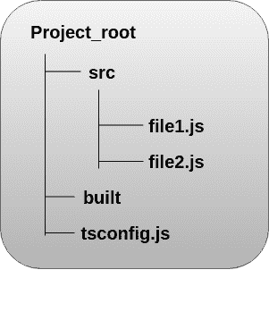

# 从 JavaScript 迁移到 TypeScript

> 原文：<https://www.javatpoint.com/migrating-from-javascript-to-typescript>

要从 JavaScript 迁移到 TypeScript，以下是必需的:

*   你知道 JavaScript。
*   您知道项目中使用的模式和构建工具。

让我们假设我们有需要转换成 TypeScript 的 JavaScript 文件。我们知道，当我们编译一个 TypeScript 文件时，它会生成相应的同名 JavaScript 文件。这里，我们需要确保作为输入的原始 JavaScript 文件不能在同一个目录中，这样 TypeScript 就不会覆盖它们。

从上面这一点来看，我们将假设我们的**目录**是像下面的结构一样设置的。这里，我们将所有输出文件保存在一个名为“**建造的**的输出目录中



我们可以使用以下过程从 JavaScript 迁移到 TypeScript:

1.  将 tsconfig.json 文件添加到项目中。
2.  与构建工具集成。
3.  移动所有。js 文件到。ts 文件。
4.  检查错误。
5.  唱响第三方 JavaScript 库。

* * *

## 1.将 tsconfig.json 文件添加到项目中

首先，我们需要在我们的项目中添加一个 **tsconfig.json** 文件。TypeScript 使用一个 tsconfig.json 文件来管理我们项目的编译选项，比如我们希望**包含**和**排除哪些文件。**

```

{
    "compilerOptions": {
        "outDir": "./built",
        "allowJs": true,
        "target": "es5"
    },
    "include": [
        "./src/**/*"
    ]
}

```

在上面的文件中，我们为 TypeScript 指定了一些内容:

*   **include** 选项读取 **src** 目录中的所有文件。
*   **allowJs** 选项接受所有 JavaScript 文件作为输入。
*   **outDir** 指定所有的**输出**文件应该在构建的文件夹中重定向。
*   **目标**选项指定所有的 JavaScript 构造应该被翻译成一个更老的版本，像 **ECMAScript 5。**

* * *

## 2.与构建工具集成

我们知道，大多数 JavaScript 项目都有一个集成的构建工具，比如**或者**网络包。****

 **#### 注意:每个构建工具都是不同的。

我们可以通过以下方式将项目与**网络包**集成:

**a)在终端上运行以下命令:**

```

$ npm install awesome-typescript-loader source-map-loader

```

在 webpack 集成中，我们将 **awesome-typescript 加载器**(一个 typescript 加载器)与**源图加载器**结合使用，以便于源代码的调试。

**b)将模块配置属性合并到我们的 webpack.config.js 文件中，以包括以下加载器:**

```

module.exports = {
    entry: "./src/index.ts",
    output: {
        filename: "./dist/bundle.js",
    },
    // Enable sourcemaps for debugging webpack's output.
    devtool: "source-map",
    resolve: {
        // Add '.ts' and '.tsx' as resolvable extensions.
        extensions: ["", ".webpack.js", ".web.js", ".ts", ".tsx", ".js"]
    },
    module: {
        loaders: [
            // All files with a '.ts' or '.tsx' extension will be handled by 'awesome-typescript-loader'.
            { test: /\.tsx?$/, loader: "awesome-typescript-loader" }
        ],
        preLoaders: [
            // All output '.js' files will have any sourcemaps re-processed by 'source-map-loader'.
            { test: /\.js$/, loader: "source-map-loader" }
        ]
    },
    // Other options...
};

```

* * *

## 3.移动所有。js 文件到。ts 文件

在这一部分，我们必须重新命名我们的**。js** 文件到**。ts** 文件。类似地，如果我们的文件使用 **JSX，**我们将需要将其重命名为 **.tsx.** 现在，如果我们在支持 TypeScript 的编辑器中打开该文件，我们的一些代码可能会出现**编译错误。**因此，逐个转换文件可以更容易地处理编译错误。如果 TypeScript 在转换过程中发现任何编译错误，它仍然能够翻译代码，就像 Word 打印我们的文档一样。

* * *

## 4.检查错误

将 js 文件移动到 ts 文件后，TypeScript 会立即启动我们代码的**类型检查**。因此，我们在 JavaScript 代码中得到**诊断**错误。下面列出了我们可能遇到的一些错误:

**a)我们可以使用任何来抑制错误，例如:**

在下面的代码中，我们可以使用**类型断言删除错误。**

```

var foo = 123;
var bar = 'hey';
bar = foo; // ERROR: cannot assign a number to a string
bar = foo as any  //Ok

```

**b)具有更少或更多参数的函数:**

```

function display(name, age, height) {
    let str1 = "Person named " + name + ",  " + age + " years old";
    let str2 = (height !== undefined) ? (" and " + height +  " feet tall") : '';
    console.log(str1 + str2);
}
display( "Rohit", 32);

```

在上面的代码中，函数 **display()** 取**三个**参数:姓名、年龄和身高。我们可以用两个值调用这个函数:“Rohit”和 23。它在 JavaScript 中完全有效，因为在 JavaScript 中，如果函数的预期参数丢失，它会将未定义的值赋给该参数。

但是，TypeScript 中的相同代码会给出**编译错误:预期有三个参数，但得到了两个**。为了消除这个错误，我们可以在参数高度上添加一个**可选参数符号**，并对我们的代码进行如下注释:

```

function display(name: string, age: number, height?: number) {
    let str1: string = "Person named " + name + ",  " + age + " years old";
    let str2: string = (height !== undefined) ? (" and " + height +  " feet tall") : '';
    console.log(str1 + str2);
}

```

**c)顺序添加的属性**

以下代码在 JavaScript 中非常常见。

```

var options = {};
options.color = "red";
options.volume = 11;

```

在 TypeScript 中，作为{}的选项类型是一个空对象。所以，**色****卷**不存在，不可赋值。如果我们将声明本身移到对象文字中，我们将不会得到任何错误:

```

let options = {
    color: "red",
    volume: 11
};

```

我们还可以定义选项的类型，并在对象文字上添加一个**类型断言**。

```

interface Options { color: string; volume: number }

let options = {} as Options;
options.color = "red";
options.volume = 11;

```

* * *

## 5.使用第三方 JavaScript 库

JavaScript 项目使用第三方库，如 **jQuery** 或 **Lodash。**为了编译文件，TypeScript 需要知道这些库中所有对象的类型。我们知道，JavaScript 库的类型定义文件已经可以在**定义类型上获得。**所以，我们不需要外部安装这种类型。我们只需要安装那些在我们的项目中使用的类型。

**例如**

对于 **jQuery** ，安装定义:

```

$ npm install @types/jquery

```

对于 **Lodash** ，安装定义:

```

$ npm install -S @types/lodash

```

一旦我们对我们的 JavaScript 项目进行了更改，运行**构建工具。**现在，我们应该将我们的 TypeScript 项目编译成可以在浏览器中运行的普通 JavaScript。

* * ***