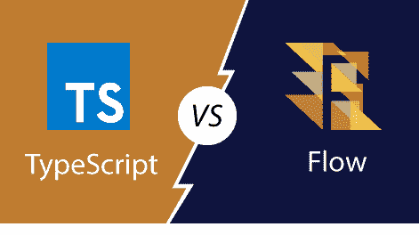

# TypeScript 和流之间的区别

> 原文：<https://www.javatpoint.com/typescript-vs-flow>

## 流动

**脸书**开发了 Flow，这是一个 JavaScript **静态类型检查器**，它位于我们现有的 JS 代码之上。这是一个基于**流程的**打字工具，不是编程语言。它做了很多工作来提高我们的工作效率。它让我们的程序**更快**、**更聪明**，更自信，规模更大。

流程使用静态**类型注释**检查代码中的**错误**。类型注释允许我们告诉流我们希望我们的代码如何工作，并且流将确保它以同样的方式工作。流量是递增可接受的。它可以很容易地从我们的**代码库中**添加和**移除**，而不会破坏任何东西。当我们希望只为项目的一部分启用**类型检查**时，这很有用。

## 以打字打的文件

TypeScript 是一种**开源**纯面向对象编程语言。它是 JavaScript 的强类型**超集**，可以编译成普通的 JavaScript。TypeScript 由**微软**根据 **Apache 2** 许可证开发和维护。它不是直接在浏览器上运行的。它需要一个编译器在 JavaScript 文件中编译生成。TypeScript 源文件在“**”中。ts** 扩展。

**安德斯·海尔斯伯格**开发了 TypeScript。于 2012 年 10 月 1 日**首次面向公众推出。经过微软两年的内部开发，新版 TypeScript 0.9 于 **2013** 发布。当前版本的 TypeScript 为 **TypeScript 3.4.5** ，于 2019 年 4 月 24 日**发布**。**

## TypeScript 与流

我们可以从下表中了解 TypeScript 和 Flow 之间的主要区别。

|  | 以打字打的文件 | 流动 |
| **简介** | 它是 JavaScript 语言的类型化超集。它是微软推出的开源免费编程语言。 | 它是一个基于流程的打字工具，而不是编程语言。它是一个 JavaScript 静态类型检查器，位于我们现有的 JS 代码之上。构建流是为了实现快速而精确的代码分析。 |
| **设计目标** | 它用于通过正确性和生产率之间的平衡来识别程序中的错误。 | 它用于加强类型的可靠性/安全性。 |
| **用例(流行框架集成)** | 当我们在 Angular 2 或更高版本上工作时，它会成为更好的选择。 | 如果我们正在研究 React，那么 Flow 将成为一个更好的选择，因为它很容易与 babel 和现有的基础设施集成。 |
| **福利** | 主要好处是:

*   It uses static types as its main benefit.
*   Provide useful tools such as code refactoring, auto-completion, navigation, etc.
*   It has excellent IDE support.
*   It can be easily integrated with VSCode, which makes the editor so popular.

 | 主要好处是:

*   It uses static types as its main benefit.
*   It provides powerful program analysis.
*   It is easy to understand the code.
*   It analyzes and controls the program powerfully.

 |
| **功能** | Typescript 的主要功能有:

*   Compile time type checking
*   Type annotation
*   Type erasure
*   Type inference
*   enumeration type
*   port
*   Namespace
*   Generics
*   tuple

 | Flow 的主要特点是:

*   reliability
*   speed
*   High throughput
*   Path sensitivity
*   Low delay
*   Type inference
*   Real-time feedback
*   Easy to integrate
*   Easy to understand JavaScript mode

 |
| **服务** | 除了提供静态类型，它还为我们提供了出色的语言服务和适当的工具，包括代码重构、导航和自动完成。 | 除了提供静态类型，Flow 还为我们提供了广泛的过程间分析，并对我们的代码进行了深入的理解。 |
| **优势** | TypeScript 的优势有:

*   Popular framework support (Vue, React, Angular)
*   Qiangda community
*   Strong IDE support
*   Compatibility with JavaScript
*   Declaration document

 | Flow 的优势有:

*   Support any JS file
*   Easy to integrate
*   Strong understanding of JS mode
*   Real-time feedback
*   type conversion
*   Easy readability
*   Easier to modify

 |
| **缺点** | TypeScript 的缺点是:

*   Another programming language
*   More difficult to compare with existing JS projects

集成 | Flow 的缺点是:

*   Smaller community
*   Not paying much attention to types.
*   Smaller IDE support.

 |
| **效用大小** | 42.4 兆字节 | 68.4 兆字节 |

* * *