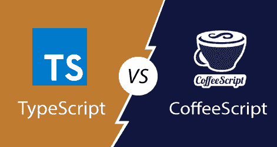

# 打字稿和咖啡稿的区别

> 原文：<https://www.javatpoint.com/typescript-vs-coffeescript>

## 咖啡脚本

CoffeeScript 是一种动态的、命令式的、脚本化的、多范式的、基于原型的、命令式的和函数式的编程语言，用于将**代码转换成 *JavaScript* 。其**语法**接近于 **Python** ，以及 **Ruby** 编程语言。咖啡脚本为复杂和大规模的应用程序开发提供了清晰的可见性。**

**Jeremy Ashkenas** 在 **2009** 年设计开发了 CoffeeScript。咖啡脚本获得了**麻省理工学院许可**的许可。咖啡脚本文件的文件扩展名是**。咖啡**或**。点燃咖啡**。它的语法类似于 JavaScript，有很多特性，为**代码可读性**提供了更大的灵活性。它还提供了类似于 Ruby 和 Python 语言的工具。

CoffeeScript 将代码一个接一个地编译成等价的 JavaScript 代码，运行时没有解释。编译后的输出是可读的，并且将在所有其他 JavaScript 应用程序或用法中工作，并且旨在比普通等效手写 JavaScript 运行更快**。**

 ****咖啡脚本的优势**

*   它是一种可靠的编程语言，支持编写动态程序。
*   它为大多数操作符提供了别名，这使得代码可读。
*   用 CoffeeScript 编写的程序也很容易维护。
*   它提供链式比较、对象迭代、并行赋值等。
*   这很容易理解。
*   代码很容易阅读和维护。

## 以打字打的文件

TypeScript 是一种**开源**纯面向对象编程语言。它是 JavaScript 的强类型**超集**，可以编译成普通的 JavaScript。TypeScript 由**微软**根据 **Apache 2** 许可证开发和维护。它不是直接在浏览器上运行的。它需要一个编译器在 JavaScript 文件中编译生成。TypeScript 源文件在“**”中。ts** 扩展。

我们可以对服务器端的*和客户端的*web 应用程序使用 Typescript。也用于**大规模** web 应用的开发。它增加了对 *ECMAScript* 中存在的不同功能的支持，该功能由 ECMA 集团的 **TC39** 委员会维护。**

 ****安德斯·海尔斯伯格**开发了 TypeScript。其第一版于 2012 年 10 月 1 日**月**向公众推出。经过微软两年的内部开发，新版 TypeScript 0.9 于 **2013** 发布。当前版本的 TypeScript 为 *TypeScript 3.4.5* ，于 2019 年 4 月 24 日**发布**。

**打字稿的优势**

*   它用于服务器端和客户端语言。
*   它是一种开源和面向对象的编程语言。
*   最适合大型项目。
*   它支持 ECMA 脚本 6 功能。
*   它是 JavaScript 的超集。

## 打字脚本与咖啡脚本

我们可以从下表中理解 TypeScript 和 CoffeeScript 之间的主要区别。

|  | 以打字打的文件 | 咖啡脚本 |
| **简介** | 它是一种开源的、动态的高级编程语言。 | 它是一种轻量级编程语言，为 JavaScript 语言提供支持。 |
| **维护** | 它由微软根据 Apache2 许可证开发和维护。 | 它由开发者社区根据麻省理工学院许可证自行开发和维护。 |
| **关系** | 它是 JavaScript 的超集。 | 它支持大多数的 JavaScript 特性。它是 JavaScript 的增强版。 |
| **平台** | 它可以在任何浏览器上运行以显示动态内容。 | 它需要任何 JavaScript 引擎来运行代码。 |
| **网络应用** | TypeScript 用于服务器端和客户端 web 应用程序。 | CoffeeScript 仅用于服务器端 web 应用程序。 |
| **界面的使用** | TypeScript 高度支持接口的使用。 | CoffeeScript 对接口的使用支持度很低。 |
| **兼容性** | TypeScript 几乎支持所有浏览器。 | 咖啡脚本支持浏览器中的内容，这取决于特定的功能。 |
| **能力** | TypeScript 具有很高的面向对象能力。但它是一种严格类型化的编程语言。 | CoffeeScript 具有很高的面向对象能力。但它是一种动态类型的编程语言。 |
| **选择打字稿/咖啡稿时** | 当我们想要静态类型检查和更好的工具支持时，TypeScript 是最好的。 | 当我们想要更简洁的代码和大量的语法糖时，CoffeeScript 是最好的。 |
| **最新版本** | 3.5.3 是 TypeScript 的当前稳定版本。 | 2.4.1 是咖啡脚本的当前稳定版本。 |

* * *****