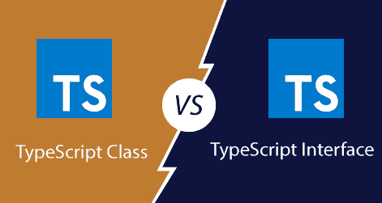

# 类型脚本类和接口的区别

> 原文：<https://www.javatpoint.com/typescript-class-vs-interface>

## 班级

TypeScript 是一种面向对象的 JavaScript 语言，支持类、接口、多态性、数据绑定等编程特性。TypeScript 从 **ES6** 及更高版本开始支持这些功能。

类是用于创建**可重用**组件的基本实体。它是一组具有共同属性的对象。就 OOPs 而言，类是创建对象的模板或蓝图。它是一个逻辑实体。

我们可以在类定义中定义以下属性:

**字段:**是类中声明的变量。
**方法:**代表对物体的一个动作。
**构造函数:**负责初始化内存中的对象。
**嵌套类和接口:**表示一个类可以包含另一个类。

**声明类的语法**

我们可以在 TypeScript 中使用 **class** 关键字来声明一个类。以下语法解释了类声明。

```

class <class_name>{    
    field;    
    method;    
}  

```

要阅读更多信息，[点击此处](typescript-classes)。

## 连接

在我们的应用程序中，接口是一种充当**契约**的结构。它定义了类要遵循的语法，这意味着实现接口的类必须实现它的所有成员。我们不能实例化接口，但是它可以被实现它的类对象引用。

接口只包含方法和字段的声明**，不包含实现。我们不能用它来建造任何东西。类继承接口，实现接口的类定义接口的所有成员。**

当 Typescript 编译器将其编译成 JavaScript 时，该接口将从 JavaScript 文件中删除。因此，它的目的只是在开发阶段提供帮助。

**界面声明**

我们可以在 TypeScript 中使用**接口**关键字来声明一个接口。以下语法解释了接口声明。

```

interface interface_name {  
          // variables' declaration  
          // methods' declaration  
}  

```

**界面使用**

我们可以将该界面用于以下事项:

*   验证属性的特定结构
*   作为参数传递的对象
*   从函数返回的对象。

要阅读更多信息，[点击此处](typescript-interface)。

## 类型脚本类与类型脚本接口



|  | 类型脚本类 | 类型脚本接口 |
| **简介** | 类是用于创建可重用组件的基本实体。它是一组具有共同属性的对象。它可以包含字段、方法、构造函数等属性。 | 接口定义了一个在我们的应用程序中充当契约的结构。它只包含方法和字段的声明，而不包含实现。 | 用法 | 它用于对象创建、字段封装、方法。 | 它用于为实体创建结构。 | **关键词** | 我们可以使用 class 关键字创建一个类。 | 我们可以使用 interface 关键字创建一个接口。 | **编译** | 在代码编译期间，类不能消失。 | 接口在代码编译期间完全消失了。 | **实时使用情况** | 设计模式，设计项目结构 | 已定义架构的实现 | **实例化** | 可以实例化一个类来创建一个对象。 | 无法实例化接口。 | **方法** | 类的方法用于执行特定的操作。 | 接口中的方法纯粹是抽象的(唯一的声明，没有主体)。 | **访问说明符** | 类的成员可以是公共的、受保护的或私有的。 | 接口的成员总是公共的。 | **施工方** | 一个类可以有一个构造函数。 | 接口不能有构造函数。 | **实施/延伸** | 一个类只能扩展一个类，并且可以实现任意数量的接口。 | 一个接口可以扩展多个接口，但不能实现任何接口。 |

* * *