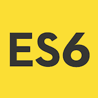

# 这是 6 个教程

> 哎哎哎:# t0]https://www . javatppoint . com/es 6

ES6 教程为您提供了基本和高级概念。

ES6 或 ECMAScript 6 是由 ECMAScript 国际标准化的脚本语言规范。该规范管理一些语言，如 [JavaScript](https://www.javatpoint.com/javascript-tutorial) 、ActionScript 和 Jscript。ECMAScript 一般用于客户端脚本，也用于使用 [Node.js](https://www.javatpoint.com/nodejs-tutorial) 编写服务器应用和服务。

ES6 允许您以一种使您的代码更加现代和可读的方式编写代码。通过使用 ES6 的特性，我们写得更少，做得更多，因此术语“写得更少，做得更多”适合 ES6。

本教程向您介绍了 ES6 在 JavaScript 中的实现。

## 什么是 ES6？

ES6 是 **ECMAScript 6** 的首字母缩写，也被称为 ECMAScript 2015。

ES6 或 **ECMAScript6** 是由 ECMAScript 国际标准化的脚本语言规范。应用程序使用它来启用客户端脚本。这个规范受到像 Self、 [Perl](https://www.javatpoint.com/perl-tutorial) 、 [Python](https://www.javatpoint.com/python-tutorial) 、 [Java](https://www.javatpoint.com/java-tutorial) 等编程语言的影响。该规范管理一些语言，如 JavaScript、ActionScript 和 Jscript。ECMAScript 一般用于客户端脚本，也用于使用 Node.js 编写服务器应用程序和服务。

ES6 允许您使代码更加现代化和可读。通过使用 ES6 的特性，我们写得更少，做得更多，因此术语“写得更少，做得更多”适合 ES6。ES6 向您介绍了许多伟大的特性，如范围变量、箭头函数、模板字符串、类析构、模块等。

创建 ES6 是为了标准化 JavaScript，以帮助几个独立的实现。自该标准首次发布以来，与其他最著名的实现如 **Jscript** 和 **ActionScript** 相比，JavaScript 一直是 ECMAScript 的知名实现。

## 历史

ECMAScript 规范是脚本语言的标准化规范，由 **Brendan Eich (** 他是美国技术专家，**网景(**的 JavaScript 编程语言 **)** 的创造者，是与网景浏览器的开发**相关的品牌名称。**

最初，ECMAScript 被命名为**摩卡、**后来的 **LiveScript、**以及最后的 **JavaScript。【1995 年 12 月，**太阳微系统公司(**一家出售计算机及其组件、软件和[信息技术](https://www.javatpoint.com/it-full-forms)服务的美国公司。它创造了爪哇、NFS、ZFS、SPARC 等。**)****网景**在发布会上宣布了这个 JavaScript。**

1996 年 11 月，网景公司宣布召开 ECMA 国际标准组织会议，以加强 JavaScript 的标准化。

ECMA 大会于 1997 年 6 月通过了第一版 ECMA-262。此后，又有几个版本的语言标准相继出版。名称**‘ECMAScript’**是包括语言标准化在内的组织之间的解决方案，尤其是网景和微软，它们的争议主导了主要的标准会议。**布兰登·艾希**评论说“ECMAScript 总是一个不受欢迎的商标名，听起来像皮肤病(湿疹)。”

JavaScript 和 Jscript 的目标都是与 ECMAScript 兼容，它们还提供了一些 ECMA 规范中没有描述的附加特性。

## 先决条件

在学习 ES6 之前，您应该对 JavaScript 有一个基本的了解。

## 观众

本 ES6 教程是为 JavaScript 开发人员准备的，对于那些想要理解该语言的现代发展并在 JavaScript 中应用它的人来说也很有用。

## 问题

我们向您保证，您不会发现本 ES6 教程有任何问题。但是如果有任何错误，请在联系表格中发布问题。

* * *