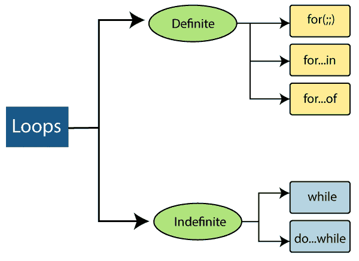
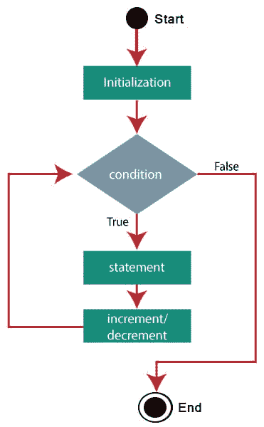
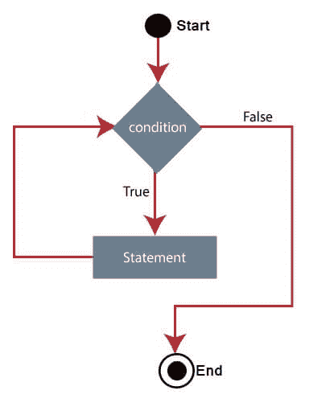
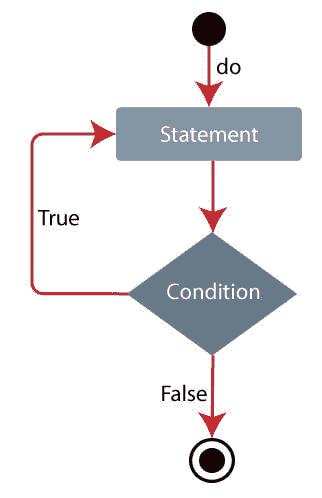

# 这是 6 个环

> 原文：<https://www.javatpoint.com/es6-loops>

编程语言中的循环语句有助于在条件评估为真时重复执行指令集/函数。循环是重复执行某些条件的理想方式。在循环中，重复被称为**迭代。**

您可以在下图中看到循环的分类:



让我们试着理解上图中的循环。

## 确定循环

一个确定的循环有确定/固定的迭代次数。在 [ES6](https://www.javatpoint.com/es6) 中，有三种类型的确定回路，如下所示:

| 确定循环 | 描述 |
| **为(；；)循环** | 它执行该代码块一定次数。 |
| **表示…在回路中** | 它遍历对象的属性。 |
| **用于循环**的… | 与对象文字不同，它迭代 iterables(数组、字符串等)。). |

让我们试着详细说明上面的循环。

### for(；；)循环

**为(；；)循环**用于多次迭代程序的一部分。如果迭代次数固定，那么总是建议使用“for”循环。

**语法**

```

for(initialization;condition;incr/decr){  
//statement or code to be executed  
}  

```

回路的**包括如下定义的部分:**

*   **初始化:**是在循环开始时执行一次的初始条件。在这一部分中，我们初始化变量，或者它也可以用于已经初始化的变量。这是一个可选语句。
*   **条件:**每次测试循环条件时执行。它继续执行循环，直到条件为假。它只返回真或假的布尔值。它也是一个可选语句。
*   **递增/递减:**可以递增或递减变量的值，也是可选语句。
*   **语句:**表示循环的主体，每次执行，直到条件表达式为假。

**流程图**



**例**

下面有三个‘T0’for‘loop’的例子，其中我们展示了‘T2’简单的‘for’loop，‘for’loop 有**多个表达式**和**无限的‘for’loop。**

*   表 2 通过使用 for 循环。

```

var i;
for(i=1;i<=10;i++)
{
   console.log("2 x "+ i +" =", 2*i);
}

```

**输出**

```
2 x 1 = 2
2 x 2 = 4
2 x 3 = 6
2 x 4 = 8
2 x 5 = 10
2 x 6 = 12
2 x 7 = 14
2 x 8 = 16
2 x 9 = 18
2 x 10 = 20

```

*   **for 循环**具有**多个表达式**
    您可以使用**逗号(，)运算符将多个赋值和最终表达式组合成一个 for 循环。**
    让我们尝试用单 for 循环打印斐波那契数列。

```

"use strict" 
for(let temp, a = 0, b = 1; b<40; temp = a, a = b, b = a + temp) 
console.log(b);

```

**输出**

```
1
1
2
3
5
8
13
21
34

```

*   无限循环
    无限循环的例子如下:

```

for(;;)
{  
   console.log("infinitive loop");  // It will print infinite times
}  

```

**输出**

```
infinite loop
infinite loop
infinite loop
infinite loop
infinite loop
infinite loop
infinite loop
infinite loop
infinite loop
infinite loop
infinite loop
infinite loop
	.
	.
	.
	.
infinite loop

```

要终止它，可以使用 ctrl + c。

### for…in 循环

**for…in loop** 类似于 **for loop，**遍历对象的属性，即当你需要访问对象的属性或键时，可以使用 **for…in loop。**当您处理索引顺序不重要的对象或字典时，这是一个更好的选择。

**语法**

```

for (variable_name in object_name) //Here in is the keyword
{  
  // statement or block to execute  
}

```

在每次迭代中，对象的一个属性被分配给变量的名称，这个循环一直持续到所有的对象属性都被覆盖。

**例**

```

function Mobile(model_no){
this.Model = model_no;
this.Color = 'White';
this.RAM = '4GB';
}
var Samsung = new Mobile("Galaxy");
for(var props in Samsung)
{
console.log(props+ " : " +Samsung[props]);
}

```

**输出**

```
Model : Galaxy
Color : White
RAM : 4GB

```

如果您在对象的属性中传递函数，那么这个循环将在输出中给出完整的函数。你可以用下面的代码来说明:

```

function Mobile(model_no){
this.Model = model_no;
this.Color = 'White';
this.RAM = '4GB';
this.Price = function price() // The loop will give you this function as it is written here.
{
   console.log(this.model + "Price = Rs. 3300");
}
}
var Samsung = new Mobile("Galaxy");
for(var props in Samsung)
{
   console.log(props+ " : " +Samsung[props]);
}

```

**输出**

```
Model : Galaxy
Color : White
RAM : 4GB
Price : function price()
{
   console.log(this.model + "Price = Rs. 3300");
}

```

因此，您也可以使用**循环访问这些方法。**

### 循环的形成…

与对象文字不同，这个循环用于迭代 iterables(数组、字符串等)。).

**语法**

```

for(variable_name of object_name) // Here of is a keyword
{  
   //statement or block to execute  
}

```

在每次迭代中，iterables 中的一个属性被赋给变量 _name，循环一直持续到迭代结束。

**例**

```

var fruits = ['Apple', 'Banana', 'Mango', 'Orange'];
for(let value of fruits)
{
  console.log(value); 
}

/*
You can also write the above code like:

for(let value of ['Apple', 'Banana', 'Mango', 'Orange'])
{
  console.log(value); 
}

*/

```

**输出**

```
Apple
Banana
Mango
Orange

```

## 无限循环

无限循环有无限次迭代。当循环中的迭代次数为中间或未知时使用。

下面列出了两种类型的不定循环:

| 无限循环 | 描述 |
| **同时循环** | 它每次都执行指令，直到定义的条件评估为真。 |
| **边做…边循环** | 它类似于 while 循环，但关键区别在于 do…while 循环会立即执行循环，而不考虑终止符条件。 |

让我们试着详细说明上面的循环。

### while 循环

while 循环是一种控制流语句，它允许基于给定的布尔条件重复执行代码。它由一段代码和一个表达式/条件组成。

while 循环在执行块之前检查表达式/条件；这就是为什么这种控制结构通常被称为预测试环路。

**语法**

```

while (condition) {
   statements;
}

```

**流程图**



**例**

```

var y = 0;
while (y < 4) {
    console.log(y);
    y++;
}

```

**输出**

```
0
1
2
3

```

**记分**

*   while 循环中总是需要**条件**，因为需要运行循环。如果条件返回真，循环将重新开始，但如果返回假，循环将停止。
*   如果条件总是真的，那么循环就永远不会结束。

### do…while 循环

这是一个至少执行一次代码块的控制流语句，然后它将取决于循环是否重复执行该代码块的条件。

do…while 循环在块执行后检查条件，这就是为什么这个控制结构也被称为**后测试循环。**也有可能条件总是评估为真，这将创建一个**无限循环。**

**语法**

```

do 
{  
  // block of statements to be executed;  
} 
while (expression); 

```

**流程图**



**例**

```

var count = 6, fact = 1;
do {
    fact = fact * count--;
} while (count > 0);

console.log(fact);

```

**输出**

```
720

```

如果使用 **while 循环**来执行本例，那么将写成:

```

var count = 6, fact = 1;
while (count > 0) 
{
    fact = fact * count--;
}
console.log(fact);

```

**输出**

```
720

```

以上两个例子的主要区别在于，只有当传递给它的条件评估为真时，才会进入 **while 循环**。但是 **do…while 循环**执行该语句一次，这是因为 **do…while 循环**的开始迭代不考虑布尔表达式。然后对于进一步的迭代，while 将检查条件并从循环中取出控制。

## 循环控制语句

循环控制语句用于中断或控制执行流程。这些语句改变了正常的执行顺序。JavaScript 为您提供了处理循环和开关语句的完全控制。

可能有些情况下，你需要从循环中走出来，而没有到达它的底部。在某些情况下，您可能需要跳过部分代码并开始循环的进一步迭代。因此，为了在 JavaScript 中处理这种情况，我们有**一个中断**和**继续**语句。

| 循环控制语句 | 描述 |
| **中断声明** | break 语句用于将程序的控制权从循环中取出。 |
| **继续声明** | 它跳过当前迭代的后续语句，并将程序的控制权带到循环的开始。 |

让我们试着阐述一下上面的控制语句。

### 中断声明

它用于从循环中控制程序。您可以在循环或 switch 语句中使用 break 语句。在循环中使用 break 语句会导致程序退出循环。

**语法**

```

break;

```

**例**

```

var n = 1;
while(n<=7) 
{ 
   console.log("n="+n); 
   if(n==4)
   {
       break;
   } 
   n++;
}

```

以上代码将打印 1 到 7 范围内的数字的 **n** 的四个值。

当 n 的值为 **4，**时，由于**中断语句，循环强制控制退出循环。**成功执行上述代码后，您将获得以下输出。

**输出**

```
n=1
n=2
n=3
n=4

```

### 继续语句

与 break 语句不同，continue 语句不会退出循环。它终止循环的当前迭代，并开始下一次迭代。

**语法**

```

continue;

```

**例**

```

var n = 0;
while(n<=5) 
{ 
   n++;
   if(n==3)
   {
       continue;
   } 
   console.log("n = "+n); 
}

```

上面的例子将显示 **n、**的值，但是如果 **n** 的值是 **3，它将跳过当前迭代。**成功执行上述代码后，您将获得以下输出。

**输出**

```
n = 1
n = 2
n = 4
n = 5
n = 6

```

## 使用标签控制流量

一个**标签**只不过是一个标识符，后跟一个**冒号(:)，**，它应用于一段代码或一条语句。您可以使用带有**断点的标签**和**继续**来控制流量。

不能在 break and continue 语句及其标签名称之间使用换行符。此外，在标签名和一个**相关循环之间不应该有任何语句。**

**定义标签的语法**

```

labelname:
Statement

```

**label name:**JavaScript 的任意标识符，不是保留字。

**语句:**是 JavaScript 语句。

#### 注意:在严格模式下，不能使用“let”作为标签名称。这将导致语法错误，因为字母是保留标识符。

| 标签 | 描述 |
| **用中断语句**标记 | 它用于在不使用标签引用的情况下退出循环或 switch 语句，但使用标签引用时，它用于从任何代码块中跳出。 |
| **用继续语句标记** | 它用于在使用或不使用标签引用的情况下跳过循环的一次迭代。 |

### 用 break 语句标记

在不使用标签引用的情况下，您可以仅使用 break 退出循环或开关，但是通过使用标签引用，您可以使用 break 从任何代码块中跳出。

**语法**

```

break labelname; 

```

**例**

```

var x, y;

loop1: 	       //The first for statement is labeled as "loop1."

for (x = 1; x < 4; x++) { 
     loop2:    //The second for statement is labelled as "loop2"
   for (y = 1; y < 4; y++) {  
      if (x === 2 && y === 2) {
         break loop1;
      }
      console.log('x = ' + x + ', y = ' + y);
   }
}

```

**输出**

```
x = 1, y = 1
x = 1, y = 2
x = 1, y = 3
x = 2, y = 1

```

### 用 continue 语句标记

continue 语句只能用于跳过一个循环迭代，无论是使用标签引用还是不使用标签引用。

**语法**

```

continue labelname; 

```

**例**

```

var x, y;

loop1:   //The first for statement is labelled as "loop1"
for (x = 1; x < 4; x++) {     
   loop2:  //The second for statement is labelled as "loop2"
   for (y = 1; y < 4; y++) {   
      if (x === 2 && y === 2) {
         continue loop1;
      }
      console.log('x = ' + x + ', y = ' + y);
   }
}

```

您可以在上面代码的以下输出中注意到，它跳过了“x = 2，y = 2”和“x = 2，y = 3”。

**输出**

```
x = 1, y = 1
x = 1, y = 2
x = 1, y = 3
x = 2, y = 1
x = 3, y = 1
x = 3, y = 2
x = 3, y = 3

```

## 带标签的函数声明

在 ECMAScript 6 之前，**标签声明**规范不允许标签声明与**函数声明相关联。**然而，标记为**的函数声明**是**非严格代码**中允许的扩展，大多数浏览器托管的 ECMAScript 实现都支持该扩展。

但是在 ECMAScript 2015 (ES6)中， **LabeledStatement** 的语法产品允许使用 **FunctionDeclaration** 作为 **LabeledItem，**但是它包含一个错误规则，如果发生这种情况，会导致语法错误。

为了与 web 浏览器兼容，该规则将通过添加带下划线的文本进行修改:

标签:功能声明

如果任何严格模式的源代码与此规则匹配，将导致语法错误。

从 ECMAScript 2015 开始，为非严格代码标准化的标记函数声明:

```

L: function hello() {}

```

如果您在严格模式下编写上述代码，那么这将引发语法错误:

```

'use strict';
L: function hello() {}
// SyntaxError: In strict mode code, functions can only be declared at top level or inside a block.

```

**发电机功能**既不能在**非严格模式**下标注，也不能在**严格模式下标注。**

```

L: function* hello() 
{
}
// SyntaxError: Generator Functions cannot be labelled

```

* * *