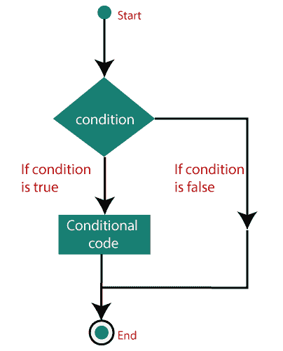
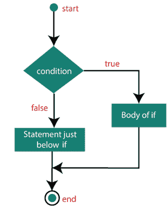
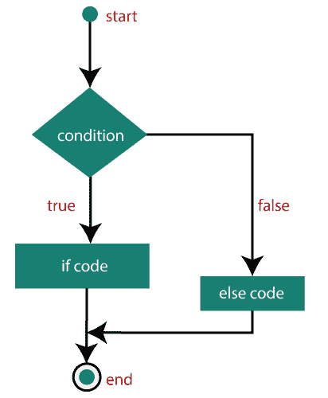
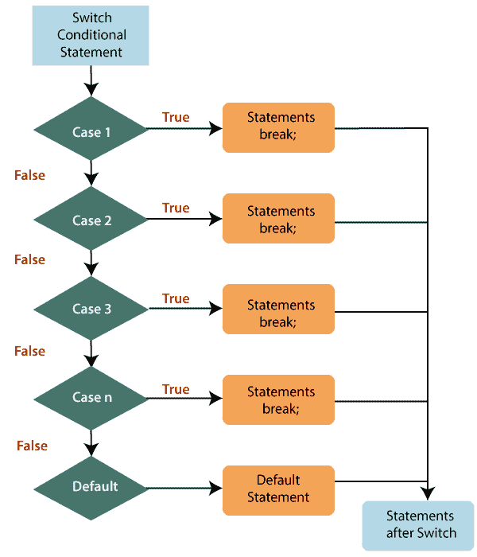

# ES6 决策

> 原文：<https://www.javatpoint.com/es6-decision-making>

[ES6](https://www.javatpoint.com/es6) 条件语句用于根据各种条件执行不同的动作。条件语句在执行指令之前评估条件。

当您编写代码时，您需要为不同的决策执行不同的操作。您可以通过使用条件语句轻松地执行它。



## 条件语句的类型

[JavaScript](https://www.javatpoint.com/javascript-tutorial) 中的条件语句如下:

*   **if 语句**
*   **如果……else 语句**
*   **如果……否则如果…声明**
*   **嵌套 if 语句**
*   **切换语句**

让我们试着详细说明这些条件语句。

### if 语句

它是最简单的决策语句之一，用于决定如果某个条件为真，一段 JavaScript 代码是否会执行。

**语法**

```

if (condition) {
  // block of code will execute if the condition is true
}

```

如果条件评估为真，将执行 **if 语句**内的代码，但如果条件评估为假，则执行 **if 语句结束后的代码(花括号结束后)**。

#### 注意:if 语句必须用小写字母书写。使用大写字母(如果或如果)将导致 JavaScript 错误。

**流程图**



**例如**

```

var  x = 78;
if (x>70) { 
   console.log("x is greater") 
}

```

**输出**

```
x is greater

```

### 如果…else 语句

如果…的话。else 语句包括两个区块，分别是 **if 区块**和 **else 区块。**它是控制语句的下一种形式，允许以更可控的方式执行 JavaScript。当您需要检查两个不同的条件并执行一组不同的代码时，可以使用它。如果条件为假，则 **else 语句**用于指定代码块的执行。

**语法**

```

if (condition)
 {
  // block of code will execute if the condition is true
}
 else
 {
  // block of code will execute if the condition is false
}

```

如果条件为真，则执行 **if 块**内的语句，如果条件为假，则执行 **else 块**的语句。

**流程图**



**例如**

让我们试着去理解**如果……。else** 语句由以下示例:

```

var x = 40, y=20; 
if (x < y) 
{ 
   console.log("y is greater"); 
} 
else 
{ 
   console.log("x is greater"); 
}

```

**输出**

```
x is greater

```

### 如果…否则如果…..else 语句

它用于测试多个条件。 **if 语句**可以有多个或零个 **else if 语句**，在使用 **else 语句之前必须使用它们。**您应该始终牢记 **else 语句**必须在 **else if 语句之后。**

**语法**

```

if (condition1) 
{
  //  block of code will execute if condition1 is true
}
 else if (condition2) 
{
  //  block of code will execute if the condition1 is false and condition2 is true
} 
else 
{
  //  block of code will execute if the condition1 is false and condition2 is false
}

```

**例**

```

var a = 10, b = 20, c = 30; 
if( a > b && a > c) { 
   console.log("a is greater"); 
} else if( b > a && b > c ) { 
    console.log("b is greater"); 
} else { 
    console.log("c is greater"); 
}

```

**输出**

```
c is greater

```

### 嵌套的 if 语句

它是 if 语句中的 if 语句。

**语法**

```

if (condition1) 
{ 
Statement 1; //It will execute when condition1 is true
if (condition2)
 { 
Statement 2; //It will execute when condition2 is true
}
else
{
 Statement 3; //It will execute when condition2 is false
}
}

```

**例**

```

var num = 20;
if (num > 10)
{
if (num%2==0)
console.log( num+ " is greater than 10 and even number");
else
console.log(num+ " is greater than 10 and odd number");
}
else
{
console.log(num+" is smaller than 10");
}
console.log("After nested if statement");

```

**输出**

```
20 is greater than 10 and even number
After nested if statement

```

### switch 语句

这是一个多路分支语句，也用于决策目的。在某些情况下，**开关语句**比 **if-else 语句更方便。**主要用于所有分支都依赖于单个变量的值时。它根据不同的情况执行一段代码。

**开关语句**使用**断**或**缺省**关键词，但两者都是可选的。让我们定义这两个关键词:

**break:** 在**开关语句**中用于终止语句的顺序。可以选择使用。如果省略了它，那么将继续对每个语句执行。当使用它时，它将停止块内的执行。

**默认值:**它指定了一些没有大小写匹配时要运行的代码。开关中只能有一个默认关键字。它也是可选的，但建议使用它，因为它可以处理意外情况。

如果传递给 switch 的条件在某些情况下与任何值都不匹配，那么默认情况下的语句将被执行。

**需要记住的几点**

*   开关表达式可以有一个或多个大小写值。
*   使用**打破**和**默认**关键词是可选的。
*   case 语句只能包含常量和文本。它不能是表达式或变量。
*   除非您在每个块的代码后放一个断点，否则执行将持续流入下一个块。
*   没有必要将默认案例放在最后一个开关块中。

**语法**

```

switch(expression){    
case value1:    
 //code to be executed;    
 break;  //optional  
case value2:    
 //code to be executed;    
 break;  //optional  
......    

default:     
 code to be executed if all cases are not matched;    
}   

```

**流程图**



**例**

```

var num = 5; 
switch(num) { 
    case 0 : { 
      console.log("Sunday"); 
      break; 
   } 
   case 1 : { 
    console.log("Monday"); 
    break; 
 } 
   case 2 : { 
    console.log("Tuesday"); 
    break; 
 }    
   case 3 : { 
    console.log("Wednesday"); 
    break; 
 }
   case 4 : { 
    console.log("Thursday"); 
    break; 
 } 
   case 5 : { 
    console.log("Friday"); 
    break; 
 } 
   case 6 : { 
    console.log("Saturday"); 
    break; 
 }    
   default: { 
      console.log("Invalid choice"); 
      break;              
   } 
}

```

**输出**

```
Friday

```

* * *