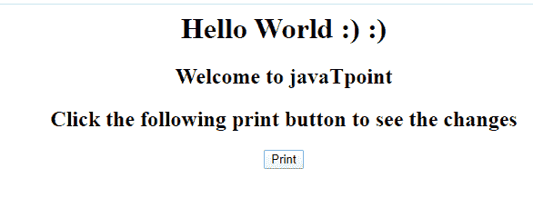

# ES6 页面打印

> 原文：<https://www.javatpoint.com/es6-page-printing>

在某些情况下，需要在网页上放置一个按钮，通过使用实际的打印机打印网页的内容。 [JavaScript](https://www.javatpoint.com/javascript-tutorial) 帮助我们实现打印网页。

当 JavaScript 中的打印功能 **window.print()** 被执行时，则打印当前网页。我们只需在 **onclick** 事件中使用它，就可以直接调用这个函数。

**语法**

```

window.print();

```

**例**

```

<html> 

<head>  

</head> 

<body> 
    <center> 
        <h1>Hello World :) :)</h1> 
        <h2>Welcome to javaTpoint</h2> 
        <h2>Click the following print button to see the changes</h2> 
        <input type = "button" value = "Print" onclick = "window.print()"/>
    </center> 
</body> 

</html>

```

**输出**

成功执行上述代码后，您将获得以下输出:



当您单击打印按钮时，您将看到以下屏幕:


* * *