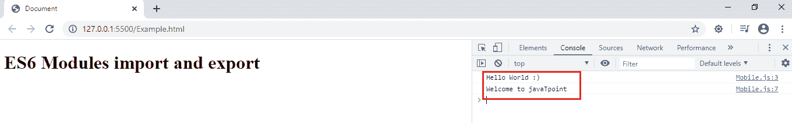
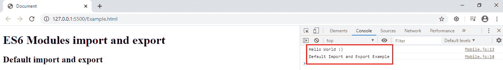
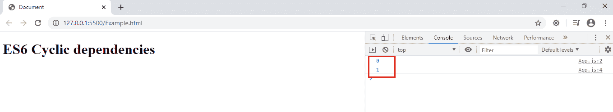

# 是 6 个模块

> 原文：<https://www.javatpoint.com/es6-modules>

模块是写在文件中的一段或一大块 JavaScript 代码。JavaScript 模块帮助我们简单地将整个代码分割成可以从任何地方导入的模块，从而将代码模块化。模块使维护代码、调试代码和重用代码变得容易。每个模块都是一段代码，一旦加载就执行。

[ES6](https://www.javatpoint.com/es6) 中的模块是一个必不可少的概念。虽然它不是到处都有，但今天我们可以使用它，并且可以将其转换成 ES5 代码。翻译是将代码从一种语言转换成其对应语言的过程。ES6 模块 transpiler 工具负责获取 ES6 模块，并将其转换为 AMD **(异步模块定义**是 JavaScript 编程语言 **)** 或 CommonJS 风格的兼容代码。

在构建过程中，我们可以使用**吞咽、巴贝尔、咕噜、**或其他**transpiler**来编译模块。除非文件导出，否则模块中的变量和函数不可用。

## 导出和导入模块

### 导出模块

JavaScript 允许我们通过使用 **export** 关键字导出函数、对象、类和基元值。有两种出口:

*   **命名出口:**以名称区分的出口称为**命名出口**。我们可以使用名为【导出】的**导出多个变量和函数。**
*   **默认导出:**使用默认导出最多可以导出一个值。

### 导入模块

要导入一个模块，我们需要使用**导入**关键字。从模块导出的值可以使用**导入**关键字导入。我们可以在另一个模块中导入导出的变量、函数和类。要导入一个模块，我们只需指定它们的路径。

导入名为的**导出时，必须使用与对应对象相同的名称。当您导入**默认**导出时，我们可以使用相应对象的任何名称。**

让我们详细说明这些出口和进口。

## 命名出口和进口

命名导出以其名称区分。使用名为导出的**导出的类、变量或任何函数只能使用相同的名称导入。**

使用名为导出的**可以导入和导出多个变量和函数。**

**语法**

让我们看看在类、函数或变量中使用命名导出的语法。下面我们将展示如何使用名为的**导出来单独导出类、变量和函数。**

```

//Named export in class
class Nokia{
//properties
//methods
}
export {Nokia}; //Named export

//Named export in functions
function show(){
}
export {show};

//Named export in Variables
const a = 10;
export {a};

```

我们可以在一个模块中应用多个名为的**导出。我们可以在一个模块中使用多个名为**的**导出的语法如下:**

**Mobile.js**

```

class Nokia{
//properties
//methods
}
function show(){
}
const a = 10;
export {Nokia, show};

```

让我们看看如何导入名为的**出口。**

### 导入命名导出

要导入由另一个模块导出的绑定，我们必须使用静态 **import** 语句。**进口模块**始终处于**严格模式**，无论我们是否申报严格模式。

**语法**

**App.js**

```

import {Nokia, show} from './Mobile.js';

```

**全部导入**

如果我们想同时导入所有的导出语句，那么我们可以单独导入它们。

但是当我们有这么多指定的出口时，这将是困难的。因此，为了使它更容易，我们可以这样做:

```

import * as device from './Mobile.js'; // Here, the device is an alias, and Mobile.js is the module name.

```

假设，我们在模块 **Mobile.js** 中定义了一个类**诺基亚**，如果我们想使用它，那么通过使用别名，我们可以执行如下操作:

```

device.Nokia //if we have a class Nokia
device.show // if we have a function show
device.a // if we have a variable a

```

让我们试着在一个例子中理解名为的**导出和导入。**

我们必须制作两个 JavaScript 模块来执行导出和导入。在第一个模块中，我们导出类、函数和变量。在第二个模块中，我们将使用名为导入的**来导入它们。**

### 示例-命名的导出和导入

这里，我们正在创建两个 JavaScript 模块，其中第一个 JavaScript 模块是 **Mobile.js，**，第二个模块名是 **App.js.** 我们还在创建一个 [HTML](https://www.javatpoint.com/html-tutorial) 文件**Example.html。**然后，我们将执行这个**。服务器中的 html** 文件。

接下来，我们要使用 **<脚本></脚本>** 标签中的 src 属性，手动链接 [HTML 文件](https://www.javatpoint.com/html-file-path)中的 JavaScript 文件。但是该模块仍然无法工作。要启用该模块，我们必须在 **<脚本></脚本>标签**中使用 **type = "module"** 。

**Example.html**

```

<!DOCTYPE html>
<html lang="en">
<head>
    <meta charset="UTF-8">
    <meta name="viewport" content="width=device-width, initial-scale=1.0">
    <meta http-equiv="X-UA-Compatible" content="ie=edge">
    <script type = "module" src = "App.js"></script>
    <title>Document</title>
</head>
<body>
    <h1>ES6 Modules import and export</h1>
</body>
</html>

```

**Mobile.js**

```

class Display{
    show(){
        console.log("Hello World :)");
    }
}
function javaT(){
    console.log("Welcome to javaTpoint");
}
export {Display,javaT};

```

**App.js**

```

import {Display,javaT} from "./Mobile.js";
const d = new Display();
d.show();
javaT();

```

**输出**

在直播服务器中运行以上**Example.html**文件。然后，使用 **ctrl+shift+I** 在浏览器中打开终端。成功执行后，您将获得以下输出:



## 默认导出和导入

我们在一个模块中只能有一个**默认导出**。A **默认**导出可以任意名称导入。

**语法**

让我们看看在类、函数或变量中使用默认导出的语法。下面我们将展示如何使用**默认**导出来单独导出类、变量和函数。

与名为的**导出不同，在**默认**导出中，我们不能同时进行多个**导出**语句。**

```

//Default export in class
class Nokia{
//properties
//methods
}
export default Nokia; //Default export

//Deafult export in functions
function show(){
}
export default show;

//Default export in Variables
const a = 10;
export default a;

```

### 导入默认导出

要导入由另一个模块导出的绑定，我们必须使用静态 **import** 语句。**进口模块**始终处于**严格模式**，无论我们是否申报严格模式。

**语法**

**Mobile.js**

```

class Nokia{
    //properties
    //methods
}
export default Nokia;

```

**App.js**

```

import Nokia from './Mobile.js';

```

### 示例-默认导入和导出

**Example.html**

```

<!DOCTYPE html>
<html lang="en">
<head>
    <meta charset="UTF-8">
    <meta name="viewport" content="width=device-width, initial-scale=1.0">
    <meta http-equiv="X-UA-Compatible" content="ie=edge">
    <script type = "module" src = "App.js"></script>
    <title>Document</title>
</head>
<body>
    <h1>ES6 Modules import and export</h1>
    <h2>Default import and export</h2>
</body>
</html>

```

**Mobile.js**

```

class Display{
        show(){
            console.log("Hello World :)");
            console.log("Default Import and Export Example");
        }
    }
    export default Display;

```

**App.js**

```

import Display from "./Mobile.js";
const d = new Display();
d.show();

```

**输出**

在直播服务器中运行以上**Example.html**文件。然后，使用 **ctrl+shift+I** 在浏览器中打开终端。成功执行后，您将获得以下输出:



## ES6 循环依赖

循环依赖是相互依赖的两个或多个模块之间的直接或间接关系。这样的模块被称为**相互递归**模块。

ES6 中的模块自动支持循环依赖。两个模块，如 **A** 和 **B** ，如果两个 A 都进口 B and B，则两个模块是循环依赖的。

假设我们有三个名为 **A、B、**和 **C** 的模块。它们的依赖链就像 **A- > B- > C- > A** ，即 A 依赖 B；乙依赖丙，丙依赖甲

CommonJS 和其他一些库支持循环依赖，但是从循环依赖模块导入和使用名为导出的**存在问题。**

ES6 通过在导出中共享对值的绑定而不是值本身来解决这个问题。这意味着可以实现与模块主体中声明的变量的连接。我们可以在下面的代码中看到相同的演示:

### 例子

**Example.html**

```

<!DOCTYPE html>
<html lang="en">
<head>
    <meta charset="UTF-8">
    <meta name="viewport" content="width=device-width, initial-scale=1.0">
    <meta http-equiv="X-UA-Compatible" content="ie=edge">
    <script type = "module" src = "App.js"></script>
    <title>Document</title>
</head>
<body>
    <h1>ES6 Cyclic dependencies</h1>
</body>
</html>

```

**Mobile.js**

```

export let count = 0;
export function show() {
    count++;
}

```

**App.js**

```

import { show, count } from './Mobile.js';
console.log(count); 
show();
console.log(count);

```

**输出**



* * *