# Ext JS 教程

> 原文：<https://www.javatpoint.com/ext-js>


### 什么是 Ext JS

**Ext JS** 是基于 **JavaScript** 的强大应用开发平台。它通过使用 JavaScript 帮助您创建数据密集型 HTML 5 应用程序。Ext JS 框架允许我们在 JavaScript 的帮助下创建具有用户体验的企业应用程序，而无需编写 [CSS](https://www.javatpoint.com/css-tutorial) 或 [HTML 5](https://www.javatpoint.com/html5-tutorial) 的代码。它为创建具有跨浏览器功能的网络应用程序提供了丰富的用户界面。

**Ext JS** 广泛用于创建桌面应用程序。它兼容所有现代浏览器，如 **[【火狐】](https://www.javatpoint.com/mozilla-firefox)[Chrome](https://www.javatpoint.com/google-chrome)、Safari 6+、Opera 12+。** Ext JS 包含内置的主题和 UI 组件，减少了开发时间，提升了生产力。

**Ext JS** 是**森查触控 JavaScript 库的产物。**提供以下产品:

*   **Sencha Touch:** 是用于开发移动应用的高性能 HTML5 框架。
*   **森查 GXT:** 借助 Java 开发丰富的基于 web 的应用程序是最健壮的方法。
*   **Ext JS:** 是一个使用 HTML5 和 JavaScript 开发 web 应用的框架。

### 扩展 JS 的特点

1.  **Ext JS** 是一个客户端 JavaScript 框架，用于创建企业应用程序。
2.  可以借助 **Ext JS** 开发单页应用。
3.  **Ext JS** 用 JavaScript 支持面向对象编程概念(OOPs)。它使应用程序开发和维护变得更加容易。
4.  **Ext JS** 基于 **MVC(模型视图控制器)**和 **MVVM(模型视图-模型)。**
5.  **Ext JS** 支持 **OOB(开箱)**组件、布局和容器。
6.  它还有一个数据包概念，这使得访问或保存数据变得很容易。
7.  **Ext JS** 支持包的本地化，帮助你本地化应用。
8.  **Ext JS** 提供组件和 UI 容器的拖放功能。
9.  它还包括 OOB(开箱即用)的主题，如海神、海王星、灰色、克里斯普和经典。
10.  **Ext JS** 在指南针和 **SASS(语法上很棒的样式表)的帮助下包含了自定义主题。**
11.  **Ext JS** 具有新版本与旧版本的代码兼容特性。
12.  **Ext JS** 包括一个灵活的布局管理器，允许我们跨多个浏览器、屏幕大小和设备组织数据和内容的显示。

### 扩展 JS 版本

| 不，先生。 | 版本 | 描述 |
| **1。** | **Ext JS 4.x** | 它用于开发桌面应用程序。在这个版本中，Sencha Touch 框架用于创建平板电脑和移动应用程序。 |
| **2。** | **Ext JS 5.x** | 它用于创建平板电脑和移动应用程序。 |
| **3。** | **Ext JS 6 . x-电流** | 此版本用于为所有类型的设备开发应用程序，如移动设备、平板电脑和台式机。在这个版本中，开发人员需要编写更少的代码。它包括两种工具包:现代和经典。 |

### Ext JS 的历史

Ext JS 的历史如下表所示:

| 不，先生。 | 版本 | 发布年份 | 描述 |
| 1. | **Ext JS 1.1** | Two thousand and six | 这是杰克·斯洛克姆在 2006 年创造的第一个版本。Ext JS 1.1 是一个实用程序类的集合。它拥有名为 **YUI-Ext** 的 **YUI(雅虎用户界面)**扩展。 |
| 2. | **Ext JS 2.0** | Two thousand and seven | 是 **2007** 推出的 **Ext JS** 第二版。此版本包含桌面应用程序的 API 文档，但功能有限。此版本与以前的版本不向后兼容。 |
| 3. | **Ext JS 3.0** | Two thousand and nine | 这是 2009 年在**发布的 **Ext JS** 的第三个版本。Ext JS 3.0** 关联了一些新功能，比如**列表和图表视图**。这个版本与以前的版本向后兼容。 |
| 4. | **Ext JS 4.0** | Two thousand and eleven | After introducing **Ext JS 3.0,** the developers face a significant challenge to boost up the speed.**Ext JS 4.0** 是 **2011** 推出的 **Ext JS** 的第四个版本。这是 **MVC(模型视图控制器)**熟读的完全升级版本，应用速度很快。 |
| 5. | **Ext JS 5.0** | Two thousand and fourteen | 是 **2014** 发布的第五版 **Ext JS** 。这个版本的主要修改是将 **MVC(现代视图控制器)**架构替换为 **MVVM(模型视图-模型)**架构。这个版本提供了一些新的功能，例如为触摸设备开发桌面应用程序、响应布局和双向数据绑定。 |
| 6. | **Ext JS 6.0** | 2014 年至今 | 是 **Ext JS** 的当前版本。在这个版本中，开发人员将 **Ext JS** (桌面应用)框架与 **Sencha Touch** (移动应用)框架相结合。 |

### 扩展 JS 的工具

下面给出了**森查**提供的一些工具。这些工具用于 **Ext JS 中的应用程序开发。**

**Sencha IDE 外挂程式**

**Sencha IDE 插件**将 Sencha 框架容纳到**WebStrome IDE、IntelliJ、**中，帮助开发人员提高生产力。它提供了**代码检查、代码完成、代码生成、代码集成、拼写检查、模板创建、代码重构等功能。**

**Sencha Cmd**

这是一个方便开发者的工具，具有一些特性，例如**代码的缩小、脚手架、**和**生产构建生成。**

**森查检查员**

它是一个调试工具，帮助我们在开发时调试代码。

### 外部 JS 与角度 JS

| 框架 | 角度 JS |
| 它是一个框架，用于在 JavaScript 的帮助下创建基于 web 的企业应用程序。 | 它是一个用来扩展 HTML 语法的框架。 |
| Ext JS 支持 **MVC** (模型视图控制器) **MVVM** (模型视图-模型)架构。 | 它只支持 **MVC** 架构。 |
| 它支持响应用户界面。 | 它不支持响应用户界面。如果你想使用一个响应用户界面设计，你需要使用引导或任何其他框架。 |
| 它是由**森查**维护的每服务器商业许可开源框架。 | 也是**谷歌**等维护的开源框架。 |
| 它为 Ext JS 提供了 **ALM(应用生命周期管理)**工具。 | 不提供任何 **ALM** 工具。如果你想用，那你就去找第三方 **ALM** 工具。 |
| 在 Ext JS 中，不需要编写 HTML 5 或 CSS 3 代码。 | 在 Angular JS 中，要求你写 **HTML 5** 或者 **CSS 3 代码**。 |
| 它支持 **OOB(开箱即用)**组件，如数据视图、树形视图、表单和网格。 | Angular JS 不支持任何 **OOB UI** 组件。 |
| 支持**经典、海王星、灰、脆、**、**海卫一、**等 OOB 主题。 | 它不支持任何 OOB 主题。 |

### 如何设置 Ext JS 环境

为了使用 Ext JS，您需要设置一个开发环境。Ext JS 应用开发需要三个必备的东西，比如 **Sencha SDK、IDE(集成开发环境)和 Web 服务器**。在本节中，我们将指导您如何在机器上下载和设置 **Ext JS** 环境。

### 库文件下载

在这里，我们将下载 Ext JS 库文件的试用版。您需要按照下面给出的步骤下载 **Ext JS 的库文件。**

**第一步:**您将使用您的注册邮件 id 下载 Ext JS 的试用版。您也可以使用以下链接[https://www.sencha.com](https://www.sencha.com/products/download)，您将获得以下片段:

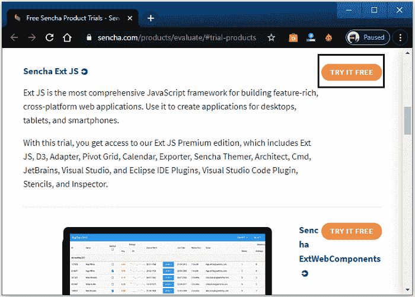

**第二步:**现在点击上图截图所示的**免费试用**按钮。点击按钮后，您将看到以下屏幕:

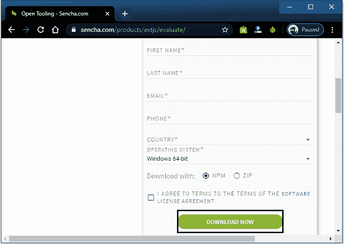

**第三步:**填写完所需的详细信息后，需要点击**立即下载，**你的库文件开始下载，如下图:

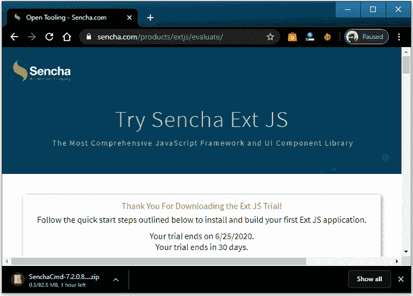

**第四步:**下载的文件夹是 zip 文件夹。你需要解压文件夹，你会得到各种 **CSS 和 JavaScript** 文件。

**第五步:**解压文件夹后，需要点击**。exe 文件，**并开始安装过程，如下图所示:

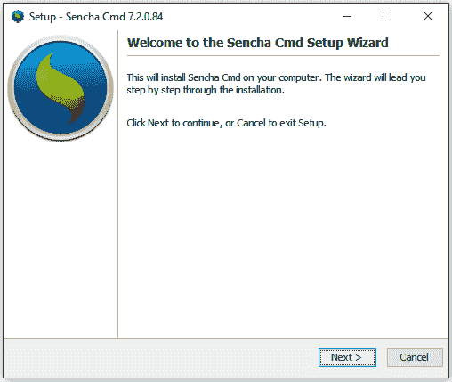

**第六步:**需要点击**下一步**按钮，会得到如下截图:

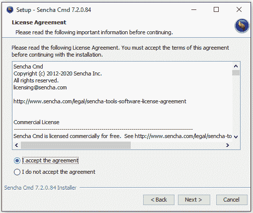

**第七步:**现在，选择**我接受协议**，然后点击**下一步**按钮，你会得到以下片段:

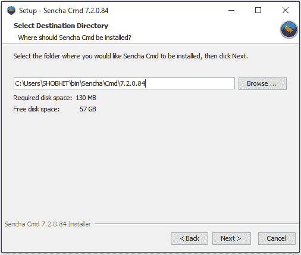

**第 8 步:**现在，需要选择安装 Ext JS 库文件的路径。默认情况下，它将安装在 **C** 驱动器中。您也可以通过点击**浏览**按钮，然后点击**下一步**按钮来更改位置。

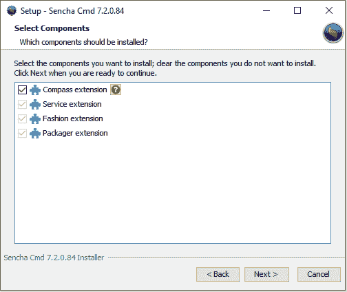

**第九步:**如上图截图所示，需要选择要安装的组件。选择组件后，点击**下一步**按钮，会出现如下画面:

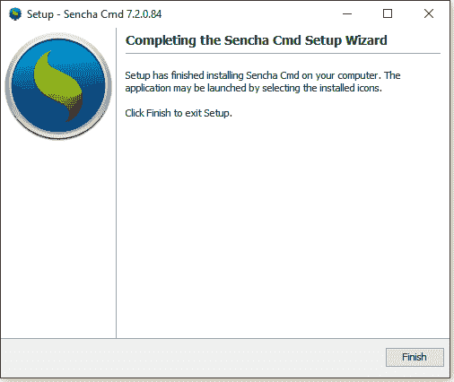

**第十步:**安装完成后，点击**完成**完成流程。

库文件包括以下 [JavaScript](https://www.javatpoint.com/javascript-tutorial) 和 CSS 文件。下面列出了这些内容:

### JavaScript 文件

在解压缩的文件夹中，您将获得以下文件，您需要将这些文件包含在应用程序中。

| -你好。不，不。 | 文件 | 描述 |
| **1。** | **ext-all.js** | 该文件包含代码 detruncate，文件中没有任何注释。 |
| **2。** | **ext.js** | 这是一个基本文件，具有执行应用程序的所有功能。 |
| **3。** | **ext-all-dev.js** | 它也是一个用于开发的 detruncate 文件。它有控制台日志和注释，这有助于我们检测错误。 |
| **4。** | **ext-all-debug.js** | 该文件用于调试目的。 |
| **5。** | **ext-all.js** | ext-all.js 文件用于开发目的。这是一个小文件。 |

### CSS 文件

在解压缩的文件夹中，您将获得以下基于主题的文件，您需要将这些文件包含在应用程序中。你会在**\ ext 7 . 2 . 0 . 84-windows \ ext-7 . 2 . 0 . 84 \ build \ classic \ theme-classic \ resources \ theme-classic-all . CSS**文件夹下找到这些文件。

*   如果您想使用移动应用程序，那么您需要使用一个现代主题，该主题可以在\ ext-7 . 2 . 0 . 84 \ ext-7 . 2 . 0 . 84 \ build \ modern 文件夹下找到。
*   如果您要使用桌面应用程序，那么您需要使用经典主题，它可以在\ ext-7 . 2 . 0 . 84 \ ext-7 . 2 . 0 . 84 \ build \ classic 文件夹下找到。

您可以在 Ext JS 应用程序中添加下面给定的 CSS 文件。也可以将 **Ext Js** 应用的代码放在一个名为 **app.js.** 的文件中

```

<html>
<head>
<link rel = "stylesheet" type = "text/css" href = "{cssPath}" />
<script type = "text/javascript" src = "{sdkPath}/ext-all.js">
</script>
<script type = 'text/javascript' src = "app.js">
</script>
</head>
</html>

```

### 内容交付网络设置

内容交付网络可以被确定为**地理上分布的服务器的集合，用于通过互联网**提供内容的快速交付。CDN 提供了传输加载内容所需的基本资产的工具，如 **JavaScript 文件、HTML 文件、图像、样式表等。**

也可以在程序中提供**内容分发网络**的直接链接，使用 **Ext JS** 而无需下载 **Ext JS** 的库文件，如下给定代码所示:

```

<html>
<head>
<link rel = "stylesheet" type = "text/css" href = "https://cdnjs.cloudflare.com/ajax/libs/extjs/7.2.0.84/classic/theme-crisp/resource/theme-crisp-all.css"/ >
<script type = "text/javascript" src= "https://cdnjs.cloudflare.com/ajax/libs/extjs/7.2.0.84/ext-all.js" >
</script>
<script type = "text/javascript" src = "app.js" >
</script>
</head>
</html>

```

### 文本编辑器设置

文本编辑器用于编写和执行 **HTML、JavaScript、CSS Python、Ruby、PHP 等多种语言的源代码。** Ext JS 是一个 JavaScript 框架，你也可以在其中使用 [HTML](https://www.javatpoint.com/html-tutorial) 文件。因此，您可以根据自己的选择和要求使用各种文本编辑器。下面给出了其中一些文本编辑器:

### Visual Studio 代码

它是微软推出的源代码编辑器，用于 Windows、Mac 和 [Linux 操作系统](https://www.javatpoint.com/linux-tutorial)。您可以通过点击以下链接轻松下载:

[https://code.visualstudio.com/](https://code.visualstudio.com/)

### 黯然失色

Eclipse 是一个开源的集成开发环境，用于开发应用程序。它包括可扩展插件和基本工作空间系统，这有助于我们定制开发环境。您可以点击下面的链接下载:

[https://www.eclipse.org/](https://www.eclipse.org/)

### 笔记本

这是一个用于[微软视窗](https://www.javatpoint.com/windows)的基本文本编辑程序。它帮助用户制作文档。你也可以使用类似的文本编辑器，如崇高，记事本++。

### 为 Ext Js 设置浏览器

可以称为**一个用于访问 [WWW](https://www.javatpoint.com/www-full-form) (万维网)上的信息的软件应用程序。**浏览器用于根据用户要求在屏幕上显示必要的内容。

Ext JS 提供跨浏览器兼容性。它可以跨不同的[浏览器](https://www.javatpoint.com/browsers)执行功能。

你可以在所有主流浏览器上执行 Ext JS 的程序代码。这里，我们在下面列出了一些支持 Ext JS 应用程序的浏览器:

*   **谷歌 Chrome 10 及以上版本**
*   **微软 Edge 12**
*   **IE (Internet Explorer) 6 及以上版本**
*   **火狐 3.6 及以上版本**
*   **Safari 4 及以上版本**
*   **歌剧 11 及以上版本**

### 扩展 JS 的体系结构

Ext JS 支持版本 4 的 **MVC(模型视图控制器)和版本 5** 架构的 **MVVM(模型视图-模型)。这种架构对于程序代码来说是可选的，但是它有助于使我们的代码易于建立和维护。**

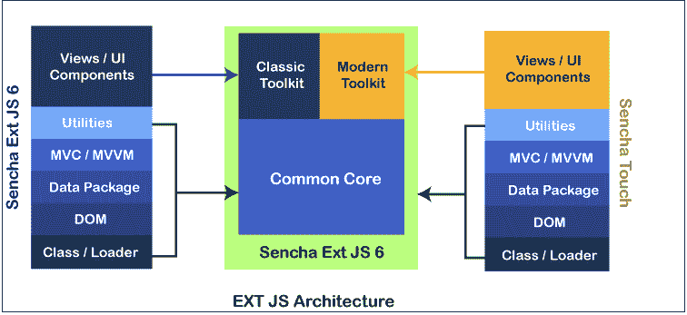

### 扩展 JS 应用程序的项目结构

```

----------------src
---------------resources
----------------CSS files 
----------------Images
----------JavaScript
------------App Folder
-----------------Controller
--------------------Controller.js
-------------------Model
-----------------------Model.js
-------------------Store
----------------------Store.js
--------------------View
------------------------View.js
--------------------Utils
------------------------Utils.js
---------------------------------app.js
------------------HTML files

```

Ext JS 应用程序文件夹包含 JavaScript 文件夹。Ext Js 应用包括**模型、存储、实用、视图、控制器文件**和 app.js 文件。在这里，我们将详细讨论每个文件。

**Model.js**

它包含后端数据对象映射来查看数据索引。它还包括执行存储数据绑定以查看的对象。在 **model.js、**中也可以借助商店获取数据。

**App.js**

它是负责启动程序流的主文件。还应该涉及到带有 **<脚本>标签的 HTML 文件。App.js** 为其余功能调用应用控制器。

**View.js**

**View.js** 负责应用的界面，向用户展示。它还包含丰富的**用户界面(用户界面)**视图。这些视图可以由用户根据自己的需要进行定制和扩展。

**控制器 js**

这个文件控制 Ext JS MVC 架构。它还包含对应用程序的整体控制，包括事件侦听器和代码。 **controller.js** 包含确定所有其他应用程序文件的路径，如 require、model、mixins、view 和 store。

**Store.js**

它存储缓存数据，这些数据将通过使用模型对象提供给视图。 **Store.js** 文件在代理的帮助下获取数据。代理包含为获取后端数据服务而确定的路径。

**使用.js**

它有助于使我们的代码清晰、干净、简单和可读。 **MVC(模型视图控制器)**不支持 utils.js，可以在 **Utils.js** 文件中创建方法，调用到控制器或者视图中。它还允许重用代码。

在 **MVVM(模型视图-模型)架构中，**你将使用视图模型代替控制器。

**检视模型**

**视图模型**就像模型和视图变化之间的中介。**视图模型**包裹模型进行查看。视图模型与视图没有任何直接的交互。

### 扩展 JS 的组件

组件可以定义为**小部件的数量，这有助于创建应用程序。** Ext JS 也是由许多被称为**组件**的小部件组成的。组件被称为 DOM 元素，它包含复杂的功能。所有组件都继承自 **Ext。组件**类。

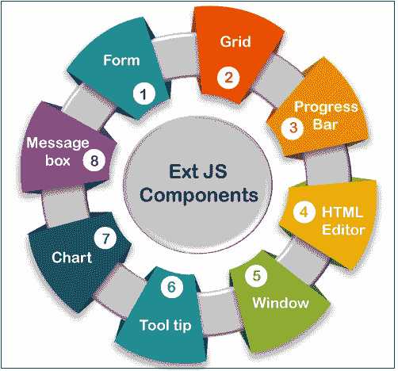

Ext JS 应用包括各种类型的元素，如 **Combobox、网格、面板、容器、textfield、numberfield 等。**

Ext JS UI(用户界面)组件是从 Ext 中提取的。组件类。延伸文件系统组件类也是从 Ext 中提取的。基类。

这里，我们有 Ext JS 的一些组件，如下表所示。

| -你好。不，不。 | 成分 | 描述 |
| **1。** | **表格** | 表单帮助我们从用户那里获取数据。 |
| **2。** | **网格** | 它用于以表格的形式显示数据。 |
| **3。** | **图表** | 它用于以图形方式显示数据。 |
| **4。** | **消息框** | 该组件用于以警告框形式显示数据。 |
| **5。** | **窗口** | **窗口**组件帮助我们创建窗口。它总是在事件发生时弹出。 |
| **6。** | **刀尖** | 它用于显示事件发生期间的数据。 |
| **7。** | **HTML 编辑器** | 编辑器用于设置用户输入的数据的样式。应该是颜色、大小和字体。 |
| **8。** | **进度条** | 此栏始终显示后端功能的进度。 |

### 扩展 JS 中的类系统

*类可以定义为一个可扩展的程序代码模板，帮助创建对象，为成员变量提供初始值，并实现方法和成员函数的行为*。

在 Ext JS 中，Ext 被用作命名空间，用于封装 Ext JS 中的类。Ext JS 框架包含自己的类系统。Ext 允许我们使用 300 多个类，这些类可以用于多种功能。Ext 类包括大约。59 个属性和 78 个方法。一些基本方法是**扩展应用、扩展创建、扩展定义、扩展获取、扩展覆盖和扩展应用等。**

### 在扩展 JS 中定义一个类

如果你想在 Ext JS 中定义一个类，那么你必须使用 **Ext.define()** 。

**语法**

```

Ext.define(class name, class member/ properties, callback function);

```

这里，我们已经讨论了语法的所有值。

**类名:**是用户根据应用结构给出的类名。

**类成员/属性:**类成员/属性用于确定类行为。

**回调函数:**是加载类时调用的函数。这是一个可选功能。

**例**

```

Ext.define (employeeApp.view.EmployeeDetailsGrid,
{
extend : 'Ext.grid.GridPanel',
id : 'employeesDetailsGrid',
store : 'EmployeesDetailsGridStore',
renderTo : 'employeesDetailsRenderDiv',
layout : 'fit',
columns : [{
text : 'Employee Name',
dataIndex : 'employeeName'
}, {
text : 'ID',
dataIndex : 'employeeId'
}, {
text : 'Department',
dataIndex : 'department'
}]
});

```

### 创建对象

像其他面向对象编程语言一样，在 Ext JS 中创建对象很容易。您可以通过以下两种方式在 Ext JS 中创建对象:

**借助 Ext.create()** 创建对象

```

Ext.create('Ext.Panel', {
renderTo : 'HelloExt JSPanel',
height : 50,
width : 50,
title : 'Hello Ext JS',
html : 'Welcome to the world of Ext JS'
});

```

**借助新关键词**创建对象

```

var employeeObject =new employee ();
employeeObject.getEmployeeName (); 

```

### 扩展 JS 继承

在面向对象编程中，术语继承可以定义为**一种子类导入超类属性的技术。**

在 Ext JS 中，可以通过以下两种方式使用继承:

**借助 ext . ext 方法继承**

```

Ext.define (employeeApp.view.EmployeeDetailsGrid,       
// EmployeeDetailsGrid uses the feature of Ext JS GridPanel
{
extend : 'Ext.grid.GridPanel',
...
});

```

**借助 Mixins** 继承

mixin 关键字帮助我们将 A 类属性导入到 b 类中，通常 mixin 包含在控制器中，控制器中包含了 store、view 等各种类的声明。

```

mixins : {
	Commons : 'DepartmentApp.utils.DepartmentUtils'
};	

```

您也可以调用 DepartmentUtils 类，并在应用程序中使用它。

### Ext JS 程序示例

在这里，我们将讨论 Ext JS 的程序代码。在下面编写的程序中，首先是代码，我们需要创建一个名为**Sample.html**的简单 HTML 文件，并在 **<头>标签中提供库文件。**

**Sample.html**

```

<!DOCTYPE html>
<html>
<head>
<link href = "https://cdnjs.cloudflare.com/ajax/libs/extjs/6.0.0/classic/theme-classic/resources/theme-classic-all.css" 
rel = "stylesheet" />
<script type = "text/javascript" 
 src = "https://cdnjs.cloudflare.com/ajax/libs/extjs/6.0.0/ext-all.js"></script>     <script type = "text/javascript">
Ext.onReady(function() {
Ext.create('Ext.Panel', {
renderTo: 'helloWorldPanel',
height: 500,
width: 500,
title: 'Hello world',
html: 'Welcome to the world of Ext'
});
});
</script>
</head>  
<body>
<div id = "helloWorldPanel" />
</body>
</html>

```

**程序说明**

在上面的程序代码中，我们有以下内容:

**Ext.onReady()方法:**当 Ext Js 元素准备好渲染时，调用该方法。

**Ext.create()方法:**用于构建对象。在上面的代码中，我们创建了 **Ext。面板**对象。

**Ext。面板:**是 Ext JS 中使用的内置类。对于不同的函数，它还包含以下不同的属性。

**渲染到:**负责交付面板。在上面的代码中，div id 是**【hello world panel】**。

**标题:**该属性为面板提供**标题**。

**高度&重量:**这些属性用于给出面板的大小。

**Html:** 这个属性帮助我们在面板中显示 Html 内容。

**输出**

为了成功执行上述程序代码，您可以在任何标准浏览器中打开**Sample.html**文件，您将获得以下输出:

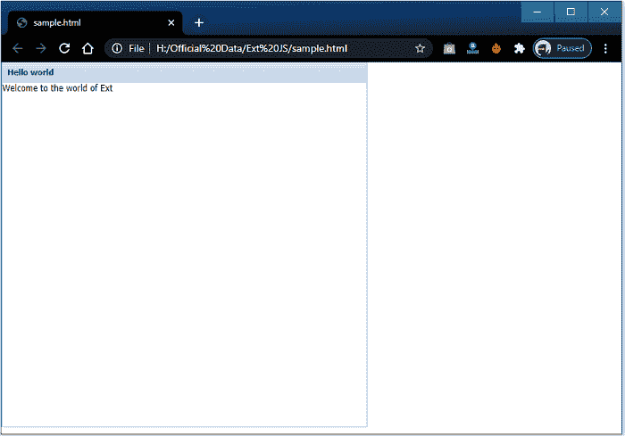

### Ext JS 中的方法

下面给出了一些方法，主要用在 Ext JS 中。这些方法是用于执行不同功能的预定义方法。各种方法存储在不同的类中。

### 延伸文件系统字符串类

**这个类包含了各种帮助我们处理字符串数据的方法。**常用方法以表格形式给出如下:

| -你好。不，不。 | 方法 | 描述 |
| **1。** | **外文。string . html encoding** | 它通过编码使 html 值可解析。
**例如-** Ext。string . htmlencode(“<p>Hello Ext JS</p>”；**输出-**“&lt；p&gt；您好 Ext JS&lt；/p&gt；”。 |
| **2。** | **外文。String.htmlDecode** | 它解码编码的 html 值。
**举例-**

```
Ext.String.htmlDecode("&lt; p &gt; Hello Ext JS &lt; /p &gt;");
```

**输出-**“<p>Hello Ext JS</p> |
| **3。** | **Ext。细绳修剪** | 此方法用于删除字符串中不需要的空格。
**举例-**

```
Ext.String.trim('   Ext JS   ');
```

**输出-**【Ext JS】 |
| **4。** | **Ext。String.urlAppend** | 此方法用于附加网址字符串的值。
**举例-**

```
Ext.String.urlAppend('https://www.google.com' , 'hello Ext JS');
```

**输出-**https://www . Google . com？hello Ext JS "

```
Ext.String.urlAppend('https://www.google.com?index=1' , 'hello Ext JS');
```

**Output-**" https://www . Google . com？索引=1 &你好 Ext JS” |
| **5。** | **Ext。拨动弦** | 此方法用于在两个不同的值之间切换值。
**例如-**

```
var toggleString = 'ASCENDING'
toggleString = Ext.String.toggle(p, 'ASCENDING', 'DESCENDING');
```

**Output-**DESIGNED as toggles string 的值为升序。现在，如果您打印相同的内容，这次您将得到 toggleString =“升序”，因为它的值为“降序”。
同类似三元运算符

```
toggleString = ((toggleString =='ASCENDING')? 'DESCENDING' : 'ASCENDING' );
```

 |

### 分机是班级

此类用于确定您正在使用的平台和操作系统。应该是手机或者台式机，Windows 或者 Mac OS。Ext.is 类包含以下方法:

| 不，先生。 | 方法 | 描述 |
| **1。** | **Ext.is.Android** | 它用于在安卓操作系统中返回真实值；否则返回 false。 |
| **2。** | **分机平台** | 此方法用于返回用于当前版本的平台。
**举例-**

```
[Object { property = "platform", regex = RegExp, identity = "iPhone"}, 
Object { property = "platform", regex = RegExp, identity = "iPod"}, 
Object { property = "userAgent", regex = RegExp, identity = "iPad"}, 
Object { property = "userAgent", regex = RegExp, identity = "Blackberry"}, 
Object { property = "userAgent", regex = RegExp, identity = "Android"}, 
Object { property = "platform", regex = RegExp, identity = "Mac"}, 
Object { property = "platform", regex = RegExp, identity = "Windows"}, 
Object { property = "platform", regex = RegExp, identity = "Linux"}
```

 |
| **3。** | **分机桌面** | 如果使用的是桌面，则返回 true，否则返回 false。 |
| **4。** | **分机 iPhone** | 如果您正在使用手机，此方法返回 true 否则，它返回 false。 |
| **5。** | **内线电话** | 如果您使用的是 iPhone，此方法返回 true 否则，它返回 false。 |
| **6。** | **Ext.is.iPod** | 当您使用 iPod 时，它会返回 true，否则返回 false。 |
| **7。** | **Ext.is.iPad** | 如果你用的是 iPad，那么它返回真，否则返回假。 |
| **8。** | **Ext.is.Linux** | 如果您使用的是 Linux 操作系统，则返回 true，否则返回 false。 |
| **9。** | **Ext.is.Mac** | 如果您使用的是苹果操作系统，则返回真，否则返回假。 |
| **10。** | **Ext.is.Blackberry** | 如果您使用的是黑莓操作系统，则返回 true，否则返回 false。 |
| **11 时。** | **外网窗口** | 如果使用的是 Windows 操作系统，则返回 true，否则返回 false。 |

### 扩展支持类

Ext.supports 类用于提供该功能是否适合该设备/浏览器的信息。扩展支持类包含以下方法:

| -你好。不，不。 | 方法 | 描述 |
| **1。** | 外部支持. Svg | **Svg** 代表**可伸缩矢量图形**。该方法检查设备是否支持 **Svg** 功能。
**检查以下内容-**

```
doc.createElementNS && !!doc.createElementNS( "http:/" + "/www.w3.org/2000/svg", "svg").createSVGRect.
```

 |
| **2。** | **外部支持历史** | 如果设备支持 HTML 5 的历史记录，则此方法返回 true 否则，它返回 false。 |
| **3。** | **外部支持地理定位** | 此方法用于支持地理定位功能。它还检查 navigator.geolocation 方法。 |
| **4。** | **扩展支持范围** | Ext.supports. Range 方法检查浏览器是否支持 document.createRange 方法。 |
| **5。** | **外部支架画布** | 此方法用于监控设备是否适合画布绘制方法。
**举例-**

```
doc.createElement('canvas').getContext
```

 |

### 其他方法

这里，我们也有一些在 Ext JS 中使用的方法。这些方法以表格形式列出如下:

| -你好。不，不。 | 方法 | 描述 |
| **1。** | 外部获取版本() | 此方法返回 Ext Js 版本的当前版本。
**例如-**
当你调用 Ext.getVersion()时，它会返回一个数组值，比如 Version、short version 等。
分机 getVersion()。-返回 Ext JS 的当前版本，如“7.2.0”。 |
| **2。** | 外部用户代理() | 此方法提供了关于用户代理浏览器的信息。userAgent 帮助我们描述服务器的 Od 和浏览器。 |
| **3。** | **版本相关功能** | 这个方法帮助我们提供当前的浏览器版本。它包含了 Ext.firefoxVersion、Ext.ieVersion 等一些功能。
**例如-**
如果你使用的是火狐，调用的方法为 Internet Explorer，那么它返回 0，当你使用的是同一个浏览器(IE)时，那么它返回浏览器版本。 |
| **4。** | **外部类型()** | 它用于显示变量的数据类型。
**例如-**

```
Var p = 10;
Var q = 'hello';
Ext.typeOf(p);
```

输出-编号
ext . type of(q)；
输出-字符串 |
| **5。** | **浏览器相关功能** | 这些函数用于根据当前的网络浏览器返回布尔值。方法有 Ext.isIE6、Ext.isChrome、Ext.isIE、ext . ISF 06 等。 |
| **6。** | **数据类型相关方法** | 它根据变量返回布尔值。
**举例-**

```
Var x = ['x', 'yz'];
Var y = 'Hello';
Var z = '456';
Var nullvariable;
Var deifnedvariable;
Function extraFunction() {return true;}
```

 |
|  |  | 

&#124; Ext.isArray(一)； &#124; //返回真 &#124;
&#124; ext . isstring(b)； &#124; //返回 true &#124;
&#124; ext . is number(c)； &#124; //返回 true &#124;
&#124; ext . isempty(empty variable)； &#124; //返回真 &#124;
&#124; ext . isempty(b)； &#124; //返回 false &#124;
&#124; ext . is defined(defined variable)； &#124; //返回 true &#124;
&#124; ext . is function(extra function)； &#124; //返回真 &#124;

 |

### Ext JS 的优势

Ext JS 的一些好处如下:

*   它遵循 MVC(模型视图控制器)架构，帮助我们使代码更易读。
*   它提供了一组小部件，帮助我们创建一个强大的用户界面。
*   这有助于我们降低开发成本。
*   它简化了跨平台开发。
*   它通过将开发与集成开发环境插件集成来增加开发。

### 扩展 JS 的局限性

*   库文件会降低应用程序的运行速度，增加加载时间，因为它的大小高达 500 kb。
*   Ext Js 需要有经验的开发人员来开发应用程序。
*   Html 语言的使用使得这个应用程序变得复杂和难以调试。
*   Ext JS 对开源应用程序是免费的，但出于商业目的而付费。
*   有时简单的事情需要代码，但在 JQuery 或普通的 Html 中更容易。

* * *