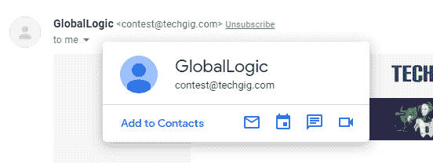
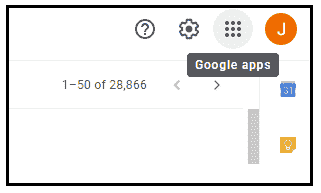
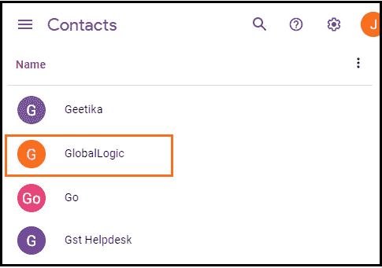
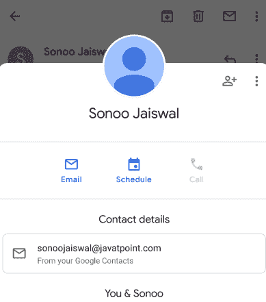
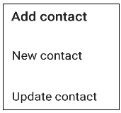
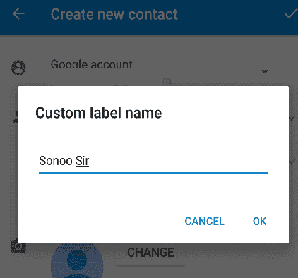
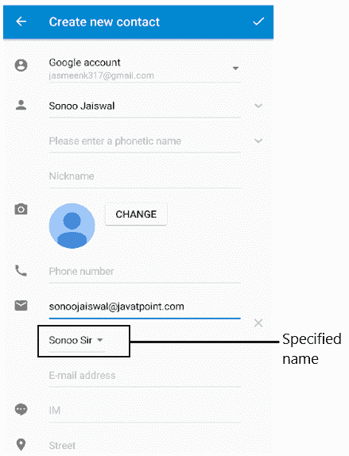

# 如何在 Gmail 中添加联系人？

> 原文：<https://www.javatpoint.com/how-to-add-contacts-to-gmail>

我们可以通过网络和手机应用程序向 Gmail 添加联系人。

### 添加联系人有什么好处？

在 Gmail 中添加联系人的优势如下:

*   当我们将某人添加到我们的 Gmail 联系人时，每当我们开始键入他们的姓名发送电子邮件时，他们的电子邮件 id 就会弹出。
*   它节省了我们的时间。
*   我们不需要从电子邮件列表中搜索电子邮件地址来发送邮件。
*   我们可以快速向企业和个人发送电子邮件。
*   所有联系人将在一个地方合并。
*   每个联系人都包含所有基本信息，如电话号码和电子邮件。一些联系方式还包括雇主、部门、实际地址或职位。

我们将讨论在电脑和手机应用程序上添加联系人的步骤。

## 将联系人添加到计算机上的 Gmail 的步骤

在 [Gmail](gmail) 中添加联系人的步骤如下:

1.  打开 Gmail 帐户，使用 Gmail ID 和密码登录。
    我们可以直接使用网址:[https://mail.google.com/](https://mail.google.com/)。
2.  打开我们想要添加为联系人的邮件或消息。
3.  将鼠标拖动到发送者的名字上，如下图:
    
4.  将出现一个小对话框，如上所示。
5.  点击**【添加联系人】**选项，如下图:
    
    该联系人将被添加到我们的联系人列表中。

要检查列表中添加的联系人，请执行以下步骤:

1.  点击谷歌应用图标，如下图:
    
2.  点击**联系人**图标。
3.  向下滚动。列表中添加的联系人如下所示:
    

## 在移动应用程序上添加联系人的步骤

步骤如下:

1.打开 Gmail 应用程序。

2.打开我们要添加为联系人的电子邮件地址，如下所示:

3.点击发件人姓名附近的图标，如下所示:

4.将出现一个对话框，如下所示:

5.点击右上角的**“添加联系人”**图标，如下图所示:

6.将出现一个小对话框，如下所示:

7.我们可以通过点击**“新联系人”**选项来创建新联系人，或者通过点击**“更新联系人”**选项来更新该联系人。我们需要选择要更新的现有联系人。

8.对于“新联系人”选项，我们需要为联系人指定一个**新名称**，如下所示:

我们可以根据自己的选择为联系人定义任何自定义名称。

9.如上图所示，点击**‘确定’**按钮。该窗口现在将显示如下图所示:

10.点击右上角的勾号按钮，如下所示:

11.该联系人将被添加到 Gmail 联系人列表中。

* * *