# 如何更改 Gmail 密码？

> 原文：<https://www.javatpoint.com/how-to-change-gmail-password>

**类似问题:**

*   如何更改我的 Gmail 密码？
*   如何更改我的 Gmail 密码？
*   如何更改您的 Gmail 密码？

我们可以轻松更改 [Gmail](gmail) 密码。它不会影响脸书、YouTube 和其他相关账户。

无论如何，我们不能使用我们的旧密码登录，一旦它被改变。

### 更改 Gmail 密码意味着

这是用户为 Gmail 帐户指定新密码的操作。Windows 在用户更改其帐户密码之前进行身份验证。

在知道当前密码的情况下，用户帐户的密码会发生变化。

之后，用户指定的新密码将被替换为当前密码。

### 当我们更改密码时会发生什么？

更改密码后，我们将从使用该 Gmail ID 登录的所有设备注销，但以下设备除外:

*   已验证的设备
*   我们授予帐户访问第三方应用程序的权限的设备
*   我们已授予帐户访问权限的有用家庭设备

更改我们的密码是在电脑、安卓和 iOS 设备上执行的。

让我们讨论更改密码的步骤。

## 更改计算机上的 Gmail 密码

请考虑以下步骤来更改计算机上 Gmail 标识的密码。

1.打开谷歌账号。
我们可以直接使用[网址](https://www.javatpoint.com/url-full-form):[https://accounts.google.com/](https://accounts.google.com/)。

2.输入 Gmail ID 和密码->点击**‘下一步’**按钮，如下图:

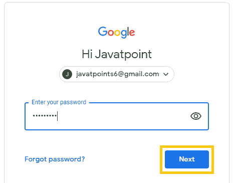

3.点击窗口左侧的**‘安全’**选项，如下图所示:

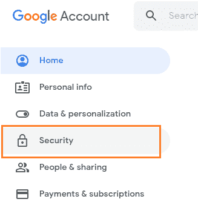

4.在**【登录谷歌】**选项下，点击**【密码】**选项，如下图:

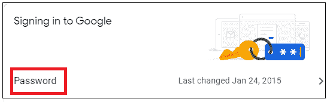

5.我们需要再次登录进行验证。再次输入当前密码->点击**‘下一步’**按钮。如下所示:

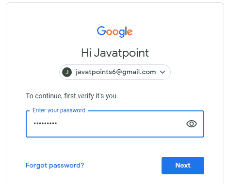

6.将出现一个指定新密码的窗口。

7.我们需要输入**新密码** - >确认新密码，如下图:

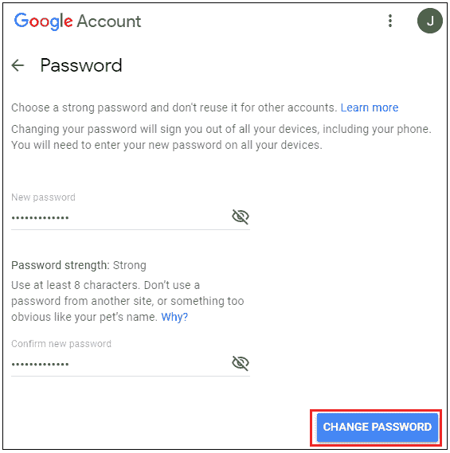

8.点击**“更改密码”**选项，如上图。

9.密码现已更改。我们可以注销并使用新密码轻松再次登录。

## 在安卓系统上更改 Gmail 密码

请考虑以下步骤，在安卓系统上更改您的 Gmail ID 密码。

1.打开[安卓](https://www.javatpoint.com/android-tutorial)移动设备上的**【设置】**。

2.向下滚动，点击**‘谷歌’**选项，如下图:

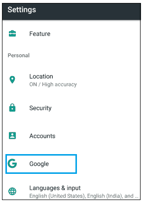

3.点击**“管理你的谷歌账户”**选项，如下图:

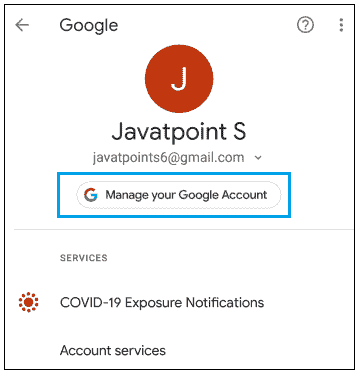

4.在显示屏顶部，点击**‘安全’**选项，如下图:

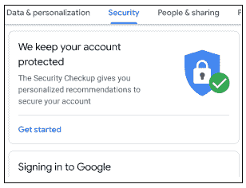

5.在“登录谷歌”选项下，点击**“密码”**选项，如下图:

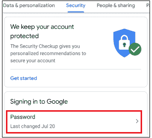

6.我们需要**再次登录**进行验证。再次输入当前密码- >点击**【下一步】**按钮，如下图:

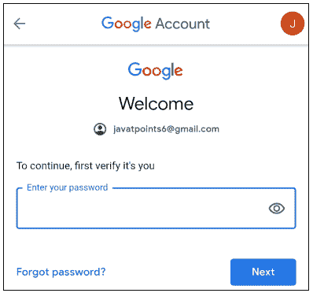

7.将出现一个指定新密码的窗口。我们需要键入新密码->确认新密码，如下所示:

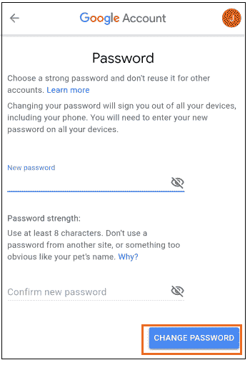

8.点击**“更改密码”**选项，如上图。

9.密码现已更改。

## 在 iPhone 和 iPad 上更改 Gmail 密码

考虑以下步骤来更改 iOS 设备上 Gmail ID 的密码。

*   打开 **Gmail** 手机 app。
*   进入**【菜单】**选项- >点击**【设置】**选项。
*   如果您有多个帐户，请选择所需的帐户。
*   点击**“管理你的谷歌账户”**选项，如下图:

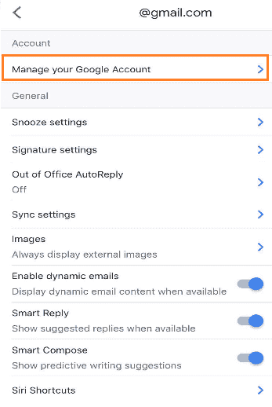

*   进入右下角的**【菜单】**选项，如下图所示:

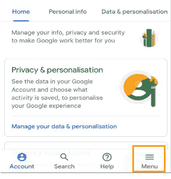

*   点击**‘安全’**选项，如下图:

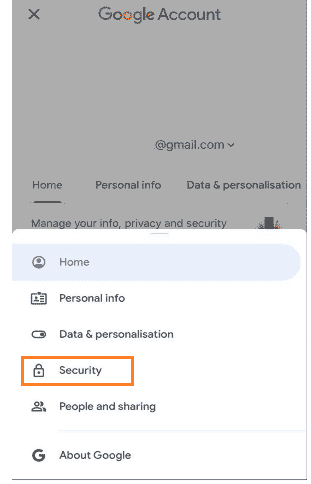

*   在**【登录谷歌】**选项下，点击**【密码】**选项，如下图:

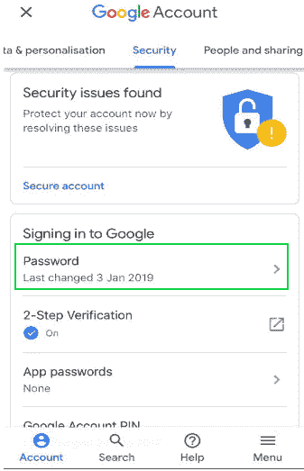

*   我们需要再次登录进行验证。再次输入当前密码。
*   点击**‘下一步’**按钮。
*   将出现一个指定新密码的窗口。我们需要键入新密码->确认新密码，如下所示:

*   点击**“更改密码”**选项，如上图。

密码现已更改。

* * *